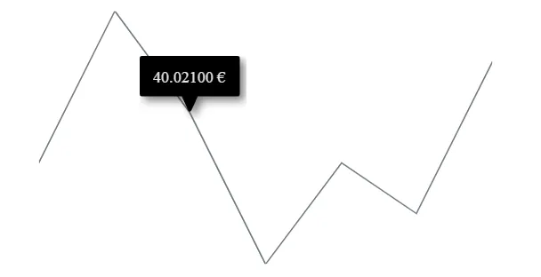

# Blazor Sparkline Charts Globalization

Globalization enables the Sparkline Charts component to format numeric values based on the application's configured culture. Use the [`Format`](https://help.syncfusion.com/cr/blazor/Syncfusion.Blazor.Charts.SfSparkline-1.html#Syncfusion_Blazor_Charts_SfSparkline_1_Format) property to specify the required numeric format.

The following example uses the standard currency format (`C`) to display tooltip values as currency for the Deutsch culture.

@using Syncfusion.Blazor.Charts

<SfSparkline DataSource="new double[]{ 300.00, 600.00, 400.21, 100.20, 300.70, 200.04, 500.00 }" Height="200px" Width="350px" Format="C">
    <SparklineTooltipSettings TValue="double" Visible="true"></SparklineTooltipSettings>
</SfSparkline>

```

N> Refer to the [localization documentation for Blazor Server](https://blazor.syncfusion.com/documentation/common/localization#enable-localization-in-blazor-server-application) and [Blazor WebAssembly](https://blazor.syncfusion.com/documentation/common/localization#enable-localization-in-blazor-webassembly-application) for configuration details.

On successful configuration, the Sparkline will be rendered as shown below.


