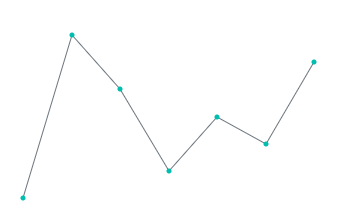
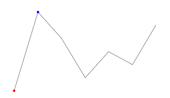
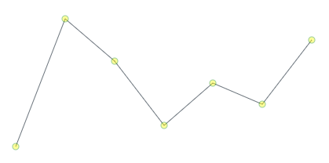

# Markers

This section explains how to add markers to the Sparkline Charts.

## Adding marker to the Sparkline Charts

To add marker to the Sparkline Charts, specify the [`Visible`](https://help.syncfusion.com/cr/blazor/Syncfusion.Blazor~Syncfusion.Blazor.Charts.SparklineMarkerSettings~Visible.html) of the [`SparklineMarkerSettings`](https://help.syncfusion.com/cr/blazor/Syncfusion.Blazor~Syncfusion.Blazor.Charts.SparklineMarkerSettings.html) as following values. The [`Visible`](https://help.syncfusion.com/cr/blazor/Syncfusion.Blazor~Syncfusion.Blazor.Charts.SparklineMarkerSettings~Visible.html) will accept the multiple values too.

* All - Enables markers for all points.
* Start - Enables marker for the start point.
* End - Enables marker for the end point.
* High - Enables marker for the high point.
* Low - Enables marker for the low point.
* Negative - Enables markers for the negative points.

The following code example shows enabling markers for all points.

```csharp
@using Syncfusion.Blazor.Charts

<SfSparkline DataSource="new int[]{ 0, 6, 4, 1, 3, 2, 5 }"
              Type="SparklineType.Line"
              Height="200px"
              Width="350px">
    <SparklineMarkerSettings Visible="new List<VisibleType> { VisibleType.All }"></SparklineMarkerSettings>
    <SparklineAxisSettings MinX="-1" MaxX="7" MaxY="7" MinY="-1"></SparklineAxisSettings>
</SfSparkline>
```



## Adding marker to special point

In Sparkline Charts, markers can be enabled for particular points such as the start, end, low, high, or negative. The following code examples shows enabling markers for the high and low points.

```csharp
@using Syncfusion.Blazor.Charts

<SfSparkline DataSource="new int[]{ 0, 6, 4, 1, 3, 2, 5 }"
              Type="SparklineType.Line"
              Height="200px"
              Width="350px"
              HighPointColor="Blue"
              LowPointColor="Red">
    <SparklineMarkerSettings Visible="new List<VisibleType> { VisibleType.High, VisibleType.Low }"></SparklineMarkerSettings>
    <SparklineAxisSettings MinX="-1" MaxX="7" MaxY="7" MinY="-1"></SparklineAxisSettings>
</SfSparkline>
```



## Customizing markers

Sparkline Charts marker can be customized using the following properties:

* [`Fill`](https://help.syncfusion.com/cr/blazor/Syncfusion.Blazor~Syncfusion.Blazor.Charts.SparklineMarkerSettings~Fill.html) - Specifies fill color for the marker
* [`Opacity`](https://help.syncfusion.com/cr/blazor/Syncfusion.Blazor~Syncfusion.Blazor.Charts.SparklineMarkerSettings~Opacity.html) - Specifies opacity of fill color for the marker
* [`Size`](https://help.syncfusion.com/cr/blazor/Syncfusion.Blazor~Syncfusion.Blazor.Charts.SparklineMarkerSettings~Size.html) - Specifies the marker size
* [`SparklineMarkerBorder`](https://help.syncfusion.com/cr/blazor/Syncfusion.Blazor~Syncfusion.Blazor.Charts.SparklineMarkerBorder.html) - Specifies the marker border color and width

The following code example shows customizing marker's fill color, border style and size.

```csharp
@using Syncfusion.Blazor.Charts

<SfSparkline DataSource="new int[]{ 0, 6, 4, 1, 3, 2, 5 }"
              Type="SparklineType.Line"
              Height="200px"
              Width="350px">
    <SparklineMarkerSettings Visible="new List<VisibleType> { VisibleType.All }"
                             Fill="yellow"
                             Opacity="0.4"
                             Size="20">
        <SparklineMarkerBorder Color="green"
                               Width="2">
        </SparklineMarkerBorder>
    </SparklineMarkerSettings>
    <SparklineAxisSettings MinX="-1" MaxX="7" MaxY="7" MinY="-1"></SparklineAxisSettings>
</SfSparkline>
```

