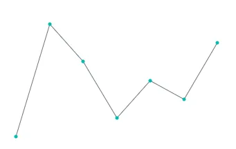
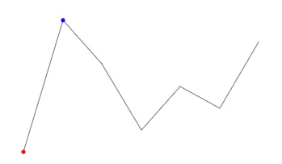
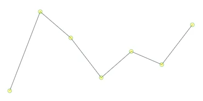

# Blazor Sparkline Charts Markers

Data markers provide information about individual data points in the Sparkline.

## Adding markers

The [`Visible`](https://help.syncfusion.com/cr/blazor/Syncfusion.Blazor.Charts.SparklineMarkerSettings.html#Syncfusion_Blazor_Charts_SparklineMarkerSettings_Visible) property in [`SparklineMarkerSettings`](https://help.syncfusion.com/cr/blazor/Syncfusion.Blazor.Charts.SparklineMarkerSettings.html) determines which markers are displayed. The following example enables markers for all data points.

```cshtml

@using Syncfusion.Blazor.Charts

<SfSparkline DataSource="new int[]{ 0, 6, 4, 1, 3, 2, 5 }" Type="SparklineType.Line" Height="200px" Width="350px">
    <SparklineMarkerSettings Visible="new List<VisibleType> { VisibleType.All }"></SparklineMarkerSettings>
    <SparklineAxisSettings MinX="-1" MaxX="7" MaxY="7" MinY="-1"></SparklineAxisSettings>
</SfSparkline>

```



## Adding special point markers

Markers can be displayed for specific types of data points by assigning one or more `VisibleType` values to the `Visible` property.

The following marker types are available:

* [`All`](https://help.syncfusion.com/cr/blazor/Syncfusion.Blazor.Charts.VisibleType.html#Syncfusion_Blazor_Charts_VisibleType_All) – Displays markers for all data points.
* [`Start`](https://help.syncfusion.com/cr/blazor/Syncfusion.Blazor.Charts.VisibleType.html#Syncfusion_Blazor_Charts_VisibleType_Start) – Displays a marker for the first data point.
* [`End`](https://help.syncfusion.com/cr/blazor/Syncfusion.Blazor.Charts.VisibleType.html#Syncfusion_Blazor_Charts_VisibleType_End) – Displays a marker for the last data point.
* [`High`](https://help.syncfusion.com/cr/blazor/Syncfusion.Blazor.Charts.VisibleType.html#Syncfusion_Blazor_Charts_VisibleType_High) – Displays markers for the highest values.
* [`Low`](https://help.syncfusion.com/cr/blazor/Syncfusion.Blazor.Charts.VisibleType.html#Syncfusion_Blazor_Charts_VisibleType_Low) – Displays markers for the lowest values.
* [`Negative`](https://help.syncfusion.com/cr/blazor/Syncfusion.Blazor.Charts.VisibleType.html#Syncfusion_Blazor_Charts_VisibleType_Negative) – Displays markers for negative values.
* [`None`](https://help.syncfusion.com/cr/blazor/Syncfusion.Blazor.Charts.VisibleType.html#Syncfusion_Blazor_Charts_VisibleType_None) – Disables all markers.

The following example displays markers for the highest and lowest values.

```cshtml

@using Syncfusion.Blazor.Charts

<SfSparkline DataSource="new int[]{ 0, 6, 4, 1, 3, 2, 5 }" Type="SparklineType.Line" Height="200px" Width="350px" HighPointColor="Blue" LowPointColor="Red">
    <SparklineMarkerSettings Visible="new List<VisibleType> { VisibleType.High, VisibleType.Low }"></SparklineMarkerSettings>
    <SparklineAxisSettings MinX="-1" MaxX="7" MaxY="7" MinY="-1"></SparklineAxisSettings>
</SfSparkline>
```



## Marker customization

The following properties can be used to customize markers:

* [`Fill`](https://help.syncfusion.com/cr/blazor/Syncfusion.Blazor.Charts.SparklineMarkerSettings.html#Syncfusion_Blazor_Charts_SparklineMarkerSettings_Fill) – Specifies the marker fill color.
* [`Opacity`](https://help.syncfusion.com/cr/blazor/Syncfusion.Blazor.Charts.SparklineMarkerSettings.html#Syncfusion_Blazor_Charts_SparklineMarkerSettings_Opacity) – Specifies the marker opacity. The value ranges from `0` to `1`.
* [`Size`](https://help.syncfusion.com/cr/blazor/Syncfusion.Blazor.Charts.SparklineMarkerSettings.html#Syncfusion_Blazor_Charts_SparklineMarkerSettings_Size) – Specifies the marker size in pixels.

Use the [`SparklineMarkerBorder`](https://help.syncfusion.com/cr/blazor/Syncfusion.Blazor.Charts.SparklineMarkerBorder.html) child component to customize the marker border color and width. The border width is specified in pixels.

```cshtml

@using Syncfusion.Blazor.Charts

<SfSparkline DataSource="new int[]{ 0, 6, 4, 1, 3, 2, 5 }" Type="SparklineType.Line" Height="200px" Width="450px">
    <SparklineMarkerSettings Visible="new List<VisibleType> { VisibleType.All }" Fill="yellow" Opacity="0.4" Size="8">
        <SparklineMarkerBorder Color="green" Width="1">
        </SparklineMarkerBorder>
    </SparklineMarkerSettings>
    <SparklineAxisSettings MinX="-1" MaxX="7" MaxY="7" MinY="-1"></SparklineAxisSettings>
</SfSparkline>

```



## See also

* [Getting started with Blazor Sparkline Charts](https://blazor.syncfusion.com/documentation/sparkline/getting-started-webapp)
* [SparklineMarkerSettings API reference](https://help.syncfusion.com/cr/blazor/Syncfusion.Blazor.Charts.SparklineMarkerSettings.html)
* [VisibleType API reference](https://help.syncfusion.com/cr/blazor/Syncfusion.Blazor.Charts.VisibleType.html)
