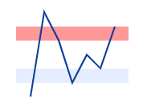

# Range Band in Blazor Sparkline Component

A range band represents a specific range on the Sparkline y-axis, improving readability or highlighting quality by specifying the [StartRange](https://help.syncfusion.com/cr/blazor/Syncfusion.Blazor.Charts.SparklineRangeBand.html#Syncfusion_Blazor_Charts_SparklineRangeBand_StartRange) and [EndRange](https://help.syncfusion.com/cr/blazor/Syncfusion.Blazor.Charts.SparklineRangeBand.html#Syncfusion_Blazor_Charts_SparklineRangeBand_EndRange) properties in the [SparklineRangeBand](https://help.syncfusion.com/cr/blazor/Syncfusion.Blazor.Charts.SparklineRangeBand.html) within [SparklineRangeBandSettings](https://help.syncfusion.com/cr/blazor/Syncfusion.Blazor.Charts.SparklineRangeBandSettings.html).

The following properties are used to customize the range band:

* [Color](https://help.syncfusion.com/cr/blazor/Syncfusion.Blazor.Charts.SparklineRangeBand.html#Syncfusion_Blazor_Charts_SparklineRangeBand_Color) – Specifies the color of the range band.
* [Opacity](https://help.syncfusion.com/cr/blazor/Syncfusion.Blazor.Charts.SparklineRangeBand.html#Syncfusion_Blazor_Charts_SparklineRangeBand_Opacity) – Specifies the opacity of the range band color.

```cshtml

@using Syncfusion.Blazor.Charts

<SfSparkline DataSource="new int[]{ 0, 6, 4, 1, 3, 2, 5 }" Height="150px" Width="150px" LineWidth="2" Fill="#0d3c9b">
    <SparklineAxisSettings MinX="-1" MaxX="7" MaxY="7" MinY="-1">
    </SparklineAxisSettings>
    <SparklineRangeBandSettings>
        <SparklineRangeBand StartRange="1" EndRange="2" Color="#bfd4fc" Opacity="0.4">
        </SparklineRangeBand>
        <SparklineRangeBand StartRange="4" EndRange="5" Color="red" Opacity="0.4">
        </SparklineRangeBand>
    </SparklineRangeBandSettings>
</SfSparkline>

```


