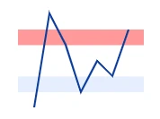

# Range Band in Blazor Sparkline Component


Range bands are a powerful feature in the Syncfusion Blazor Sparkline component that allow you to visually highlight specific value ranges on the y-axis of your chart. By adding range bands, you can draw attention to important thresholds, indicate safe or critical zones, or simply improve the overall readability of your data visualization. This is especially useful in scenarios such as performance monitoring, financial analysis, or quality control, where certain value ranges have special significance.

## What is a Range Band?

A range band is a colored region that spans a specified range of values along the y-axis of the Sparkline chart. You can define one or more range bands to highlight multiple regions. Each range band is configured using the [SparklineRangeBand](https://help.syncfusion.com/cr/blazor/Syncfusion.Blazor.Charts.SparklineRangeBand.html) element, which is placed inside the [SparklineRangeBandSettings](https://help.syncfusion.com/cr/blazor/Syncfusion.Blazor.Charts.SparklineRangeBandSettings.html) collection.

### Key Properties

- ***StartRange*: The starting value of the range band on the y-axis.
- **EndRange**: The ending value of the range band on the y-axis.
- **Color**: The fill color used to highlight the range band.
- **Opacity**: The transparency level of the range band color, allowing you to control how prominently it appears behind the chart line.

## Why Use Range Bands?

Range bands are useful for:
- Emphasizing critical or target value ranges (e.g., safe, warning, or danger zones)
- Making charts easier to interpret at a glance
- Providing visual cues for quality control or compliance
- Highlighting performance thresholds in dashboards

## Step-by-Step Guide to Adding Range Bands

1. **Add the Sparkline Component**: Place the `<SfSparkline>` component in your Razor file and provide the required data source and appearance settings.
2. **Configure Axis Settings**: Use `<SparklineAxisSettings>` to define the minimum and maximum values for the x and y axes, ensuring your range bands are visible within the chart area.
3. **Add Range Band Settings**: Inside `<SparklineRangeBandSettings>`, add one or more `<SparklineRangeBand>` elements, specifying the `StartRange`, `EndRange`, `Color`, and `Opacity` for each band.
4. **Customize as Needed**: Adjust the color and opacity to match your application's theme or to differentiate between multiple bands.

### Example: Multiple Range Bands

```cshtml
@using Syncfusion.Blazor.Charts

<SfSparkline DataSource="new int[]{ 0, 6, 4, 1, 3, 2, 5 }" Height="150px" Width="150px" LineWidth="2" Fill="#0d3c9b">
    <SparklineAxisSettings MinX="-1" MaxX="7" MaxY="7" MinY="-1">
    </SparklineAxisSettings>
    <SparklineRangeBandSettings>
        <SparklineRangeBand StartRange="1" EndRange="2" Color="#bfd4fc" Opacity="0.4">
        </SparklineRangeBand>
        <SparklineRangeBand StartRange="4" EndRange="5" Color="red" Opacity="0.4">
        </SparklineRangeBand>
    </SparklineRangeBandSettings>
</SfSparkline>
```

In this example, two range bands are added: one from 1 to 2 (light blue) and another from 4 to 5 (red), both with 40% opacity. These bands visually highlight the specified y-axis ranges, making it easy to spot when data points fall within these regions.

## Practical Scenarios

- **Quality Control**: Highlight acceptable and unacceptable value ranges in manufacturing or laboratory data.
- **Financial Analysis**: Emphasize profit/loss thresholds or target ranges in financial dashboards.
- **Performance Monitoring**: Indicate safe, warning, and critical zones for metrics such as CPU usage, temperature, or response time.
- **Educational Tools**: Help students quickly identify passing or failing score ranges in assessment charts.


```cshtml

@using Syncfusion.Blazor.Charts

<SfSparkline DataSource="new int[]{ 0, 6, 4, 1, 3, 2, 5 }" Height="150px" Width="150px" LineWidth="2" Fill="#0d3c9b">
    <SparklineAxisSettings MinX="-1" MaxX="7" MaxY="7" MinY="-1">
    </SparklineAxisSettings>
    <SparklineRangeBandSettings>
        <SparklineRangeBand StartRange="1" EndRange="2" Color="#bfd4fc" Opacity="0.4">
        </SparklineRangeBand>
        <SparklineRangeBand StartRange="4" EndRange="5" Color="red" Opacity="0.4">
        </SparklineRangeBand>
    </SparklineRangeBandSettings>
</SfSparkline>

```



## Additional Resources

- [Blazor Sparkline Documentation](https://blazor.syncfusion.com/documentation/sparkline/getting-started)
- [API Reference: SparklineRangeBand](https://help.syncfusion.com/cr/blazor/Syncfusion.Blazor.Charts.SparklineRangeBand.html)
- [API Reference: SparklineRangeBandSettings](https://help.syncfusion.com/cr/blazor/Syncfusion.Blazor.Charts.SparklineRangeBandSettings.html)

By leveraging range bands in the Blazor Sparkline component, you can create more informative and visually engaging charts that help users quickly interpret data and make better decisions. Experiment with different configurations to find the best way to highlight key value ranges in your application.