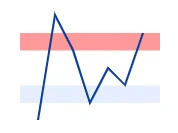

# Blazor Sparkline Charts Range Band

A range band represents a specific range on the Sparkline y-axis. It can be used to improve readability and highlight specific value ranges by configuring the `StartRange` and `EndRange` properties of `SparklineRangeBand` within `SparklineRangeBandSettings`.

The following properties are used to customize a range band:

* `Color` - Specifies the color of the range band.
* `Opacity` - Specifies the opacity of the range band color. Accepted values range from `0` to `1`.

The following example demonstrates how to highlight multiple y-axis ranges using range bands with different colors and opacity values.

```cshtml
@using Syncfusion.Blazor.Charts

<SfSparkline DataSource="new int[]{ 0, 6, 4, 1, 3, 2, 5 }" Height="150px" Width="150px" LineWidth="2" Fill="#0d3c9b">
    <SparklineAxisSettings MinX="-1" MaxX="7" MaxY="7" MinY="-1">
    </SparklineAxisSettings>
    <SparklineRangeBandSettings>
        <SparklineRangeBand StartRange="1" EndRange="2" Color="#bfd4fc" Opacity="0.4">
        </SparklineRangeBand>
        <SparklineRangeBand StartRange="4" EndRange="5" Color="red" Opacity="0.4">
        </SparklineRangeBand>
    </SparklineRangeBandSettings>
</SfSparkline>

```


