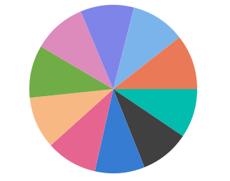

# Sparkline Chart Types

The different types of shapes can be used to represent the Sparkline Charts. Change the type of Sparkline Charts by setting the [`Type`](https://help.syncfusion.com/cr/blazor/Syncfusion.Blazor~Syncfusion.Blazor.Charts.SfSparkline%601~Type.html) property. Sparkline Charts supports the following types:

* Line
* Column
* Win-Loss
* Pie
* Area

The following code sample shows the different types of Sparkline Charts.

## Line

The [`Line`](https://help.syncfusion.com/cr/blazor/Syncfusion.Blazor~Syncfusion.Blazor.Charts.SfSparkline%601~Type.html) type is used to render the Sparkline Charts series as line.

```csharp
@using Syncfusion.Blazor.Charts

<SfSparkline DataSource="PopulationData"
              TValue="PopulationReport"
              XName="Year"
              YName="Population"
              Width="200px"
              Height="150px"
              Type="SparklineType.Line">
</SfSparkline>

@code {
    public class PopulationReport
    {
        public int Year;
        public int Population;
    };
    private List<PopulationReport> PopulationData = new List<PopulationReport> {
        new  PopulationReport { Year= 2005, Population= 20090440 },
        new  PopulationReport { Year= 2006, Population= 20264080 },
        new  PopulationReport { Year= 2007, Population= 20434180 },
        new  PopulationReport { Year= 2008, Population= 21007310 },
        new  PopulationReport { Year= 2009, Population= 21262640 },
        new  PopulationReport { Year= 2010, Population= 21515750 },
        new  PopulationReport { Year= 2011, Population= 21766710 },
        new  PopulationReport { Year= 2012, Population= 22015580 },
        new  PopulationReport { Year= 2013, Population= 22262500 },
        new  PopulationReport { Year= 2014, Population= 22507620 }
    };
}
```


## Column

The [`Column`](https://help.syncfusion.com/cr/blazor/Syncfusion.Blazor~Syncfusion.Blazor.Charts.SfSparkline%601~Type.html) type is used to render the Sparkline Charts series as column.

```csharp
@using Syncfusion.Blazor.Charts

<SfSparkline DataSource="PopulationData"
              TValue="PopulationReport"
              XName="Year"
              YName="Population"
              Width="70%"
              Height="100px"
              Type="SparklineType.Column">
</SfSparkline>
```

> Refer to the [code block](#line) to know about the property value of the `PopulationData`.


## Pie

The [`Pie`](https://help.syncfusion.com/cr/blazor/Syncfusion.Blazor~Syncfusion.Blazor.Charts.SfSparkline%601~Type.html) type is used to render the Sparkline Charts series as pie.

```csharp
@using Syncfusion.Blazor.Charts

<SfSparkline DataSource="PopulationData"
              TValue="PopulationReport"
              XName="Year"
              YName="Population"
              Width="70%"
              Height="200px"
              Type="SparklineType.Pie">
</SfSparkline>
```

> Refer to the [code block](#line) to know about the property value of the `PopulationData`.



## WinLoss

The [`WinLoss`](https://help.syncfusion.com/cr/blazor/Syncfusion.Blazor~Syncfusion.Blazor.Charts.SfSparkline%601~Type.html) type is used to render the Sparkline Charts series as WinLoss.

```csharp
@using Syncfusion.Blazor.Charts

<SfSparkline DataSource="new int[]{12, 15, -10, 13, 15, 6, -12, 17, 13, 0, 8, -10}"
              Width="50%"
              Height="200px"
              Type="SparklineType.WinLoss">
</SfSparkline>
```


## Area

The [`Area`](https://help.syncfusion.com/cr/blazor/Syncfusion.Blazor~Syncfusion.Blazor.Charts.SfSparkline%601~Type.html) type is used to render the Sparkline Charts series as area.

```csharp
@using Syncfusion.Blazor.Charts

<SfSparkline DataSource="PopulationData"
              TValue="PopulationReport"
              XName="Year"
              YName="Population"
              Width="70%"
              Height="100px"
              Type="SparklineType.Area">
</SfSparkline>
```

> Refer to the [code block](#line) to know about the property value of the `PopulationData`.

