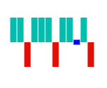

# Special Points Customization in Blazor Sparkline Component

## Add custom color for special points

The color of special points can be changed by specifying the corresponding property, and it is applicable for [Line](https://help.syncfusion.com/cr/blazor/Syncfusion.Blazor.Charts.SparklineType.html#Syncfusion_Blazor_Charts_SparklineType_Line), [Column](https://help.syncfusion.com/cr/blazor/Syncfusion.Blazor.Charts.SparklineType.html#Syncfusion_Blazor_Charts_SparklineType_Column) and [Area](https://help.syncfusion.com/cr/blazor/Syncfusion.Blazor.Charts.SparklineType.html#Syncfusion_Blazor_Charts_SparklineType_Area) chart types in the Sparkline. The following properties are used to customize the special points.

* [StartPointColor](https://help.syncfusion.com/cr/blazor/Syncfusion.Blazor.Charts.SfSparkline-1.html#Syncfusion_Blazor_Charts_SfSparkline_1_StartPointColor)
* [EndPointColor](https://help.syncfusion.com/cr/blazor/Syncfusion.Blazor.Charts.SfSparkline-1.html#Syncfusion_Blazor_Charts_SfSparkline_1_EndPointColor)
* [NegativePointColor](https://help.syncfusion.com/cr/blazor/Syncfusion.Blazor.Charts.SfSparkline-1.html#Syncfusion_Blazor_Charts_SfSparkline_1_NegativePointColor)
* [LowPointColor](https://help.syncfusion.com/cr/blazor/Syncfusion.Blazor.Charts.SfSparkline-1.html#Syncfusion_Blazor_Charts_SfSparkline_1_LowPointColor)
* [HighPointColor](https://help.syncfusion.com/cr/blazor/Syncfusion.Blazor.Charts.SfSparkline-1.html#Syncfusion_Blazor_Charts_SfSparkline_1_HighPointColor)

```cshtml
@using Syncfusion.Blazor.Charts

<SfSparkline XName="CarName" YName="Rating" Width="130px" Height="150px" TValue="CarRating" DataSource="CarRatings" Type="SparklineType.Column" ValueType="SparklineValueType.Category"
             HighPointColor="blue" LowPointColor="orange" StartPointColor="green" EndPointColor="green" NegativePointColor="red">
</SfSparkline>

@code {
    public class CarRating
    {
        public string CarName { get; set; }
        public double Rating { get; set; }
    };
    public List<CarRating> CarRatings = new List<CarRating> {
        new CarRating { CarName= "AUDI", Rating= 1 },
        new CarRating { CarName= "BMW", Rating= 5 },
        new CarRating { CarName= "BUICK", Rating= -1 },
        new CarRating { CarName= "CETROEN", Rating= -6 },
        new CarRating { CarName= "CHEVROLET", Rating= 0.01 },
        new CarRating { CarName= "FIAT", Rating= 1 },
        new CarRating { CarName= "FORD", Rating= -2 },
        new CarRating { CarName= "HONDA", Rating= 7 },
        new CarRating { CarName= "HYUNDAI", Rating= -9 },
        new CarRating { CarName= "JEEP", Rating= 0.01 },
        new CarRating { CarName= "KIA", Rating= -10 },
        new CarRating { CarName= "MAZDA", Rating= 3 }
    };
}
```


## Tie point color

To highlight the tie area of the Y-axis value, use the [TiePointColor](https://help.syncfusion.com/cr/blazor/Syncfusion.Blazor.Charts.SfSparkline-1.html#Syncfusion_Blazor_Charts_SfSparkline_1_TiePointColor) property that is only applicable to the [WinLoss](https://help.syncfusion.com/cr/blazor/Syncfusion.Blazor.Charts.SparklineType.html#Syncfusion_Blazor_Charts_SparklineType_WinLoss) type.

```cshtml
@using Syncfusion.Blazor.Charts

<SfSparkline Width="130px" Height="150px" Type="SparklineType.WinLoss" TiePointColor="blue" DataSource="new int[]{12, 15, -10, 13, 15, 6, -12, 17, 13, 0, 8, -10}">
</SfSparkline>
```


