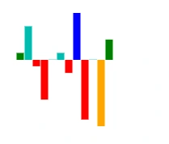
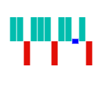

# Blazor Sparkline Charts Special Points Customization

## Customize Colors for Special Points

Special points in the Blazor Sparkline Charts can be highlighted by setting the corresponding color properties. These properties accept CSS color values, such as color names, hexadecimal values, and RGB values. When a property is not specified, the default series color is applied.

Special-point customization is applicable to the [Line](https://help.syncfusion.com/cr/blazor/Syncfusion.Blazor.Charts.SparklineType.html#Syncfusion_Blazor_Charts_SparklineType_Line), [Column](https://help.syncfusion.com/cr/blazor/Syncfusion.Blazor.Charts.SparklineType.html#Syncfusion_Blazor_Charts_SparklineType_Column), and [Area](https://help.syncfusion.com/cr/blazor/Syncfusion.Blazor.Charts.SparklineType.html#Syncfusion_Blazor_Charts_SparklineType_Area) sparkline types.

The following properties are used to customize special points:

- [StartPointColor](https://help.syncfusion.com/cr/blazor/Syncfusion.Blazor.Charts.SfSparkline-1.html#Syncfusion_Blazor_Charts_SfSparkline_1_StartPointColor): Specifies the color of the first data point.
- [EndPointColor](https://help.syncfusion.com/cr/blazor/Syncfusion.Blazor.Charts.SfSparkline-1.html#Syncfusion_Blazor_Charts_SfSparkline_1_EndPointColor): Specifies the color of the last data point.
- [NegativePointColor](https://help.syncfusion.com/cr/blazor/Syncfusion.Blazor.Charts.SfSparkline-1.html#Syncfusion_Blazor_Charts_SfSparkline_1_NegativePointColor): Specifies the color of data points with negative values.
- [LowPointColor](https://help.syncfusion.com/cr/blazor/Syncfusion.Blazor.Charts.SfSparkline-1.html#Syncfusion_Blazor_Charts_SfSparkline_1_LowPointColor): Specifies the color of the data point with the lowest value.
- [HighPointColor](https://help.syncfusion.com/cr/blazor/Syncfusion.Blazor.Charts.SfSparkline-1.html#Syncfusion_Blazor_Charts_SfSparkline_1_HighPointColor): Specifies the color of the data point with the highest value.

The following example renders the highest point in blue, the lowest point in orange, the first and last points in green, and negative points in red.

```cshtml
@using Syncfusion.Blazor.Charts

<SfSparkline XName="CarName" YName="Rating" Width="130px" Height="150px" TValue="CarRating" DataSource="CarRatings" Type="SparklineType.Column" ValueType="SparklineValueType.Category"
             HighPointColor="blue" LowPointColor="orange" StartPointColor="green" EndPointColor="green" NegativePointColor="red">
</SfSparkline>

@code {
    public class CarRating
    {
        public string CarName { get; set; }
        public double Rating { get; set; }
    };

    public List<CarRating> CarRatings = new List<CarRating> {
        new CarRating { CarName = "AUDI", Rating = 1 },
        new CarRating { CarName = "BMW", Rating = 5 },
        new CarRating { CarName = "BUICK", Rating = -1 },
        new CarRating { CarName = "CETROEN", Rating = -6 },
        new CarRating { CarName = "CHEVROLET", Rating = 0.01 },
        new CarRating { CarName = "FIAT", Rating = 1 },
        new CarRating { CarName = "FORD", Rating = -2 },
        new CarRating { CarName = "HONDA", Rating = 7 },
        new CarRating { CarName = "HYUNDAI", Rating = -9 },
        new CarRating { CarName = "JEEP", Rating = 0.01 },
        new CarRating { CarName = "KIA", Rating = -10 },
        new CarRating { CarName = "MAZDA", Rating = 3 }
    };
}
```



## Customize the Tie Point Color

A tie point is a data point with a value of zero in a WinLoss sparkline. Use the [TiePointColor](https://help.syncfusion.com/cr/blazor/Syncfusion.Blazor.Charts.SfSparkline-1.html#Syncfusion_Blazor_Charts_SfSparkline_1_TiePointColor) property to customize its color. This property is applicable only to the [WinLoss](https://help.syncfusion.com/cr/blazor/Syncfusion.Blazor.Charts.SparklineType.html#Syncfusion_Blazor_Charts_SparklineType_WinLoss) sparkline type.

The following example displays the tie point in blue.

```cshtml
@using Syncfusion.Blazor.Charts

<SfSparkline Width="130px" Height="150px" Type="SparklineType.WinLoss" TiePointColor="blue" DataSource="new int[]{12, 15, -10, 13, 15, 6, -12, 17, 13, 0, 8, -10}">
</SfSparkline>

```

