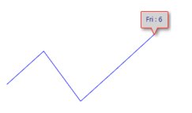
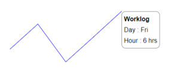
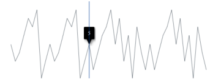

# User Interaction in Blazor Sparkline Component

User interaction features in the Sparkline include the tooltip and the tracker line.

## Tooltip

When the mouse hovers over a data point, the Sparkline can display details about the value of the data point via a tooltip. The following example shows how to enable the Sparkline tooltip with a custom format.

```cshtml

@using Syncfusion.Blazor.Charts

<SfSparkline Width="500" Height="200" TValue="WorkLog" DataSource="WorkLogs" XName="Day" YName="Hour" Fill="blue" ValueType="SparklineValueType.Category">
    <SparklineAxisSettings MinX="-1" MaxX="7" MaxY="8" MinY="-1">
    </SparklineAxisSettings>
    <SparklineTooltipSettings TValue="WorkLog" Visible="true" Format="${Day} : ${Hour}">
    </SparklineTooltipSettings>
</SfSparkline>

@code {
    public class WorkLog
    {
        public string Day { get; set; }
        public double Hour { get; set; }
    };

    public List<WorkLog> WorkLogs = new List<WorkLog> {
        new WorkLog { Day = "Mon", Hour = 3 },
        new WorkLog { Day = "Tue", Hour = 5 },
        new WorkLog { Day = "Wed", Hour = 2 },
        new WorkLog { Day = "Thu", Hour = 4 },
        new WorkLog { Day = "Fri", Hour = 6 }
    };
}

```


### Tooltip Customization

The following properties can be used to customize the Sparkline tooltip:

* [Fill](https://help.syncfusion.com/cr/blazor/Syncfusion.Blazor.Charts.SparklineTooltipSettings-1.html#Syncfusion_Blazor_Charts_SparklineTooltipSettings_1_Fill) – Specifies fill color for the tooltip
* [Format](https://help.syncfusion.com/cr/blazor/Syncfusion.Blazor.Charts.SparklineTooltipSettings-1.html#Syncfusion_Blazor_Charts_SparklineTooltipSettings_1_Format) – Specifies custom content of the tooltip by assigning the properties from the datasource.
* [SparklineTooltipTextStyle](https://help.syncfusion.com/cr/blazor/Syncfusion.Blazor.Charts.SparklineTooltipTextStyle.html) – Specifies font family, font style, font weight, color, opacity and size of the tooltip content
* [SparklineTooltipBorder](https://help.syncfusion.com/cr/blazor/Syncfusion.Blazor.Charts.SparklineTooltipBorder.html) – Customize border width and color of the tooltip.

The following example shows customizing tooltip format, text color, and fill color.

```cshtml

@using Syncfusion.Blazor.Charts

<SfSparkline Width="500" Height="200" TValue="WorkLog" DataSource="WorkLogs" XName="Day" YName="Hour" Fill="blue" ValueType="SparklineValueType.Category">
    <SparklineAxisSettings MinX="-1" MaxX="7" MaxY="8" MinY="-1">
    </SparklineAxisSettings>
    <SparklineTooltipSettings TValue="WorkLog" Visible="true" Format="${Day} : ${Hour}" Fill="lightgray">
        <SparklineTooltipTextStyle Color="darkblue"></SparklineTooltipTextStyle>
        <SparklineTooltipBorder Color="red" Width="1"></SparklineTooltipBorder>
    </SparklineTooltipSettings>
</SfSparkline>

```

N> Refer to the [code block](#tooltip) for the **WorkLogs** property value.



### Tooltip Template

The tooltip can be rendered as a custom component by specifying the [Template](https://help.syncfusion.com/cr/blazor/Syncfusion.Blazor.Charts.SparklineTooltipSettings-1.html#Syncfusion_Blazor_Charts_SparklineTooltipSettings_1_Template) property in [SparklineTooltipSettings](https://help.syncfusion.com/cr/blazor/Syncfusion.Blazor.Charts.SparklineTooltipSettings-1.html), which accepts one or more UI elements as input and renders them as part of the tooltip.

```cshtml

@using Syncfusion.Blazor.Charts

<SfSparkline Width="500" Height="200" TValue="WorkLog" DataSource="WorkLogs" XName="Day" YName="Hour" Fill="blue" ValueType="SparklineValueType.Category">
    <SparklineAxisSettings MinX="-1" MaxX="7" MaxY="8" MinY="-1">
    </SparklineAxisSettings>
    <SparklineTooltipSettings TValue="WorkLog" Visible="true" Fill="lightgray">
        <Template>
            @{
                <table style="width:100%; background-color: #ffffff; border-spacing: 0px; border-collapse:separate; border: 1px solid grey; border-radius:10px; padding-top: 5px; padding-bottom:5px">
                    <tr>
                        <td style="font-weight:bold; color:black; padding-left: 5px;padding-top: 2px;padding-bottom: 2px;">Worklog</td>
                    </tr>
                    <tr>
                        <td style="padding-left: 5px; color:black; padding-right: 5px; padding-bottom: 2px;">Day : @context.Day  </td>
                    </tr>
                    <tr>
                        <td style="padding-left: 5px; color:black; padding-right: 5px">Hour : @context.Hour hrs </td>
                    </tr>
                </table>
            }
        </Template>
    </SparklineTooltipSettings>
</SfSparkline>

```

N> Refer to the [code block](#tooltip) for the **WorkLogs** property value.



## Track Line

The track line highlights data points closest to the mouse position or touch interaction. Enable it by setting the [Visible](https://help.syncfusion.com/cr/blazor/Syncfusion.Blazor.Charts.SparklineTrackLineSettings.html#Syncfusion_Blazor_Charts_SparklineTrackLineSettings_Visible) property to **true** in [SparklineTrackLineSettings](https://help.syncfusion.com/cr/blazor/Syncfusion.Blazor.Charts.SparklineTrackLineSettings.html). The track line color and width can be customized using the [Color](https://help.syncfusion.com/cr/blazor/Syncfusion.Blazor.Charts.SparklineTrackLineSettings.html#Syncfusion_Blazor_Charts_SparklineTrackLineSettings_Color) and [Width](https://help.syncfusion.com/cr/blazor/Syncfusion.Blazor.Charts.SparklineTrackLineSettings.html#Syncfusion_Blazor_Charts_SparklineTrackLineSettings_Width) properties.

```cshtml

@using Syncfusion.Blazor.Charts

<SfSparkline Width="500px" Height="200px"
             DataSource="new int[]{ 5, 3, 4, 6, 8, 7, 9, 1, 3, 5, 3, 4, 6, 8, 7, 9, 1, 3, 5, 2, 4, 6, 7, 9, 5, 8, 3, 6, 1, 7, 4, 2, 5, 2, 4, 6, 7, 9, 5, 8, 3, 6, 1, 7, 4, 2 }">
    <SparklineAxisSettings MinX="-1" MaxX="46" MaxY="10" MinY="-1">
    </SparklineAxisSettings>
    <SparklineTooltipSettings TValue="int" Visible="true">
        <SparklineTrackLineSettings Visible="true" Color="#033e96" Width="1">
        </SparklineTrackLineSettings>
    </SparklineTooltipSettings>
</SfSparkline>

```


