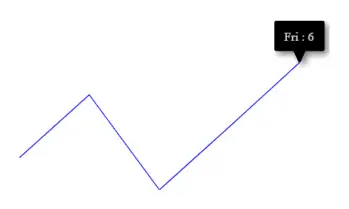
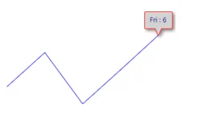
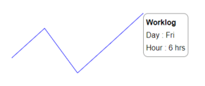
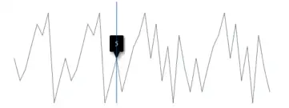

# Blazor Sparkline Charts User Interaction

The Blazor Sparkline Charts component supports tooltips and tracker lines for displaying additional information during pointer and touch interactions.

## Tooltip

The Sparkline displays information about a data point in a tooltip when the pointer hovers over the point. To enable the tooltip, set the [Visible](https://help.syncfusion.com/cr/blazor/Syncfusion.Blazor.Charts.SparklineTooltipSettings-1.html#Syncfusion_Blazor_Charts_SparklineTooltipSettings_1_Visible) property to `true` in `SparklineTooltipSettings`.

Use the [Format](https://help.syncfusion.com/cr/blazor/Syncfusion.Blazor.Charts.SparklineTooltipSettings-1.html#Syncfusion_Blazor_Charts_SparklineTooltipSettings_1_Format) property to customize the tooltip content. The placeholders in the format string must correspond to properties in the type specified by `TValue`.

```cshtml
@using Syncfusion.Blazor.Charts

<SfSparkline Width="500" Height="200" TValue="WorkLog" DataSource="WorkLogs" XName="Day" YName="Hour" Fill="blue" ValueType="SparklineValueType.Category">
    <SparklineAxisSettings MinX="-1" MaxX="7" MaxY="8" MinY="-1">
    </SparklineAxisSettings>
    <SparklineTooltipSettings TValue="WorkLog" Visible="true" Format="${Day} : ${Hour}">
    </SparklineTooltipSettings>
</SfSparkline>

@code {
    public class WorkLog
    {
        public string Day { get; set; }
        public double Hour { get; set; }
    };

    public List<WorkLog> WorkLogs = new List<WorkLog> {
        new WorkLog { Day = "Mon", Hour = 3 },
        new WorkLog { Day = "Tue", Hour = 5 },
        new WorkLog { Day = "Wed", Hour = 2 },
        new WorkLog { Day = "Thu", Hour = 4 },
        new WorkLog { Day = "Fri", Hour = 6 }
    };
}
```



## Tooltip customization

The following settings can be used to customize the Sparkline tooltip:

* [Fill](https://help.syncfusion.com/cr/blazor/Syncfusion.Blazor.Charts.SparklineTooltipSettings-1.html#Syncfusion_Blazor_Charts_SparklineTooltipSettings_1_Fill) — Specifies the fill color of the tooltip.
* [Format](https://help.syncfusion.com/cr/blazor/Syncfusion.Blazor.Charts.SparklineTooltipSettings-1.html#Syncfusion_Blazor_Charts_SparklineTooltipSettings_1_Format) — Specifies the tooltip content by using properties from the data source.
* [SparklineTooltipTextStyle](https://help.syncfusion.com/cr/blazor/Syncfusion.Blazor.Charts.SparklineTooltipTextStyle.html) — Configures the font family, font style, font weight, color, opacity, and size of the tooltip content.
* [SparklineTooltipBorder](https://help.syncfusion.com/cr/blazor/Syncfusion.Blazor.Charts.SparklineTooltipBorder.html) — Configures the width and color of the tooltip border.

The following example demonstrates how to customize the tooltip format, text color, fill color, and border.

```cshtml
@using Syncfusion.Blazor.Charts

<SfSparkline Width="500" Height="200" TValue="WorkLog" DataSource="WorkLogs" XName="Day" YName="Hour" Fill="blue" ValueType="SparklineValueType.Category">
    <SparklineAxisSettings MinX="-1" MaxX="7" MaxY="8" MinY="-1">
    </SparklineAxisSettings>
    <SparklineTooltipSettings TValue="WorkLog" Visible="true" Format="${Day} : ${Hour}" Fill="lightgray">
        <SparklineTooltipTextStyle Color="darkblue"></SparklineTooltipTextStyle>
        <SparklineTooltipBorder Color="red" Width="1"></SparklineTooltipBorder>
    </SparklineTooltipSettings>
</SfSparkline>

```

N> Refer to the [code block](#tooltip) for the **WorkLogs** property value.



## Tooltip template

The tooltip can render custom Razor content by using the [Template](https://help.syncfusion.com/cr/blazor/Syncfusion.Blazor.Charts.SparklineTooltipSettings-1.html#Syncfusion_Blazor_Charts_SparklineTooltipSettings_1_Template) property in [SparklineTooltipSettings](https://help.syncfusion.com/cr/blazor/Syncfusion.Blazor.Charts.SparklineTooltipSettings-1.html).

```cshtml

@using Syncfusion.Blazor.Charts

<SfSparkline Width="500" Height="200" TValue="WorkLog" DataSource="WorkLogs" XName="Day" YName="Hour" Fill="blue" ValueType="SparklineValueType.Category">
    <SparklineAxisSettings MinX="-1" MaxX="7" MaxY="8" MinY="-1">
    </SparklineAxisSettings>
    <SparklineTooltipSettings TValue="WorkLog" Visible="true" Fill="lightgray">
        <Template>
            @{
                <table style="width:100%; background-color: #ffffff; border-spacing: 0px; border-collapse:separate; border: 1px solid grey; border-radius:10px; padding-top: 5px; padding-bottom:5px">
                    <tr>
                        <td style="font-weight:bold; color:black; padding-left: 5px;padding-top: 2px;padding-bottom: 2px;">Worklog</td>
                    </tr>
                    <tr>
                        <td style="padding-left: 5px; color:black; padding-right: 5px; padding-bottom: 2px;">Day : @context.Day  </td>
                    </tr>
                    <tr>
                        <td style="padding-left: 5px; color:black; padding-right: 5px">Hour : @context.Hour hrs </td>
                    </tr>
                </table>
            }
        </Template>
    </SparklineTooltipSettings>
</SfSparkline>

```

N> Refer to the [code block](#tooltip) for the **WorkLogs** property value.



## Tracker line

The tracker line displays a vertical line at the data point nearest to the pointer or touch position.

Configure `SparklineTrackLineSettings` inside `SparklineTooltipSettings` and set its [Visible](https://help.syncfusion.com/cr/blazor/Syncfusion.Blazor.Charts.SparklineTrackLineSettings.html#Syncfusion_Blazor_Charts_SparklineTrackLineSettings_Visible) property to `true`. The tracker line appearance can be customized using the [Color](https://help.syncfusion.com/cr/blazor/Syncfusion.Blazor.Charts.SparklineTrackLineSettings.html#Syncfusion_Blazor_Charts_SparklineTrackLineSettings_Color) and [Width](https://help.syncfusion.com/cr/blazor/Syncfusion.Blazor.Charts.SparklineTrackLineSettings.html#Syncfusion_Blazor_Charts_SparklineTrackLineSettings_Width) properties.

```cshtml

@using Syncfusion.Blazor.Charts

<SfSparkline Width="500px" Height="200px"
             DataSource="new int[]{ 5, 3, 4, 6, 8, 7, 9, 1, 3, 5, 3, 4, 6, 8, 7, 9, 1, 3, 5, 2, 4, 6, 7, 9, 5, 8, 3, 6, 1, 7, 4, 2, 5, 2, 4, 6, 7, 9, 5, 8, 3, 6, 1, 7, 4, 2 }">
    <SparklineAxisSettings MinX="-1" MaxX="46" MaxY="10" MinY="-1">
    </SparklineAxisSettings>
    <SparklineTooltipSettings TValue="int" Visible="true">
        <SparklineTrackLineSettings Visible="true" Color="#033e96" Width="1">
        </SparklineTrackLineSettings>
    </SparklineTooltipSettings>
</SfSparkline>

```



> If the tooltip or tracker line does not appear, verify that the relevant `Visible` properties are set to `true`, the component has valid dimensions, the data source is not empty, and the configured data field names match the properties in `TValue`.
