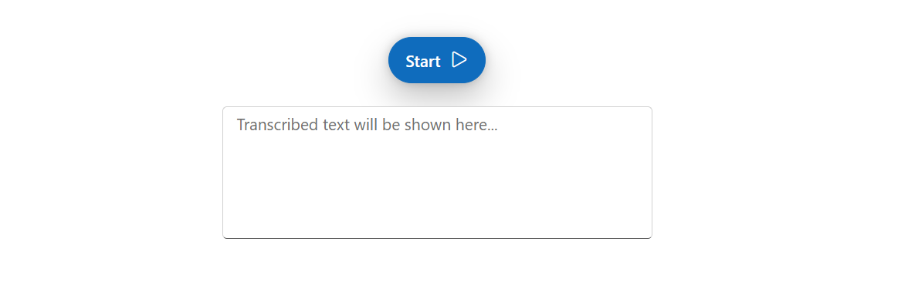

# Appearance in Blazor SpeechToText Component

This guide explains how to customize the visual appearance of the Blazor SpeechToText component.

## Customizing the button

The [ButtonSettings](https://help.syncfusion.com/cr/blazor/Syncfusion.Blazor.Inputs.SfSpeechToText.html#Syncfusion_Blazor_Inputs_SfSpeechToText_ButtonSettings) property allows for detailed customization of the start and stop buttons.

### Text content

Define the text for the button's start and stop states using the [Text](https://help.syncfusion.com/cr/blazor/Syncfusion.Blazor.Inputs.SpeechToTextButtonSettings.html#Syncfusion_Blazor_Inputs_SpeechToTextButtonSettings_Text) and [StopStateText](https://help.syncfusion.com/cr/blazor/Syncfusion.Blazor.Inputs.SpeechToTextButtonSettings.html#Syncfusion_Blazor_Inputs_SpeechToTextButtonSettings_StopStateText) properties.

### Icon

Set a custom icon for the button's start and stop states by applying CSS classes to the [IconCss](https://help.syncfusion.com/cr/blazor/Syncfusion.Blazor.Inputs.SpeechToTextButtonSettings.html#Syncfusion_Blazor_Inputs_SpeechToTextButtonSettings_IconCss) and [StopIconCss](https://help.syncfusion.com/cr/blazor/Syncfusion.Blazor.Inputs.SpeechToTextButtonSettings.html#Syncfusion_Blazor_Inputs_SpeechToTextButtonSettings_StopIconCss) properties.

### Icon position

Use the [IconPosition](https://help.syncfusion.com/cr/blazor/Syncfusion.Blazor.Inputs.SpeechToTextButtonSettings.html#Syncfusion_Blazor_Inputs_SpeechToTextButtonSettings_IconPosition) property to display the icon at the top, bottom, left, or right of the button's text.

### Primary button

Configure the button as a primary action button by setting the [IsPrimary](https://help.syncfusion.com/cr/blazor/Syncfusion.Blazor.Inputs.SpeechToTextButtonSettings.html#Syncfusion_Blazor_Inputs_SpeechToTextButtonSettings_IsPrimary) property to `true`.

The following example demonstrates how to configure these button settings.




@using Syncfusion.Blazor.Inputs
@using Syncfusion.Blazor.Buttons

    <SfSpeechToText ButtonSettings="@buttonSettings" @bind-Transcript="@transcript"></SfSpeechToText>
    <SfTextArea RowCount="5" ColumnCount="50" @bind-Value="@transcript" ResizeMode="Resize.None" Placeholder="Transcribed text will be shown here..."></SfTextArea>

@code {
    string transcript = "";
    SpeechToTextButtonSettings buttonSettings = new SpeechToTextButtonSettings()
    {
        Text = "Start",
        StopStateText = "Stop",
        IconCss = "e-icons e-play",
        StopIconCss = "e-icons e-pause",
        IconPosition = IconPosition.Right,
        isPrimary = true
    };
}




## Customizing the tooltips

The [TooltipSettings](https://help.syncfusion.com/cr/blazor/Syncfusion.Blazor.Inputs.SfSpeechToText.html#Syncfusion_Blazor_Inputs_SfSpeechToText_TooltipSettings) property allows customization of the tooltip's content and position.

### Setting start content

Use the [Text](https://help.syncfusion.com/cr/blazor/Syncfusion.Blazor.Inputs.SpeechToTextTooltipSettings.html#Syncfusion_Blazor_Inputs_SpeechToTextTooltipSettings_Text) and [StopStateText](https://help.syncfusion.com/cr/blazor/Syncfusion.Blazor.Inputs.SpeechToTextTooltipSettings.html#Syncfusion_Blazor_Inputs_SpeechToTextTooltipSettings_StopStateText) properties to set the content for the start and stop state tooltips.

### Tooltip position

Determine where the tooltip appears relative to the button using the [Position](https://help.syncfusion.com/cr/blazor/Syncfusion.Blazor.Inputs.SpeechToTextTooltipSettings.html#Syncfusion_Blazor_Inputs_SpeechToTextTooltipSettings_Position) property.

This example shows how to configure the tooltip settings.




@using Syncfusion.Blazor.Inputs

    <SfSpeechToText TooltipSettings="@tooltipSettings" @bind-Transcript="@transcript"></SfSpeechToText>
    <SfTextArea RowCount="5" ColumnCount="50" @bind-Value="@transcript" ResizeMode="Resize.None" Placeholder="Transcribed text will be shown here..."></SfTextArea>

@code {
    string transcript = "";

    SpeechToTextTooltipSettings tooltipSettings = new SpeechToTextTooltipSettings()
        {
            Position = TooltipPosition.BottomRight,
            Text = "Click the button to start recognition",
            StopStateText = "Click the button to stop recognition"
        };
}




## Styling

Customize the appearance of the SpeechToText component by applying predefined styles or creating custom styles using the [CssClass](https://help.syncfusion.com/cr/blazor/Syncfusion.Blazor.Inputs.SfSpeechToText.html#Syncfusion_Blazor_Inputs_SfSpeechToText_CssClass) property.

### Predefined styles

The component supports several built-in styles for common use cases.

| CssClass    | Description                                   |
|-------------|-----------------------------------------------|
| `e-primary` | Represents a primary action.                  |
| `e-outline` | Renders the button with an outline style.     |
| `e-info`    | Represents an informative action.             |
| `e-success` | Represents a positive action.                 |
| `e-warning` | Represents an action that requires caution.   |
| `e-danger`  | Represents a negative or destructive action.  |

### Custom styles

You can also apply your own CSS rules by assigning a custom class to the [CssClass](https://help.syncfusion.com/cr/blazor/Syncfusion.Blazor.Inputs.SfSpeechToText.html#Syncfusion_Blazor_Inputs_SfSpeechToText_CssClass) property.

The following example demonstrates how to apply a custom CSS class to change the button's background color, text color, and border radius.




@using Syncfusion.Blazor.Inputs

    <SfSpeechToText CssClass="customSpeechBtn" @bind-Transcript="@transcript"></SfSpeechToText>
    <SfTextArea RowCount="5" ColumnCount="50" @bind-Value="@transcript" ResizeMode="Resize.None" Placeholder="Transcribed text will be shown here..."></SfTextArea>

@code {
    string transcript = "";
}




