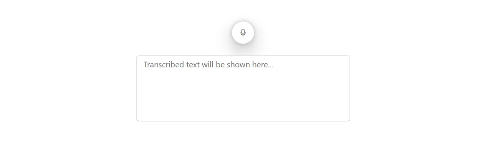
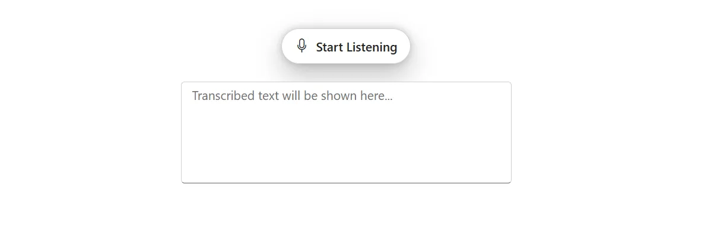
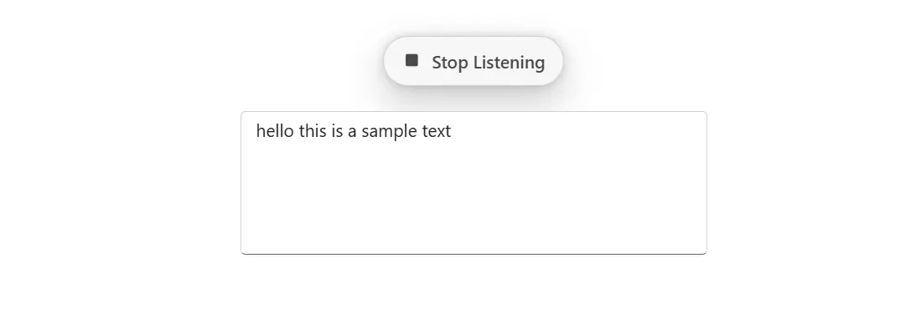

<!-- markdownlint-disable MD040 -->

# Getting Started with Blazor SpeechToText in Blazor WASM App

This section briefly explains about how to include [Blazor SpeechToText](https://www.syncfusion.com/blazor-components/blazor-speech-to-text) component in a Blazor WebAssembly App using [Visual Studio](https://visualstudio.microsoft.com/vs/), [Visual Studio Code](https://code.visualstudio.com/), and the [.NET CLI](https://learn.microsoft.com/en-us/dotnet/core/tools/).

## Create a new Blazor WASM App





Create a **Blazor WebAssembly App** using Visual Studio via [Microsoft Templates](https://learn.microsoft.com/en-us/aspnet/core/blazor/tooling?view=aspnetcore-10.0&pivots=vs) or the [Blazor Extension](https://blazor.syncfusion.com/documentation/visual-studio-integration/template-studio). For detailed instructions, refer to the [Blazor WebAssembly App Getting Started](https://blazor.syncfusion.com/documentation/getting-started/blazor-webassembly-app) documentation.





Run the following command to create a new Blazor WebAssembly App.




dotnet new blazorwasm -o BlazorApp




Alternatively, create a **Blazor WebAssembly App** using Visual Studio Code via [Microsoft Templates](https://learn.microsoft.com/en-us/aspnet/core/blazor/tooling?view=aspnetcore-10.0&pivots=vsc), the [Blazor Extension](https://blazor.syncfusion.com/documentation/visual-studio-code-integration/create-project), or the [C# Dev Kit](https://marketplace.visualstudio.com/items?itemName=ms-dotnettools.csdevkit) extension.





Run the following command to create a new Blazor WebAssembly App.




dotnet new blazorwasm -o BlazorApp








## Install the required Blazor packages

Install [Syncfusion.Blazor.Inputs](https://www.nuget.org/packages/Syncfusion.Blazor.Inputs/) NuGet package. All Syncfusion Blazor packages are available on [nuget.org](https://www.nuget.org/packages?q=syncfusion.blazor). See the [NuGet packages](https://blazor.syncfusion.com/documentation/nuget-packages) topic for details.





1. Go to *Tools → NuGet Package Manager → Manage NuGet Packages for Solution*.
2. Search the required NuGet package (`Syncfusion.Blazor.Inputs`) and install it.

Alternatively, you can install the same packages using the Package Manager Console with the following commands.




Install-Package Syncfusion.Blazor.Inputs -Version {{ site.releaseversion }}








Open the terminal and run the following command.




dotnet add package Syncfusion.Blazor.Inputs -v {{ site.releaseversion }}








Open the command prompt and run the following command.




dotnet add package Syncfusion.Blazor.Inputs -v {{ site.releaseversion }}








## Add import namespaces

After the package is installed, open the **~/_Imports.razor** file and import the `Syncfusion.Blazor` and `Syncfusion.Blazor.Inputs` namespaces.




@using Syncfusion.Blazor
@using Syncfusion.Blazor.Inputs




## Register the Blazor service

Open the **Program.cs** file in Blazor WebAssembly App and register the Blazor service.




....
using Syncfusion.Blazor;
....
builder.Services.AddSyncfusionBlazor();
....




## Add script resources

The script can be accessed from NuGet through [Static Web Assets](https://blazor.syncfusion.com/documentation/appearance/themes#static-web-assets). Include the [script references](https://blazor.syncfusion.com/documentation/common/adding-script-references) in the **~wwwroot/index.html** file.







N> Check out the [Adding Script Reference](https://blazor.syncfusion.com/documentation/common/adding-script-references) topic to learn different approaches for adding script references in the Blazor application.

## Add Blazor SpeechToText component

Open a Razor file located in the **~/Pages/*Index.razor** and add the [Blazor SpeechToText](https://www.syncfusion.com/blazor-components/blazor-speech-to-text) component inside the razor file.




@using Syncfusion.Blazor.Inputs

    <SfSpeechToText @bind-Transcript="@transcript"></SfSpeechToText>
    <SfTextArea RowCount="5" ColumnCount="50" @bind-Value="@transcript" ResizeMode="Resize.None" Placeholder="Transcribed text will be shown here..."></SfTextArea>

@code {
    string transcript = "";
}




**Run the application**





Press <kbd>Ctrl</kbd>+<kbd>F5</kbd> (Windows) or <kbd>⌘</kbd>+<kbd>F5</kbd> (macOS) to launch the application. The Blazor SpeechToText component will render in your default web browser.





Open the terminal and run the following command.




dotnet run








Open the command prompt and run the following command.




dotnet run








> The [SpeechToText](https://help.syncfusion.com/cr/blazor/Syncfusion.Blazor.Inputs.SfSpeechToText.html) component requires an internet connection and a browser that supports the [SpeechRecognition](https://developer.mozilla.org/en-US/docs/Web/API/SpeechRecognition) Web Speech API.

## Add button content

Use the [Text](https://help.syncfusion.com/cr/blazor/Syncfusion.Blazor.Inputs.SpeechToTextButtonSettings.html#Syncfusion_Blazor_Inputs_SpeechToTextButtonSettings_Text) property to display the start listening text and [StopStateText](https://help.syncfusion.com/cr/blazor/Syncfusion.Blazor.Inputs.SpeechToTextButtonSettings.html#Syncfusion_Blazor_Inputs_SpeechToTextButtonSettings_StopStateText) property to display the stop listening text by using the [ButtonSettings](https://help.syncfusion.com/cr/blazor/Syncfusion.Blazor.Inputs.SfSpeechToText.html#Syncfusion_Blazor_Inputs_SfSpeechToText_ButtonSettings) property.




@using Syncfusion.Blazor.Inputs

    <SfSpeechToText ButtonSettings="@buttonSettings" @bind-Transcript="@transcript"></SfSpeechToText>
    <SfTextArea RowCount="5" ColumnCount="50" @bind-Value="@transcript" ResizeMode="Resize.None" Placeholder="Transcribed text will be shown here..."></SfTextArea>

@code {
    string transcript = "";
    SpeechToTextButtonSettings buttonSettings = new SpeechToTextButtonSettings()
    {
        Text = "Start Listening", // Displays when idle
        StopStateText = "Stop Listening" // Displays when speech recognition is active
    };
}




## See also

* [Getting Started with Blazor for Client-Side in .NET Core CLI](https://blazor.syncfusion.com/documentation/getting-started/blazor-webassembly-dotnet-cli)
* [Getting Started with Blazor for Server-Side in Visual Studio](https://blazor.syncfusion.com/documentation/getting-started/blazor-server-side-visual-studio)
* [Getting Started with Blazor for Server-Side in .NET Core CLI](https://blazor.syncfusion.com/documentation/getting-started/blazor-server-side-dotnet-cli)