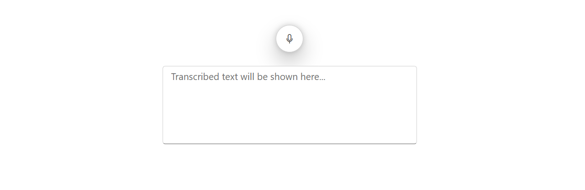
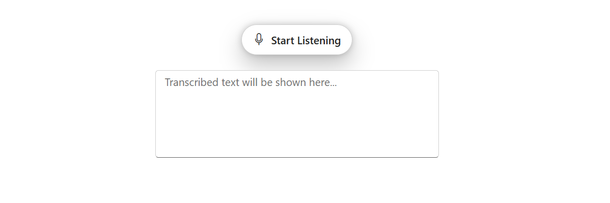
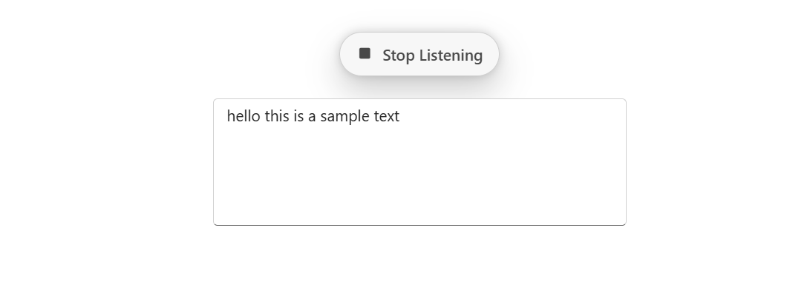

<!-- markdownlint-disable MD040 -->

# Getting Started with Blazor SpeechToText in a Blazor Web App

This section explains how to add the [Blazor SpeechToText](https://www.syncfusion.com/blazor-components) component to your Blazor Web App using Visual Studio and Visual Studio Code.





## Prerequisites

* [System requirements for Blazor components](https://blazor.syncfusion.com/documentation/system-requirements)

## Create a new Blazor Web App in Visual Studio

You can create a **Blazor Web App** using either [Microsoft Templates](https://learn.microsoft.com/en-us/aspnet/core/blazor/tooling?view=aspnetcore-7.0&pivots=vs) or the [Syncfusion<sup style="font-size:70%">&reg;</sup> Blazor Extension](https://blazor.syncfusion.com/documentation/visual-studio-integration/template-studio).

## Install Syncfusion<sup style="font-size:70%">&reg;</sup> Blazor Inputs NuGet in the App

To add **Blazor SpeechToText** to the application, open the NuGet Package Manager in Visual Studio (Tools → NuGet Package Manager → Manage NuGet Packages for Solution), search for and install [Syncfusion.Blazor.Inputs](https://www.nuget.org/packages/Syncfusion.Blazor.Inputs). Alternatively, the package can be installed using the following Package Manager Console command.




Install-Package Syncfusion.Blazor.Inputs -Version {{ site.releaseversion }}




N> Syncfusion<sup style="font-size:70%">&reg;</sup> Blazor components are available on [nuget.org](https://www.nuget.org/packages?q=syncfusion.blazor). Refer to the [NuGet packages](https://blazor.syncfusion.com/documentation/nuget-packages) topic for a complete list of available packages and their corresponding components.





## Prerequisites

* [System requirements for Blazor components](https://blazor.syncfusion.com/documentation/system-requirements)

## Create a new Blazor Web App in Visual Studio Code

You can create a **Blazor Web App** using Visual Studio Code via [Microsoft Templates](https://learn.microsoft.com/en-us/aspnet/core/blazor/tooling?view=aspnetcore-8.0&pivots=vsc) or the [Syncfusion<sup style="font-size:70%">&reg;</sup> Blazor Extension](https://blazor.syncfusion.com/documentation/visual-studio-code-integration/create-project).

The appropriate [Interactive render mode](https://learn.microsoft.com/en-us/aspnet/core/blazor/components/render-modes?view=aspnetcore-8.0#render-modes) and [Interactivity location](https://learn.microsoft.com/en-us/aspnet/core/blazor/tooling?view=aspnetcore-8.0&pivots=vsc) must be configured when setting up the application to ensure correct rendering and behavior of interactive components.

For example, to create a Blazor Web App with the `Auto` interactive render mode, use the following commands.




dotnet new blazor -o BlazorWebApp -int Auto
cd BlazorWebApp
cd BlazorWebApp.Client




N> For more information on creating a **Blazor Web App** with various interactive modes and locations, refer to this [link](https://blazor.syncfusion.com/documentation/getting-started/blazor-web-app?tabcontent=visual-studio-code#render-interactive-modes).

## Install Syncfusion<sup style="font-size:70%">&reg;</sup> Blazor Inputs NuGet in the App

When the `WebAssembly` or `Auto` render mode is used, the Syncfusion<sup style="font-size:70%">&reg;</sup> Blazor NuGet package must be installed in the client project to ensure proper functionality and interactivity.

*   Press <kbd>Ctrl</kbd>+<kbd>`</kbd> to open the integrated terminal in Visual Studio Code.
*   Ensure that the terminal is opened in the root directory of the project, where the `.csproj` file is located.
*   Run the following command to install the [Syncfusion.Blazor.Inputs](https://www.nuget.org/packages/Syncfusion.Blazor.Inputs) NuGet package and its dependencies.





dotnet add package Syncfusion.Blazor.Inputs -v {{ site.releaseversion }}
dotnet restore





N> Syncfusion<sup style="font-size:70%">&reg;</sup> Blazor components are available on [nuget.org](https://www.nuget.org/packages?q=syncfusion.blazor). Refer to the [NuGet packages](https://blazor.syncfusion.com/documentation/nuget-packages) topic for a complete list of available packages and their corresponding components.





## Register Syncfusion<sup style="font-size:70%">&reg;</sup> Blazor Service

Import the `Syncfusion.Blazor` and `Syncfusion.Blazor.Inputs` namespace.

| Interactive Render Mode | File Location |
| -- | -- |
| WebAssembly or Auto | Open `~/_Imports.razor` from the client project. |
| Server | Open `~/_Imports.razor` from the `Components` folder. |




@using Syncfusion.Blazor
@using Syncfusion.Blazor.Inputs




Now, register the Syncfusion<sup style="font-size:70%">&reg;</sup> Blazor Service in the **~/Program.cs** file of your Blazor Web App.

If the **Interactive Render Mode** is set to `WebAssembly` or `Auto`, you need to register the Syncfusion<sup style="font-size:70%">&reg;</sup> Blazor service in both **~/Program.cs** files of your Blazor Web App.




...
...
using Syncfusion.Blazor;

var builder = WebApplication.CreateBuilder(args);

// Add services to the container.
builder.Services.AddRazorComponents()
    .AddInteractiveServerComponents()
    .AddInteractiveWebAssemblyComponents();
builder.Services.AddSyncfusionBlazor();

var app = builder.Build();
....




...
using Syncfusion.Blazor;

var builder = WebAssemblyHostBuilder.CreateDefault(args);
builder.Services.AddSyncfusionBlazor();

await builder.Build().RunAsync();




If the **Interactive Render Mode** is configured as `Server`, the project will contain a single `~/Program.cs` file, where the service should be registered.




...
using Syncfusion.Blazor;

var builder = WebApplication.CreateBuilder(args);

// Add services to the container.
builder.Services.AddRazorComponents()
    .AddInteractiveServerComponents();
builder.Services.AddSyncfusionBlazor();

var app = builder.Build();
....




## Add Script Resources

The required script can be loaded from NuGet through [Static Web Assets](https://blazor.syncfusion.com/documentation/appearance/themes#static-web-assets). Add the script reference at the end of the `<body>` tag in the `~/Components/App.razor` file.

```html
<body>
    ....
    <script src="_content/Syncfusion.Blazor.Core/scripts/syncfusion-blazor.min.js" type="text/javascript"></script>
</body>
```

For detailed guidance on including script references in a Blazor application, refer to the [Adding Script Reference](https://blazor.syncfusion.com/documentation/common/adding-script-references) topic, which outlines various supported methods and best practices.

## Adding Blazor SpeechToText component

Add the Syncfusion<sup style="font-size:70%">&reg;</sup> Blazor SpeechToText component to the `~/Pages/Index.razor` file.




@using Syncfusion.Blazor.Inputs

<div class="speechtext-container">
    <SfSpeechToText @bind-Transcript="@transcript"></SfSpeechToText>
    <SfTextArea RowCount="5" ColumnCount="50" @bind-Value="@transcript" ResizeMode="Resize.None" Placeholder="Transcribed text will be shown here..."></SfTextArea>
</div>

<style>
    .speechtext-container {
        margin: 50px auto;
        gap: 20px;
        display: flex;
        flex-direction: column;
        align-items: center;
    }
</style>

@code {
    string transcript = "";
}




*  Press <kbd>Ctrl</kbd>+<kbd>F5</kbd> (Windows) or <kbd>⌘</kbd>+<kbd>F5</kbd> (macOS) to launch the application. The Syncfusion<sup style="font-size:70%">&reg;</sup> Blazor SpeechToText component will then render in the default web browser.



> The [SpeechToText](https://help.syncfusion.com/cr/blazor/Syncfusion.Blazor.Inputs.SfSpeechToText.html) component requires an active internet connection and a browser that supports the [SpeechRecognition](https://developer.mozilla.org/en-US/docs/Web/API/SpeechRecognition) Web Speech API.

## Adding Button Content

The button text can be customized for different states using the [Text](https://help.syncfusion.com/cr/blazor/Syncfusion.Blazor.Inputs.SpeechToTextButtonSettings.html#Syncfusion_Blazor_Inputs_SpeechToTextButtonSettings_Text) property for the start listening state and the [StopStateText](https://help.syncfusion.com/cr/blazor/Syncfusion.Blazor.Inputs.SpeechToTextButtonSettings.html#Syncfusion_Blazor_Inputs_SpeechToTextButtonSettings_StopStateText) property for the stop listening state, both configured within the [ButtonSettings](https://help.syncfusion.com/cr/blazor/Syncfusion.Blazor.Inputs.SfSpeechToText.html#Syncfusion_Blazor_Inputs_SfSpeechToText_ButtonSettings) section.




@using Syncfusion.Blazor.Inputs

<div class="speechtext-container">
    <SfSpeechToText ButtonSettings="@buttonSettings" @bind-Transcript="@transcript"></SfSpeechToText>
    <SfTextArea RowCount="5" ColumnCount="50" @bind-Value="@transcript" ResizeMode="Resize.None" Placeholder="Transcribed text will be shown here..."></SfTextArea>
</div>

<style>
    .speechtext-container {
        margin: 50px auto;
        gap: 20px;
        display: flex;
        flex-direction: column;
        align-items: center;
    }
</style>

@code {
    string transcript = "";
    SpeechToTextButtonSettings buttonSettings = new SpeechToTextButtonSettings()
    {
        Text = "Start Listening", // Displays when idle
        StopStateText = "Stop Listening" // Displays when speech recognition is active
    };
}







## See Also

1. [Getting Started with Syncfusion<sup style="font-size:70%">&reg;</sup> Blazor for client-side in .NET Core CLI](https://blazor.syncfusion.com/documentation/getting-started/blazor-webassembly-app)
2. [Getting Started with Syncfusion<sup style="font-size:70%">&reg;</sup> Blazor for client-side in Visual Studio](https://blazor.syncfusion.com/documentation/getting-started/blazor-webassembly-visual-studio)
3. [Getting Started with Syncfusion<sup style="font-size:70%">&reg;</sup> Blazor for server-side in .NET Core CLI](https://blazor.syncfusion.com/documentation/getting-started/blazor-web-app)
