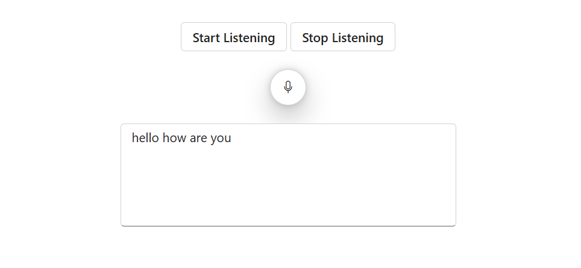

# Methods in Blazor SpeechToText component

The Blazor SpeechToText component provides public methods that allow you to programmatically control its listening state.

## Start listening

The [StartListeningAsync](https://help.syncfusion.com/cr/blazor/Syncfusion.Blazor.Inputs.SfSpeechToText.html#Syncfusion_Blazor_Inputs_SfSpeechToText_StartListeningAsync) public method programmatically initiates speech recognition. When called, the component begins capturing audio and converting it to text.

## Stop listening

The [StopListeningAsync](https://help.syncfusion.com/cr/blazor/Syncfusion.Blazor.Inputs.SfSpeechToText.html#Syncfusion_Blazor_Inputs_SfSpeechToText_StopListeningAsync) public method programmatically stops the speech recognition process.

The following example demonstrates the SpeechToText component configured with above methods.




@using Syncfusion.Blazor.Inputs
@using Syncfusion.Blazor.Buttons

    

        <SfButton Content="Start Listening" OnClick="TriggerStartListening"></SfButton>
        <SfButton Content="Stop Listening" OnClick="TriggerStopListening"></SfButton>
    

    <SfSpeechToText @ref="@speechToText" @bind-Transcript="@transcript"> </SfSpeechToText>
    <SfTextArea RowCount="5" ColumnCount="50" @bind-Value="@transcript" ResizeMode="Resize.None" Placeholder="Transcribed text will be shown here..."></SfTextArea>

@code {
    SfSpeechToText speechToText;
    string transcript = "";

    private async Task TriggerStartListening()
    {
        await speechToText.StartListeningAsync();
    }

    private async Task TriggerStopListening()
    {
        await speechToText.StopListeningAsync();
    }

}




