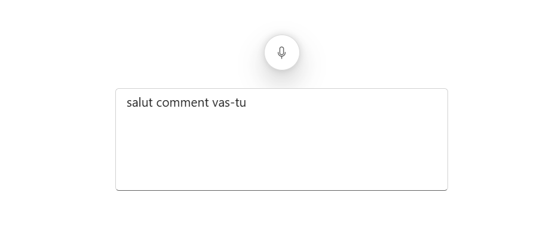
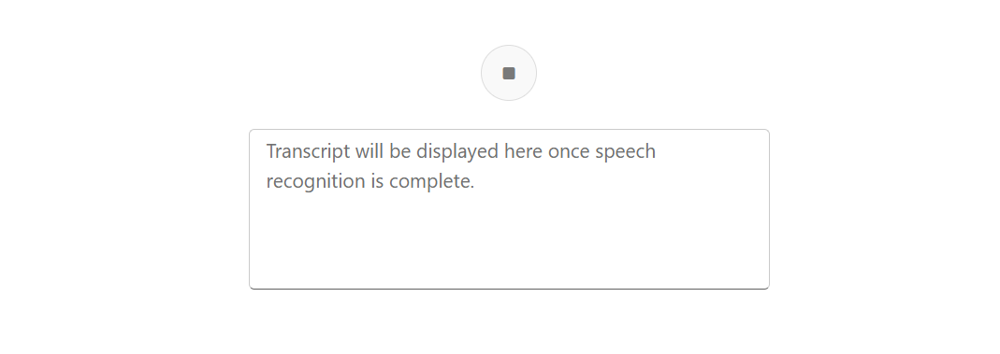
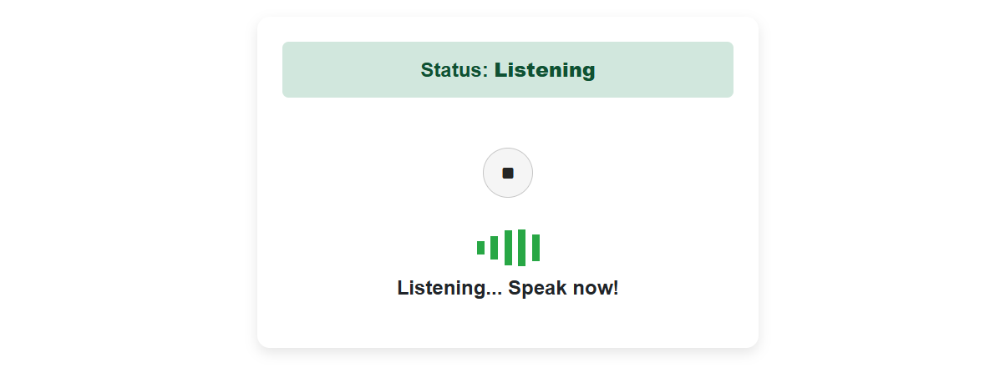
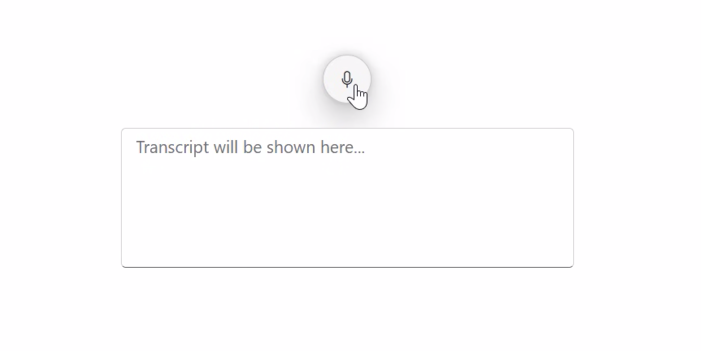
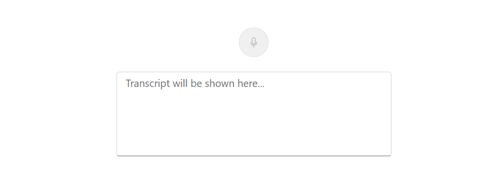

# Speech recognition in Blazor SpeechToText component

The Syncfusion Blazor SpeechToText component offers a comprehensive set of features for managing the speech recognition process. You can retrieve transcribed text, configure the recognition language, control interim results, monitor the component's state, and handle errors.

## Retrieving transcripts

Use the [Transcript](https://help.syncfusion.com/cr/blazor/Syncfusion.Blazor.Inputs.SfSpeechToText.html#Syncfusion_Blazor_Inputs_SfSpeechToText_Transcript) property to retrieve the transcribed text from spoken input. This property allows to display the transcribed text once the speech recognition process is started.




    <SfSpeechToText @bind-Transcript="@transcript"></SfSpeechToText>
    <SfTextArea RowCount="5" ColumnCount="50" @bind-Value="@transcript" ResizeMode="Resize.None" Placeholder="Transcribed text will be shown here..."></SfTextArea>

@code {
    string transcript = "";
}




## Setting language

Specify the recognition language using the [Language](https://help.syncfusion.com/cr/blazor/Syncfusion.Blazor.Inputs.SfSpeechToText.html#Syncfusion_Blazor_Inputs_SfSpeechToText_Language) property. This ensures the recognition engine correctly interprets speech based on the specified locale. The property accepts standard language codes, such as `en-US` for American English, `fr-FR` for French, or `es-ES` for Spanish.




    <SfSpeechToText Language="fr-FR" @bind-Transcript="@transcript"></SfSpeechToText>
    <SfTextArea RowCount="5" ColumnCount="50" @bind-Value="@transcript" ResizeMode="Resize.None" Placeholder="Transcribed text will be shown here..."></SfTextArea>

@code {
    string transcript = "";
}




## Allowing interim results

The [AllowInterimResults](https://help.syncfusion.com/cr/blazor/Syncfusion.Blazor.Inputs.SfSpeechToText.html#Syncfusion_Blazor_Inputs_SfSpeechToText_AllowInterimResults) property controls whether the component displays transcription results as they are being recognized. When `true` (the default), the `Transcript` is updated continuously. When `false`, the `Transcript` is updated only after the speaker pauses and the engine finalizes the result.




    <SfSpeechToText AllowInterimResults="false" @bind-Transcript="@transcript"></SfSpeechToText>
    <SfTextArea RowCount="5" ColumnCount="50" @bind-Value="@transcript" ResizeMode="Resize.None" Placeholder="Transcript will be displayed here once speech recognition is complete."></SfTextArea>

@code {
    string transcript = "";
}




## Managing listening state

Track the component's status using the [ListeningState](https://help.syncfusion.com/cr/blazor/Syncfusion.Blazor.Inputs.SfSpeechToText.html#Syncfusion_Blazor_Inputs_SfSpeechToText_ListeningState) property, which returns the current state of the speech recognition process. This is useful for providing visual feedback to the user.

*   **Inactive**: The component is idle and not performing any recognition. This is the default state.
*   **Listening**: The component is actively capturing audio and transcribing speech.
*   **Stopped**: The speech recognition process has ended, and the component is no longer capturing audio.

Below sample demonstrates the usage of [ListeningState](https://help.syncfusion.com/cr/blazor/Syncfusion.Blazor.Inputs.SfSpeechToText.html#Syncfusion_Blazor_Inputs_SfSpeechToText_ListeningState) property.




@using Syncfusion.Blazor.Inputs

    

        Status: <strong>@listeningState</strong>
    

    <SfSpeechToText ListeningState="listeningState" SpeechRecognitionStopped="(args) => UpdateListeningState(args.State)" SpeechRecognitionStarted="(args) => UpdateListeningState(args.State)"></SfSpeechToText>

    

        @if (listeningState == SpeechToTextState.Listening)
        {
            

                
            

            
Listening... Speak now!

        }
        else
        {
            
Click the button to start listening.

        }
    

@code {
    private SpeechToTextState listeningState = SpeechToTextState.Inactive;

    private void UpdateListeningState(SpeechToTextState state) {
        listeningState = state;
    }

    private string GetStatusClass()
    {
        return listeningState switch
        {
            SpeechToTextState.Listening => "listening",
            SpeechToTextState.Stopped => "stopped",
            _ => "inactive"
        };
    }
}




## Show or hide tooltip

Control the visibility of the tooltip on the component's microphone button using the [ShowTooltip](https://help.syncfusion.com/cr/blazor/Syncfusion.Blazor.Inputs.SfSpeechToText.html#Syncfusion_Blazor_Inputs_SfSpeechToText_ShowTooltip) boolean property. When set to `false`, the default tooltip will not be displayed on hover. The default value is `true`.




@using Syncfusion.Blazor.Inputs

    <SfSpeechToText ShowTooltip="false" @bind-Transcript="@transcript"></SfSpeechToText>
    <SfTextArea RowCount="5" ColumnCount="50" @bind-Value="@transcript" ResizeMode="Resize.None" Placeholder="Transcribed text will be shown here..."></SfTextArea>

@code {
    string transcript = "";
}




## Setting disabled

Disable the SpeechToText component by setting the [Disabled](https://help.syncfusion.com/cr/blazor/Syncfusion.Blazor.Inputs.SfSpeechToText.html#Syncfusion_Blazor_Inputs_SfSpeechToText_Disabled) property to `true`. This prevents all user interaction with the microphone button. By default, this property is `false`.




@using Syncfusion.Blazor.Inputs

    <SfSpeechToText Disabled="true" @bind-Transcript="@transcript"></SfSpeechToText>
    <SfTextArea RowCount="5" ColumnCount="50" @bind-Value="@transcript" ResizeMode="Resize.None" Placeholder="Transcribed text will be shown here..."></SfTextArea>

@code {
    string transcript = "";
}




## Setting html attributes

The [HtmlAttributes](https://help.syncfusion.com/cr/blazor/Syncfusion.Blazor.Inputs.SfSpeechToText.html#Syncfusion_Blazor_Inputs_SfSpeechToText_HtmlAttributes) property allows you to add custom HTML attributes to the component's root element.

## Error handling

The SpeechToText component provides error events to handle various issues during speech recognition. The following table lists common errors and their causes:

| Error                | Cause                                                                                        |
|----------------------|----------------------------------------------------------------------------------------------|
| `no-speech`            | The microphone did not detect any speech.                                                    |
| `aborted`              | The recognition process was terminated, either by the user or programmatically.              |
| `audio-capture`        | No microphone was found, or there was an issue accessing it.                                 |
| `not-allowed`          | Microphone access was denied by the user or a browser security policy.                       |
| `service-not-allowed`  | The browser or service denied recognition for security reasons.                              |
| `network`              | A network connection error prevented communication with the recognition service.             |
| `unsupported-browser`  | The browser does not support the Web Speech API.                                             |
| `default`              | An unspecified or unknown error occurred.                                                    |

## Browser support

The SpeechToText component relies on the browser's implementation of the [Speech Recognition API](https://developer.mozilla.org/en-US/docs/Web/API/SpeechRecognition). Ensure target browsers support this API.

| Browser      | Supported Versions |
|--------------|--------------------|
| Chrome       | 25+                |
| Edge         | 79+                |
| Safari       | 12+              |
| Opera        | 30+                |
| Firefox      | Not Supported      |