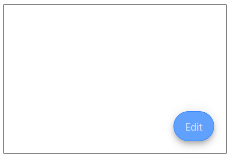
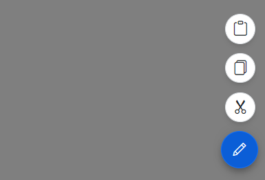

# Appearance in Blazor SpeedDial Component

This section briefly explains about Appearance of Speed dial.

## Disabled

You can enable or disable the Speed Dial Component using [Disabled](https://help.syncfusion.com/cr/blazor/Syncfusion.Blazor.Buttons.SfSpeedDial.html#Syncfusion_Blazor_Buttons_SfSpeedDial_Disabled) property.




@using Syncfusion.Blazor.Buttons

<SfSpeedDial Disabled=true Content="Edit">
    <SpeedDialItems>
        <SpeedDialItem IconCss="e-icons e-cut"/>
        <SpeedDialItem IconCss="e-icons e-copy"/>
        <SpeedDialItem IconCss="e-icons e-paste"/>
    </SpeedDialItems>
</SfSpeedDial>




## Visibility

You can set the Speed Dial Component to visible/hidden state using [Visible](https://help.syncfusion.com/cr/blazor/Syncfusion.Blazor.Buttons.SfSpeedDial.html#Syncfusion_Blazor_Buttons_SfSpeedDial_Visible) property.




@using Syncfusion.Blazor.Buttons

<SfSpeedDial Visible=false Content="Edit">
    <SpeedDialItems>
        <SpeedDialItem IconCss="e-icons e-cut"/>
        <SpeedDialItem IconCss="e-icons e-copy"/>
        <SpeedDialItem IconCss="e-icons e-paste"/>
    </SpeedDialItems>
</SfSpeedDial>




## Modal

You can use the [IsModal](https://help.syncfusion.com/cr/blazor/Syncfusion.Blazor.Buttons.SfSpeedDial.html#Syncfusion_Blazor_Buttons_SfSpeedDial_IsModal) property to set the Speed Dial as modal which adds an overlay to prevent the background interaction.




@using Syncfusion.Blazor.Buttons

<SfSpeedDial IsModal=true Position="FabPosition.BottomRight" OpenIconCss="e-icons e-edit">
    <SpeedDialItems>
        <SpeedDialItem IconCss="e-icons e-cut"/>
        <SpeedDialItem IconCss="e-icons e-copy"/>
        <SpeedDialItem IconCss="e-icons e-paste"/>
    </SpeedDialItems>
</SfSpeedDial>




## Tooltip

You can show tooltip on hover to show additional details to end-user by setting [Title](https://help.syncfusion.com/cr/blazor/Syncfusion.Blazor.Buttons.SpeedDialItem.html#Syncfusion_Blazor_Buttons_SpeedDialItem_Title) property to speed dial items.




@using Syncfusion.Blazor.Buttons

<SfSpeedDial Content="Edit">
    <SpeedDialItems>
        <SpeedDialItem Title="Cut" IconCss="e-icons e-cut"/>
        <SpeedDialItem Title="Copy" IconCss="e-icons e-copy"/>
        <SpeedDialItem Title="Paste" IconCss="e-icons e-paste"/>
    </SpeedDialItems>
</SfSpeedDial>




## CssClass

The Blazor Speed Dial supports the following predefined styles that can be defined using the [CssClass](https://help.syncfusion.com/cr/blazor/Syncfusion.Blazor.Buttons.SfSpeedDial.html#Syncfusion_Blazor_Buttons_SfSpeedDial_CssClass) property. You can customize by setting the `CssClass` property with the below defined class.
You can also customize the Speed dial item, by override the default CSS of Speed dial component by using the `CssClass` property.

| CssClass | Description |
| -------- | -------- |
| e-primary | Used to represent a primary action. |
| e-outline |  Used to represent an appearance of button with outline. |
| e-info |  Used to represent an informative action. |
| e-success | Used to represent a positive action. |
| e-warning | Used to represent an action with caution. |
| e-danger | Used to represent a negative action. |




@using Syncfusion.Blazor.Buttons

<SfSpeedDial CssClass="e-warning" Content="Edit">
    <SpeedDialItems>
        <SpeedDialItem IconCss="e-icons e-cut"/>
        <SpeedDialItem IconCss="e-icons e-copy"/>
        <SpeedDialItem IconCss="e-icons e-paste"/>
    </SpeedDialItems>
</SfSpeedDial>




