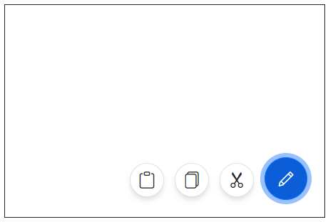

# Display Modes in Blazor Speed Dial Component

The action items in Blazor Speed Dial can be displayed in `Linear` and `Radial` display modes by setting [Mode](https://help.syncfusion.com/cr/blazor/Syncfusion.Blazor.Buttons.SfSpeedDial.html#Syncfusion_Blazor_Buttons_SfSpeedDial_Mode) property.

## Linear display mode

In `Linear` display mode, Speed Dial action items are displayed in a list-like format either horizontally or vertically. By default, Speed Dial items are displayed in `Linear` mode.

### Direction

You can open the action items on the top, left, up, and down side of the Speed Dial button by setting [Direction](https://help.syncfusion.com/cr/blazor/Syncfusion.Blazor.Buttons.SfSpeedDial.html#Syncfusion_Blazor_Buttons_SfSpeedDial_Direction) property. The default value is `Auto` where the action items are displayed based on the [Position](https://help.syncfusion.com/cr/blazor/Syncfusion.Blazor.Buttons.SfSpeedDial.html#Syncfusion_Blazor_Buttons_SfSpeedDial_Position)of the Speed Dial.

The `Linear` directions of Speed Dial are as follows:

* Left - Action items are displayed on the left side of the button.
* Right - Action items are displayed on the right side of the button.
* Up - Action items are displayed on the top of the button.
* Down - Action items are displayed on the bottom of the button.
* Auto - Action items display direction auto calculated based on `Position` of the Speed Dial. If Speed Dial is position at bottom right, then action items displayed at top.

```cshtml

@using Syncfusion.Blazor.Buttons

<SfSpeedDial Mode="SpeedDialMode.Linear" Direction="LinearDirection.Left" OpenIconCss="e-icons e-edit">
    <SpeedDialItems>
        <SpeedDialItem IconCss="e-icons e-cut"/>
        <SpeedDialItem IconCss="e-icons e-copy"/>
        <SpeedDialItem IconCss="e-icons e-paste"/>
    </SpeedDialItems>
</SfSpeedDial>

```



## Radial display mode (Radial Menu)

In `Radial` mode, Speed Dial action items are displayed in a circular pattern like a radial menu. For more details about radial mode, check out the link [here](https://blazor.syncfusion.com/documentation/speeddial/getting-started).
