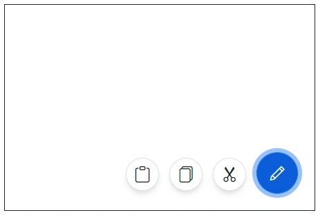

# Display Modes in Blazor Speed Dial

The action items in the Blazor SpeedDial can be displayed in Linear or Radial modes by setting the [Mode](https://help.syncfusion.com/cr/blazor/Syncfusion.Blazor.Buttons.SfSpeedDial.html#Syncfusion_Blazor_Buttons_SfSpeedDial_Mode) property. By default, SpeedDial items are displayed in Linear mode.

## Linear display mode

In `Linear` display mode, SpeedDial action items are displayed in a list-like layout either horizontally or vertically, based on the direction.

### Direction

You can open the action items to the left, right, up, or down side of the SpeedDial button by setting the [Direction](https://help.syncfusion.com/cr/blazor/Syncfusion.Blazor.Buttons.SfSpeedDial.html#Syncfusion_Blazor_Buttons_SfSpeedDial_Direction) property. The `Direction` property applies only when `Mode` is `Linear`. The default value is `Auto`, where the action items are displayed based on the [Position](https://help.syncfusion.com/cr/blazor/Syncfusion.Blazor.Buttons.SfSpeedDial.html#Syncfusion_Blazor_Buttons_SfSpeedDial_Position) of the SpeedDial.

The available [LinearDirection](https://help.syncfusion.com/cr/blazor/Syncfusion.Blazor.Buttons.LinearDirection.html) values are:

* `Left` - Action items are displayed on the left side of the button.
* `Right` - Action items are displayed on the right side of the button.
* `Up` - Action items are displayed above the button.
* `Down` - Action items are displayed below the button.
* `Auto` - The direction is automatically calculated based on the SpeedDial `Position`.

```cshtml

@using Syncfusion.Blazor.Buttons

<SfSpeedDial Mode="SpeedDialMode.Linear" Direction="LinearDirection.Left" OpenIconCss="e-icons e-edit">
    <SpeedDialItems>
        <SpeedDialItem IconCss="e-icons e-cut"/>
        <SpeedDialItem IconCss="e-icons e-copy"/>
        <SpeedDialItem IconCss="e-icons e-paste"/>
    </SpeedDialItems>
</SfSpeedDial>

```



## Radial display mode (Radial Menu)

In `Radial` mode, SpeedDial action items are displayed in a circular pattern similar to a radial menu. Use the [SpeedDialRadialSettings](https://help.syncfusion.com/cr/blazor/Syncfusion.Blazor.Buttons.SpeedDialRadialSettings.html) tag directive to customize the radial direction, start and end angles, and the offset distance from the trigger button. For more details, see [Radial Menu](radial-menu.md).

```cshtml

@using Syncfusion.Blazor.Buttons

<SfSpeedDial Mode="SpeedDialMode.Radial" OpenIconCss="e-icons e-edit">
    <SpeedDialRadialSettings Direction="RadialDirection.Clockwise" OffSet="80px"/>
    <SpeedDialItems>
        <SpeedDialItem IconCss="e-icons e-cut"/>
        <SpeedDialItem IconCss="e-icons e-copy"/>
        <SpeedDialItem IconCss="e-icons e-paste"/>
    </SpeedDialItems>
</SfSpeedDial>

```

