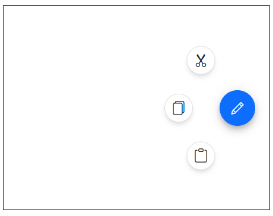
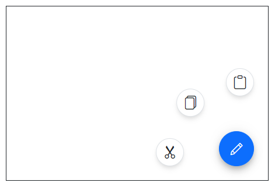

# Display Options in Blazor SpeedDial Component

The action items in Blazor Speed Dial can be displayed in `Linear` and `Radial` display modes by setting [Mode](https://help.syncfusion.com/cr/blazor/Syncfusion.Blazor.Buttons.SfSpeedDial.html#Syncfusion_Blazor_Buttons_SfSpeedDial_Mode) property.

## Open trigger

By default action items displayed only when clicking the speed dial button. You can use [OpensOnHover](https://help.syncfusion.com/cr/blazor/Syncfusion.Blazor.Buttons.SfSpeedDial.html#Syncfusion_Blazor_Buttons_SfSpeedDial_OpensOnHover) property to open actions items on hover itself.




@using Syncfusion.Blazor.Buttons

<SfSpeedDial OpensOnHover=true Content="Edit">
    <SpeedDialItems>
        <SpeedDialItem IconCss="e-icons e-cut"/>
        <SpeedDialItem IconCss="e-icons e-copy"/>
        <SpeedDialItem IconCss="e-icons e-paste"/>
    </SpeedDialItems>
</SfSpeedDial>





## Animation

The Speed Dial items can be animated during the opening and closing of the popup action items. You can customize the animation's `Effect`, `Delay`, and `Duration` by setting [SpeedDialAnimationSettings](https://help.syncfusion.com/cr/blazor/Syncfusion.Blazor.Buttons.SpeedDialAnimationSettings.html) tag directive. By default, Speed Dial animates with a `Fade` effect and supports all [SpeedDialAnimationEffect](https://help.syncfusion.com/cr/blazor/Syncfusion.Blazor.Buttons.SpeedDialAnimationEffect.html) effects.

Below example demonstrates the Speed Dial items with applied Zoom effect.

```cshtml

@using Syncfusion.Blazor.Buttons

<SfSpeedDial OpenIconCss="e-icons e-edit" CloseIconCss="e-icons e-close" Content="Edit">
    <SpeedDialItems>
        <SpeedDialItem Text="Cut" IconCss="e-icons e-cut"/>
        <SpeedDialItem Text="Copy" IconCss="e-icons e-copy"/>
        <SpeedDialItem Text="Paste" IconCss="e-icons e-paste"/>
    </SpeedDialItems>
    <SpeedDialAnimationSettings Effect="SpeedDialAnimationEffect.Zoom"></SpeedDialAnimationSettings>
</SfSpeedDial>

```


## Modes

You can use the [`Mode`](https://help.syncfusion.com/cr/blazor/Syncfusion.Blazor.Buttons.SfSpeedDial.html#Syncfusion_Blazor_Buttons_SfSpeedDial_Mode) property to either display the menu in linear order like a list or like a radial menu in radial (circular) direction.

## Linear mode

In `Linear` display mode, Speed Dial action items are displayed in a list-like format either horizontally or vertically. By default, Speed Dial items are displayed in `Linear` mode.

### Direction

You can open the action items on the top, left, up, and down side of the Speed Dial button by setting [Direction](https://help.syncfusion.com/cr/blazor/Syncfusion.Blazor.Buttons.SfSpeedDial.html#Syncfusion_Blazor_Buttons_SfSpeedDial_Direction) property. The default value is `Auto` where the action items are displayed based on the [Position](https://help.syncfusion.com/cr/blazor/Syncfusion.Blazor.Buttons.SfSpeedDial.html#Syncfusion_Blazor_Buttons_SfSpeedDial_Position) of the Speed Dial.

The `Linear` directions of Speed Dial are as follows:

* Left - Action items are displayed on the left side of the button.
* Right - Action items are displayed on the right side of the button.
* Up - Action items are displayed on the top of the button.
* Down - Action items are displayed on the bottom of the button.
* Auto - Action items display direction auto calculated based on `Position` of the Speed Dial. If Speed Dial is position at bottom right, then action items displayed at top.

```cshtml

@using Syncfusion.Blazor.Buttons

<SfSpeedDial Mode="SpeedDialMode.Linear" Direction="LinearDirection.Left" OpenIconCss="e-icons e-edit">
    <SpeedDialItems>
        <SpeedDialItem IconCss="e-icons e-cut"/>
        <SpeedDialItem IconCss="e-icons e-copy"/>
        <SpeedDialItem IconCss="e-icons e-paste"/>
    </SpeedDialItems>
</SfSpeedDial>

```


## Radial mode 

The action items in Blazor Speed Dial can be displayed in a circular patter like a radial menu by setting [Mode](https://help.syncfusion.com/cr/blazor/Syncfusion.Blazor.Buttons.SfSpeedDial.html#Syncfusion_Blazor_Buttons_SfSpeedDial_Mode) property. You can customize the `Direction`, `StartAngle`, `EndAngle` and `Offset` by setting [SpeedDialRadialSettings](https://help.syncfusion.com/cr/blazor/Syncfusion.Blazor.Buttons.SpeedDialRadialSettings.html) tag directive.

### Direction

You can open the action items in either clockwise or anticlockwise by setting [Direction](https://help.syncfusion.com/cr/blazor/Syncfusion.Blazor.Buttons.SpeedDialRadialSettings.html#Syncfusion_Blazor_Buttons_SpeedDialRadialSettings_Direction) property. The default value is `Auto` where the action items are displayed based on the `Position` property of the Speed Dial.

```cshtml

@using Syncfusion.Blazor.Buttons

<SfSpeedDial Mode="SpeedDialMode.Radial" OpenIconCss="e-icons e-edit">
    <SpeedDialRadialSettings Direction="RadialDirection.AntiClockwise"/>
    <SpeedDialItems>
        <SpeedDialItem IconCss="e-icons e-cut"/>
        <SpeedDialItem IconCss="e-icons e-copy"/>
        <SpeedDialItem IconCss="e-icons e-paste"/>
    </SpeedDialItems>
</SfSpeedDial>

```


### Start and end angle

You can modify the start and end angle of action items by setting [StartAngle](https://help.syncfusion.com/cr/blazor/Syncfusion.Blazor.Buttons.SpeedDialRadialSettings.html#Syncfusion_Blazor_Buttons_SpeedDialRadialSettings_StartAngle) and [EndAngle](https://help.syncfusion.com/cr/blazor/Syncfusion.Blazor.Buttons.SpeedDialRadialSettings.html#Syncfusion_Blazor_Buttons_SpeedDialRadialSettings_EndAngle) properties. If the angle is not defined, the action items are displayed based on the `Position` property of the Speed Dial.

The SpeedDial angle starts with `0` degree in the right side and increases in the clockwise direction.


```cshtml

@using Syncfusion.Blazor.Buttons

<SfSpeedDial Position="FabPosition.MiddleCenter" Mode="SpeedDialMode.Radial" OpenIconCss="e-icons e-edit">
    <SpeedDialRadialSettings Direction="RadialDirection.AntiClockwise" StartAngle="180" EndAngle="360"/>
    <SpeedDialItems>
        <SpeedDialItem IconCss="e-icons e-cut"/>
        <SpeedDialItem IconCss="e-icons e-copy"/>
        <SpeedDialItem IconCss="e-icons e-paste"/>
    </SpeedDialItems>
</SfSpeedDial>

```



### Offset

You can modify the offset distance between action items and Speed Dial button using [Offset](https://help.syncfusion.com/cr/blazor/Syncfusion.Blazor.Buttons.SpeedDialRadialSettings.html#Syncfusion_Blazor_Buttons_SpeedDialRadialSettings_OffSet) property.

```cshtml

@using Syncfusion.Blazor.Buttons

<SfSpeedDial Mode="SpeedDialMode.Radial" OpenIconCss="e-icons e-edit">
    <SpeedDialRadialSettings OffSet="80px"/>
    <SpeedDialItems>
        <SpeedDialItem IconCss="e-icons e-cut"/>
        <SpeedDialItem IconCss="e-icons e-copy"/>
        <SpeedDialItem IconCss="e-icons e-paste"/>
    </SpeedDialItems>
</SfSpeedDial>

```

