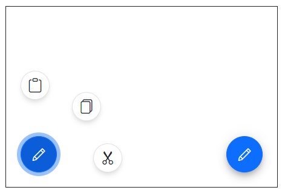
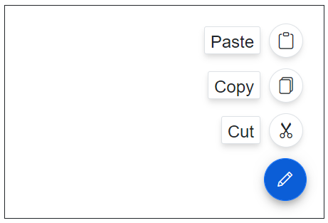

# Getting Started with Blazor SpeedDial in Blazor Web App

This section briefly explains about how to include `Blazor SpeedDial` component in your Blazor Web App using [Visual Studio](https://visualstudio.microsoft.com/vs/).

## Prerequisites

* [System requirements for Blazor components](https://blazor.syncfusion.com/documentation/system-requirements)

## Create a new Blazor Web App

You can create a **Blazor Web App** using Visual Studio 2022 via [Microsoft Templates](https://learn.microsoft.com/en-us/aspnet/core/blazor/tooling?view=aspnetcore-8.0) or the [Syncfusion Blazor Extension](https://blazor.syncfusion.com/documentation/visual-studio-integration/template-studio).

You need to configure the corresponding [Interactive render mode](https://learn.microsoft.com/en-us/aspnet/core/blazor/components/render-modes?view=aspnetcore-8.0#render-modes) and [Interactivity location](https://learn.microsoft.com/en-us/aspnet/core/blazor/tooling?view=aspnetcore-8.0&pivots=windows) while creating a Blazor Web Application.

## Install Syncfusion Blazor Buttons and Themes NuGet in the App

To add **Blazor SpeedDial** component in the app, open the NuGet package manager in Visual Studio (*Tools → NuGet Package Manager → Manage NuGet Packages for Solution*), search and install [Syncfusion.Blazor.Buttons](https://www.nuget.org/packages/Syncfusion.Blazor.Buttons) and [Syncfusion.Blazor.Themes](https://www.nuget.org/packages/Syncfusion.Blazor.Themes/).

If you utilize `WebAssembly or Auto` render modes in the Blazor Web App need to be install Syncfusion Blazor components NuGet packages within the client project.

Alternatively, you can utilize the following package manager command to achieve the same.




Install-Package Syncfusion.Blazor.Buttons -Version {{ site.releaseversion }}
Install-Package Syncfusion.Blazor.Themes -Version {{ site.releaseversion }}




N> Syncfusion Blazor components are available in [nuget.org](https://www.nuget.org/packages?q=syncfusion.blazor). Refer to [NuGet packages](https://blazor.syncfusion.com/documentation/nuget-packages) topic for available NuGet packages list with component details.

## Register Syncfusion Blazor Service

Open **~/_Imports.razor** file and import the `Syncfusion.Blazor` and `Syncfusion.Blazor.Buttons` namespace .

```cshtml

@using Syncfusion.Blazor
@using Syncfusion.Blazor.Buttons

```

Now, register the Syncfusion Blazor Service in the **~/Program.cs** file of your Blazor Web App.

If you select an **Interactive render mode** as `WebAssembly` or `Auto`, you need to register the Syncfusion Blazor service in both **~/Program.cs** files of your Blazor Web App.

```cshtml

....
using Syncfusion.Blazor;
....
builder.Services.AddSyncfusionBlazor();
....

```

## Add stylesheet and script resources

The theme stylesheet and script can be accessed from NuGet through [Static Web Assets](https://blazor.syncfusion.com/documentation/appearance/themes#static-web-assets). Include the stylesheet reference in the `<head>` section and the script reference at the end of the `<body>` in the **~/Components/App.razor** file as shown below:

```html
<head>
    ....
    <link href="_content/Syncfusion.Blazor.Themes/material.css" rel="stylesheet" />
</head>

<body>
    ....
    <script src="_content/Syncfusion.Blazor.Core/scripts/syncfusion-blazor.min.js" type="text/javascript"></script>
</body>

```

N> Check out the [Blazor Themes](https://blazor.syncfusion.com/documentation/appearance/themes) topic to discover various methods ([Static Web Assets](https://blazor.syncfusion.com/documentation/appearance/themes#static-web-assets), [CDN](https://blazor.syncfusion.com/documentation/appearance/themes#cdn-reference), and [CRG](https://blazor.syncfusion.com/documentation/common/custom-resource-generator)) for referencing themes in your Blazor application. Also, check out the [Adding Script Reference](https://blazor.syncfusion.com/documentation/common/adding-script-references) topic to learn different approaches for adding script references in your Blazor application.

## Add Syncfusion Blazor SpeedDial component

Add the Syncfusion Blazor SpeedDial component in the **~Pages/.razor** file. If an interactivity location as `Per page/component` in the web app, define a render mode at the top of the `~Pages/.razor` component, as follows:




@* desired render mode define here *@
@rendermode InteractiveAuto







<div id="target" style="min-height:200px; position:relative; width:300px; border:1px solid;">
    <SfSpeedDial Target="#target" Content="Edit">
        <SpeedDialItems>
            <SpeedDialItem Text="Cut"/>
            <SpeedDialItem Text="Copy"/>
            <SpeedDialItem Text="Paste"/>
        </SpeedDialItems>
    </SfSpeedDial>
</div>




* Press <kbd>Ctrl</kbd>+<kbd>F5</kbd> (Windows) or <kbd>⌘</kbd>+<kbd>F5</kbd> (macOS) to launch the application. This will render the Syncfusion Blazor SpeedDial component in your default web browser.


N> [View Sample in GitHub](https://github.com/SyncfusionExamples/Blazor-Getting-Started-Examples/tree/main/SpeedDial/BlazorWebApp).

## Linear and radial display modes

You can use the [`Mode`](https://help.syncfusion.com/cr/blazor/Syncfusion.Blazor.Buttons.SfSpeedDial.html#Syncfusion_Blazor_Buttons_SfSpeedDial_Mode) property to either display the menu in linear order like a list or like a radial menu in radial (circular) direction.




<div id="target" style="min-height:200px; position:relative; width:300px; border:1px solid;">
    <SfSpeedDial Target="#target" Position="FabPosition.BottomLeft" Mode="SpeedDialMode.Radial" OpenIconCss="e-icons e-edit">
        <SpeedDialRadialSettings OffSet="80px"/>
        <SpeedDialItems>
            <SpeedDialItem IconCss="e-icons e-cut"/>
            <SpeedDialItem IconCss="e-icons e-copy"/>
            <SpeedDialItem IconCss="e-icons e-paste"/>
        </SpeedDialItems>
    </SfSpeedDial>
    <SfSpeedDial Target="#target" Position="FabPosition.BottomRight" Mode="SpeedDialMode.Linear" OpenIconCss="e-icons e-edit">
        <SpeedDialItems>
            <SpeedDialItem IconCss="e-icons e-cut" Text="Cut"/>
            <SpeedDialItem IconCss="e-icons e-copy" Text="Copy"/>
            <SpeedDialItem IconCss="e-icons e-paste" Text="Paste"/>
        </SpeedDialItems>
    </SfSpeedDial>
</div>







## Item clicked event

The speed dial control triggers the [`ItemClicked`](https://help.syncfusion.com/cr/blazor/Syncfusion.Blazor.Buttons.SfSpeedDial.html#Syncfusion_Blazor_Buttons_SfSpeedDial_ItemClicked) event with [`SpeedDialItemEventArgs`](https://help.syncfusion.com/cr/blazor/Syncfusion.Blazor.Buttons.SpeedDialItemEventArgs.html) argument when an action item is clicked. You can use this event to perform the required action.




<div id="target" style="min-height:200px; position:relative; width:300px; border:1px solid;">
    <SfSpeedDial Target="#target" OpenIconCss="e-icons e-edit" ItemClicked="ItemEventClick">
        <SpeedDialItems>
            <SpeedDialItem IconCss="e-icons e-cut" Text="Cut"/>
            <SpeedDialItem IconCss="e-icons e-copy" Text="Copy"/>
            <SpeedDialItem IconCss="e-icons e-paste" Text="Paste"/>
        </SpeedDialItems>
    </SfSpeedDial>
</div>

@code{
    public void ItemEventClick(SpeedDialItemEventArgs args)
    {
        // Here, you can call your desired action.
    }
}





N> You can also explore our [Blazor Speed Dial Button example](https://blazor.syncfusion.com/demos/speeddial/defaultfunctionalities) that shows how to render and configure the button.