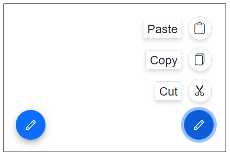

# Getting Started with Blazor SpeedDial in Blazor Web App

This section briefly explains about how to include `Blazor SpeedDial` component in your Blazor Web App using [Visual Studio](https://visualstudio.microsoft.com/vs/), [Visual Studio Code](https://code.visualstudio.com/), and the [.NET CLI](https://learn.microsoft.com/en-us/dotnet/core/tools/).





## Prerequisites

* [System requirements for Blazor components](https://blazor.syncfusion.com/documentation/system-requirements)

## Create a new Blazor Web App in Visual Studio

Create a **Blazor Web App** using Visual Studio 2022 via [Microsoft Templates](https://learn.microsoft.com/en-us/aspnet/core/blazor/tooling?view=aspnetcore-10.0&pivots=vs) or the [Syncfusion<sup style="font-size:70%">&reg;</sup> Blazor Extension](https://blazor.syncfusion.com/documentation/visual-studio-integration/template-studio).

Configure the appropriate [Interactive render mode](https://learn.microsoft.com/en-us/aspnet/core/blazor/components/render-modes?view=aspnetcore-10.0#render-modes) and [Interactivity location](https://learn.microsoft.com/en-us/aspnet/core/blazor/tooling?view=aspnetcore-10.0&pivots=vs) while creating a Blazor Web App.


## Install Syncfusion<sup style="font-size:70%">&reg;</sup> Blazor Buttons and Themes NuGet in the App

To add the **Blazor SpeedDial** component in the app, open the NuGet package manager in Visual Studio (*Tools → NuGet Package Manager → Manage NuGet Packages for Solution*), then search and install [Syncfusion.Blazor.Buttons](https://www.nuget.org/packages/Syncfusion.Blazor.Buttons) and [Syncfusion.Blazor.Themes](https://www.nuget.org/packages/Syncfusion.Blazor.Themes/).

If using the `WebAssembly or Auto` render modes in the Blazor Web App, install Syncfusion<sup style="font-size:70%">&reg;</sup> Blazor component NuGet packages in the client project.

Alternatively, run the following commands in the Package Manager Console to achieve the same.




Install-Package Syncfusion.Blazor.Buttons -Version {{ site.releaseversion }}
Install-Package Syncfusion.Blazor.Themes -Version {{ site.releaseversion }}




N> Syncfusion<sup style="font-size:70%">&reg;</sup> Blazor components are available in [nuget.org](https://www.nuget.org/packages?q=syncfusion.blazor). Refer to the [NuGet packages](https://blazor.syncfusion.com/documentation/nuget-packages) topic for available NuGet packages list with component details.





## Prerequisites

* [System requirements for Blazor components](https://blazor.syncfusion.com/documentation/system-requirements)

## Create a new Blazor Web App in Visual Studio Code

Create a **Blazor Web App** using Visual Studio Code via [Microsoft Templates](https://learn.microsoft.com/en-us/aspnet/core/blazor/tooling?view=aspnetcore-10.0&pivots=vsc) or the [Syncfusion<sup style="font-size:70%">&reg;</sup> Blazor Extension](https://blazor.syncfusion.com/documentation/visual-studio-code-integration/create-project).

Configure the appropriate interactive render mode and interactivity location when setting up a Blazor Web App. For detailed information, refer to the [interactive render mode documentation](https://blazor.syncfusion.com/documentation/common/interactive-render-mode).

For example, to create a Blazor Web App with the `Auto` interactive render mode, use the following commands.




dotnet new blazor -o BlazorWebApp -int Auto
cd BlazorWebApp
cd BlazorWebApp.Client




## Install Syncfusion<sup style="font-size:70%">&reg;</sup> Blazor Buttons and Themes NuGet in the App

If using the `WebAssembly` or `Auto` render modes in the Blazor Web App, install Syncfusion<sup style="font-size:70%">&reg;</sup> Blazor component NuGet packages in the client project.

* Press <kbd>Ctrl</kbd>+<kbd>`</kbd> to open the integrated terminal in Visual Studio Code.
* Ensure you’re in the project root directory where your `.csproj` file is located.
* Run the following command to install a [Syncfusion.Blazor.Buttons](https://www.nuget.org/packages/Syncfusion.Blazor.Buttons) and [Syncfusion.Blazor.Themes](https://www.nuget.org/packages/Syncfusion.Blazor.Themes/) NuGet package and ensure all dependencies are installed.





dotnet add package Syncfusion.Blazor.Buttons -v {{ site.releaseversion }}
dotnet add package Syncfusion.Blazor.Themes -v {{ site.releaseversion }}
dotnet restore





N> Syncfusion<sup style="font-size:70%">&reg;</sup> Blazor components are available in [nuget.org](https://www.nuget.org/packages?q=syncfusion.blazor). Refer to the [NuGet packages](https://blazor.syncfusion.com/documentation/nuget-packages) topic for the available NuGet packages list with component details.





## Prerequisites

Latest version of the [.NET SDK](https://dotnet.microsoft.com/en-us/download). If you previously installed the SDK, you can determine the installed version by executing the following command in a command prompt (Windows) or terminal (macOS) or command shell (Linux).




dotnet --version




## Create a Blazor Web App using .NET CLI

Run the following command to create a new Blazor Web App in a command prompt (Windows) or terminal (macOS) or command shell (Linux). For detailed instructions, refer to [this Blazor Web App Getting Started](https://blazor.syncfusion.com/documentation/getting-started/blazor-web-app?tabcontent=.net-cli) documentation.

Configure the appropriate interactive render mode and interactivity location when setting up a Blazor Web Application. For detailed information, refer to the [interactive render mode documentation](https://blazor.syncfusion.com/documentation/common/interactive-render-mode).

For example, to create a Blazor Web App with the `Auto` interactive render mode, use the following commands:




dotnet new blazor -o BlazorApp -int Auto
cd BlazorApp
cd BlazorApp.Client




This command creates a new Blazor Web App and places it in a new directory called `BlazorApp` inside your current location. See the [Create a Blazor App](https://dotnet.microsoft.com/en-us/learn/aspnet/blazor-tutorial/create) and [dotnet new CLI command](https://learn.microsoft.com/en-us/aspnet/core/blazor/tooling?pivots=cli&view=aspnetcore-10.0) topics for more details.

## Install Syncfusion<sup style="font-size:70%">&reg;</sup> Blazor Buttons and Themes NuGet in the App

Here's an example of how to add **Blazor Speed Dial** component in the application using the following command in the command prompt (Windows) or terminal (Linux and macOS) to install a [Syncfusion.Blazor.Buttons](https://www.nuget.org/packages/Syncfusion.Blazor.Buttons/) and [Syncfusion.Blazor.Themes](https://www.nuget.org/packages/Syncfusion.Blazor.Themes/) NuGet package. See [Install and manage packages using the dotnet CLI](https://learn.microsoft.com/en-us/nuget/consume-packages/install-use-packages-dotnet-cli) topics for more details.

If using the `WebAssembly or Auto` render modes in the Blazor Web App, install Syncfusion<sup style="font-size:70%">&reg;</sup> Blazor component NuGet packages in the client project.




dotnet add package Syncfusion.Blazor.Buttons --version {{ site.releaseversion }}
dotnet add package Syncfusion.Blazor.Themes --version {{ site.releaseversion }}
dotnet restore




N> Syncfusion<sup style="font-size:70%">&reg;</sup> Blazor components are available in [nuget.org](https://www.nuget.org/packages?q=syncfusion.blazor). Refer to the [NuGet packages](https://blazor.syncfusion.com/documentation/nuget-packages) topic for the available NuGet packages list with component details.





## Add Import Namespaces

Open the **~/_Imports.razor** file from the client project and import the `Syncfusion.Blazor` and `Syncfusion.Blazor.Buttons` namespace.




@using Syncfusion.Blazor
@using Syncfusion.Blazor.Buttons




## Register Syncfusion<sup style="font-size:70%">&reg;</sup> Blazor Service

Register the Syncfusion<sup style="font-size:70%">&reg;</sup> Blazor Service in the **~/Program.cs** file of your Blazor Web App.

If the **Interactive Render Mode** is set to `WebAssembly` or `Auto`, register the Syncfusion<sup style="font-size:70%">&reg;</sup> Blazor service in the **~/Program.cs** files of the main `server` project and associated `.Client` project.




...
...
using Syncfusion.Blazor;

var builder = WebApplication.CreateBuilder(args);

// Add services to the container.
builder.Services.AddRazorComponents()
    .AddInteractiveServerComponents()
    .AddInteractiveWebAssemblyComponents();
builder.Services.AddSyncfusionBlazor();

var app = builder.Build();
....




...
using Syncfusion.Blazor;

var builder = WebAssemblyHostBuilder.CreateDefault(args);
builder.Services.AddSyncfusionBlazor();

await builder.Build().RunAsync();




## Add stylesheet and script resources

The theme stylesheet and script are provided via NuGet as [static web assets](https://blazor.syncfusion.com/documentation/appearance/themes#static-web-assets). Add the stylesheet reference in the head and the script reference at the end of the body in **~/Components/App.razor** as shown below. The script enables client-side interactivity for Syncfusion components.

```html
<head>
    ....
    <link href="_content/Syncfusion.Blazor.Themes/bootstrap5.css" rel="stylesheet" />
</head>

<body>
    ....
    <script src="_content/Syncfusion.Blazor.Core/scripts/syncfusion-blazor.min.js" type="text/javascript"></script>
</body>

```

N> Check out the [Blazor Themes](https://blazor.syncfusion.com/documentation/appearance/themes) topic to discover various methods ([Static Web Assets](https://blazor.syncfusion.com/documentation/appearance/themes#static-web-assets), [CDN](https://blazor.syncfusion.com/documentation/appearance/themes#cdn-reference), and [CRG](https://blazor.syncfusion.com/documentation/common/custom-resource-generator)) for referencing themes in your Blazor application. Also, check out the [Adding Script Reference](https://blazor.syncfusion.com/documentation/common/adding-script-references) topic to learn different approaches for adding script references in your Blazor application.

## Add Syncfusion<sup style="font-size:70%">&reg;</sup> Blazor SpeedDial component

Add the Syncfusion<sup style="font-size:70%">&reg;</sup> Blazor SpeedDial component to a Razor page located under the Pages folder (e.g., Pages/Home.razor) in either the **Server** or **Client** project. If an interactivity location as `Per page/component` in the web app, define a render mode at top of the component, as follows:

| Interactivity location | RenderMode | Code |
| --- | --- | --- |
| Per page/component | Auto | @rendermode InteractiveAuto |
|  | WebAssembly | @rendermode InteractiveWebAssembly |
|  | None | --- |

N> If an **Interactivity Location** is set to `Global` and the **Render Mode** is set to `Auto` or `WebAssembly`, the render mode is configured in the `App.razor` file by default.




@* desired render mode define here *@
@rendermode InteractiveAuto







<div id="target" style="min-height:200px; position:relative; width:300px; border:1px solid;">
    <SfSpeedDial Target="#target" Content="Edit">
        <SpeedDialItems>
            <SpeedDialItem Text="Cut"/>
            <SpeedDialItem Text="Copy"/>
            <SpeedDialItem Text="Paste"/>
        </SpeedDialItems>
    </SfSpeedDial>
</div>




* Press <kbd>Ctrl</kbd>+<kbd>F5</kbd> (Windows) or <kbd>⌘</kbd>+<kbd>F5</kbd> (macOS) to launch the application. This will render the Syncfusion<sup style="font-size:70%">&reg;</sup> Blazor SpeedDial component in the default web browser.



N> [View Sample in GitHub](https://github.com/SyncfusionExamples/Blazor-Getting-Started-Examples/tree/main/SpeedDial/BlazorWebApp).

## Linear and radial display modes

You can use the [`Mode`](https://help.syncfusion.com/cr/blazor/Syncfusion.Blazor.Buttons.SfSpeedDial.html#Syncfusion_Blazor_Buttons_SfSpeedDial_Mode) property to either display the menu in linear order like a list or like a radial menu in radial (circular) direction.




<div id="target" style="min-height:200px; position:relative; width:300px; border:1px solid;">
    <SfSpeedDial Target="#target" Position="FabPosition.BottomLeft" Mode="SpeedDialMode.Radial" OpenIconCss="e-icons e-edit">
        <SpeedDialRadialSettings OffSet="80px"/>
        <SpeedDialItems>
            <SpeedDialItem IconCss="e-icons e-cut"/>
            <SpeedDialItem IconCss="e-icons e-copy"/>
            <SpeedDialItem IconCss="e-icons e-paste"/>
        </SpeedDialItems>
    </SfSpeedDial>
    <SfSpeedDial Target="#target" Position="FabPosition.BottomRight" Mode="SpeedDialMode.Linear" OpenIconCss="e-icons e-edit">
        <SpeedDialItems>
            <SpeedDialItem IconCss="e-icons e-cut" Text="Cut"/>
            <SpeedDialItem IconCss="e-icons e-copy" Text="Copy"/>
            <SpeedDialItem IconCss="e-icons e-paste" Text="Paste"/>
        </SpeedDialItems>
    </SfSpeedDial>
</div>






## Item clicked event

The speed dial control triggers the [`ItemClicked`](https://help.syncfusion.com/cr/blazor/Syncfusion.Blazor.Buttons.SfSpeedDial.html#Syncfusion_Blazor_Buttons_SfSpeedDial_ItemClicked) event with [`SpeedDialItemEventArgs`](https://help.syncfusion.com/cr/blazor/Syncfusion.Blazor.Buttons.SpeedDialItemEventArgs.html) argument when an action item is clicked. You can use this event to perform the required action.




<div id="target" style="min-height:200px; position:relative; width:300px; border:1px solid;">
    <SfSpeedDial Target="#target" OpenIconCss="e-icons e-edit" ItemClicked="ItemEventClick">
        <SpeedDialItems>
            <SpeedDialItem IconCss="e-icons e-cut" Text="Cut"/>
            <SpeedDialItem IconCss="e-icons e-copy" Text="Copy"/>
            <SpeedDialItem IconCss="e-icons e-paste" Text="Paste"/>
        </SpeedDialItems>
    </SfSpeedDial>
</div>

@code{
    public void ItemEventClick(SpeedDialItemEventArgs args)
    {
        // Here, you can call your desired action.
    }
}





N> Explore the [Blazor Speed Dial Button example](https://blazor.syncfusion.com/demos/speeddial/defaultfunctionalities) that shows how to render and configure the button.