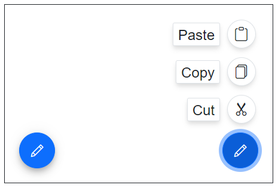

# Getting Started with Blazor SpeedDial Component

This section explains how to add the Blazor SpeedDial component to a Blazor WebAssembly application using [Visual Studio](https://visualstudio.microsoft.com/vs/), [Visual Studio Code](https://code.visualstudio.com/), and the [.NET CLI](https://learn.microsoft.com/en-us/dotnet/core/tools/).

To get start quickly with Blazor SpeedDial component, refer to this [GitHub](https://github.com/SyncfusionExamples/Blazor-Getting-Started-Examples/tree/main/SpeedDial) sample.





## Prerequisites

* [System requirements for Blazor components](https://blazor.syncfusion.com/documentation/system-requirements)

## Create a new Blazor App in Visual Studio

Create a **Blazor WebAssembly App** using Visual Studio via [Microsoft Templates](https://learn.microsoft.com/en-us/aspnet/core/blazor/tooling?view=aspnetcore-10.0&pivots=vs) or the [Syncfusion<sup style="font-size:70%">&reg;</sup> Blazor Extension](https://blazor.syncfusion.com/documentation/visual-studio-integration/template-studio). For detailed instructions, refer to the [Blazor WASM App Getting Started](https://blazor.syncfusion.com/documentation/getting-started/blazor-webassembly-app) documentation.


## Install Syncfusion<sup style="font-size:70%">&reg;</sup> Blazor Buttons and Themes NuGet in the App

To add the Blazor SpeedDial component, open NuGet Package Manager in Visual Studio (Tools → NuGet Package Manager → Manage NuGet Packages for Solution), then search and install [Syncfusion.Blazor.Buttons](https://www.nuget.org/packages/Syncfusion.Blazor.Buttons) and [Syncfusion.Blazor.Themes](https://www.nuget.org/packages/Syncfusion.Blazor.Themes/). Alternatively, run the following commands in the Package Manager Console to achieve the same.




Install-Package Syncfusion.Blazor.Buttons -Version {{ site.releaseversion }}
Install-Package Syncfusion.Blazor.Themes -Version {{ site.releaseversion }}




N> Syncfusion<sup style="font-size:70%">&reg;</sup> Blazor components are available in [nuget.org](https://www.nuget.org/packages?q=syncfusion.blazor). Refer to the [NuGet packages](https://blazor.syncfusion.com/documentation/nuget-packages) topic for the available NuGet packages list with component details.





## Prerequisites

* [System requirements for Blazor components](https://blazor.syncfusion.com/documentation/system-requirements)

## Create a new Blazor App in Visual Studio Code

Create a **Blazor WebAssembly App** using Visual Studio Code via [Microsoft Templates](https://learn.microsoft.com/en-us/aspnet/core/blazor/tooling?view=aspnetcore-10.0&pivots=vsc) or the [Syncfusion<sup style="font-size:70%">&reg;</sup> Blazor Extension](https://blazor.syncfusion.com/documentation/visual-studio-code-integration/create-project). For detailed instructions, refer to the [Blazor WASM App Getting Started](https://blazor.syncfusion.com/documentation/getting-started/blazor-webassembly-app?tabcontent=visual-studio-code) documentation.

Alternatively, create a WebAssembly application by using the following command in the integrated terminal(<kbd>Ctrl</kbd>+<kbd>`</kbd>).





dotnet new blazorwasm -o BlazorApp
cd BlazorApp





## Install Syncfusion<sup style="font-size:70%">&reg;</sup> Blazor Buttons and Themes NuGet in the App

* Press <kbd>Ctrl</kbd>+<kbd>`</kbd> to open the integrated terminal in Visual Studio Code.
* Ensure in the project root directory where the `.csproj` file is located.
* Run the following commands to install the [Syncfusion.Blazor.Buttons](https://www.nuget.org/packages/Syncfusion.Blazor.Buttons) and [Syncfusion.Blazor.Themes](https://www.nuget.org/packages/Syncfusion.Blazor.Themes/) NuGet packages and ensure all dependencies are installed.





dotnet add package Syncfusion.Blazor.Buttons -v {{ site.releaseversion }}
dotnet add package Syncfusion.Blazor.Themes -v {{ site.releaseversion }}
dotnet restore





N> Syncfusion<sup style="font-size:70%">&reg;</sup> Blazor components are available in [nuget.org](https://www.nuget.org/packages?q=syncfusion.blazor). Refer to the [NuGet packages](https://blazor.syncfusion.com/documentation/nuget-packages) topic for the available NuGet packages list with component details.





## Prerequisites

Install the latest version of [.NET SDK](https://dotnet.microsoft.com/en-us/download). If the .NET SDK is already installed, determine the installed version by running the following command in a command prompt (Windows), terminal (macOS), or command shell (Linux).




dotnet --version




## Create a Blazor WebAssembly App using .NET CLI

Run the following command to create a new Blazor WebAssembly App in a command prompt (Windows) or terminal (macOS) or command shell (Linux). For detailed instructions, refer to [this Blazor WASM App Getting Started](https://blazor.syncfusion.com/documentation/getting-started/blazor-webassembly-app?tabcontent=.net-cli) documentation.




dotnet new blazorwasm -o BlazorApp
cd BlazorApp




## Install Syncfusion<sup style="font-size:70%">&reg;</sup> Blazor Buttons and Themes NuGet in the App

To add the **Blazor SpeedDial** component to the application, run the following commands in a command prompt (Windows), command shell (Linux), or terminal (macOS) to install the [Syncfusion.Blazor.Buttons](https://www.nuget.org/packages/Syncfusion.Blazor.Buttons/) and [Syncfusion.Blazor.Themes](https://www.nuget.org/packages/Syncfusion.Blazor.Themes/) NuGet packages. See [Install and manage packages using the dotnet CLI](https://learn.microsoft.com/en-us/nuget/consume-packages/install-use-packages-dotnet-cli) for more details.




dotnet add package Syncfusion.Blazor.Buttons -Version {{ site.releaseversion }}
dotnet add package Syncfusion.Blazor.Themes -Version {{ site.releaseversion }}
dotnet restore




N> Syncfusion<sup style="font-size:70%">&reg;</sup> Blazor components are available in [nuget.org](https://www.nuget.org/packages?q=syncfusion.blazor). Refer to the [NuGet packages](https://blazor.syncfusion.com/documentation/nuget-packages) topic for the available NuGet packages list with component details.





## Add Import Namespaces

Open the **~/_Imports.razor** file and import the `Syncfusion.Blazor` and `Syncfusion.Blazor.Buttons` namespaces.




@using Syncfusion.Blazor
@using Syncfusion.Blazor.Buttons




## Register Syncfusion<sup style="font-size:70%">&reg;</sup> Blazor Service

Register the Syncfusion<sup style="font-size:70%">&reg;</sup> Blazor Service in the **~/Program.cs** file of the Blazor WebAssembly App.




using Microsoft.AspNetCore.Components.Web;
using Microsoft.AspNetCore.Components.WebAssembly.Hosting;
using Syncfusion.Blazor;

var builder = WebAssemblyHostBuilder.CreateDefault(args);
builder.RootComponents.Add<App>("#app");
builder.RootComponents.Add<HeadOutlet>("head::after");

builder.Services.AddScoped(sp => new HttpClient { BaseAddress = new Uri(builder.HostEnvironment.BaseAddress) });

builder.Services.AddSyncfusionBlazor();
await builder.Build().RunAsync();
....




## Add stylesheet and script resources

The theme stylesheet and script can be accessed from NuGet through [Static Web Assets](https://blazor.syncfusion.com/documentation/appearance/themes#static-web-assets). Include the stylesheet and script references within the `<head>` section of the **~/index.html** file.

```html
<head>
    ....
    <link href="_content/Syncfusion.Blazor.Themes/bootstrap5.css" rel="stylesheet" />
    <script src="_content/Syncfusion.Blazor.Core/scripts/syncfusion-blazor.min.js" type="text/javascript"></script>
</head>
```

N> Check out the [Blazor Themes](https://blazor.syncfusion.com/documentation/appearance/themes) topic to discover various methods ([Static Web Assets](https://blazor.syncfusion.com/documentation/appearance/themes#static-web-assets), [CDN](https://blazor.syncfusion.com/documentation/appearance/themes#cdn-reference), and [CRG](https://blazor.syncfusion.com/documentation/common/custom-resource-generator)) for referencing themes in Blazor application. Also, check out the [Adding Script Reference](https://blazor.syncfusion.com/documentation/common/adding-script-references) topic to learn different approaches for adding script references in Blazor application.

## Add Blazor SpeedDial component

Add the Syncfusion<sup style="font-size:70%">&reg;</sup> Blazor SpeedDial component in the **~/Pages/Index.razor** file.




@using Syncfusion.Blazor.Buttons

<div id="target" style="min-height:200px; position:relative; width:300px; border:1px solid;">
    <SfSpeedDial Target="#target" Content="Edit">
        <SpeedDialItems>
            <SpeedDialItem Text="Cut"/>
            <SpeedDialItem Text="Copy"/>
            <SpeedDialItem Text="Paste"/>
        </SpeedDialItems>
    </SfSpeedDial>
</div>



* Press <kbd>Ctrl</kbd>+<kbd>F5</kbd> (Windows) or <kbd>⌘</kbd>+<kbd>F5</kbd> (macOS) to run the application. The Syncfusion<sup style="font-size:70%">&reg;</sup> Blazor SpeedDial component will render in the default web browser.



## Linear and radial display modes

Use the [`Mode`](https://help.syncfusion.com/cr/blazor/Syncfusion.Blazor.Buttons.SfSpeedDial.html#Syncfusion_Blazor_Buttons_SfSpeedDial_Mode) property to display action items either in a linear list or as a radial (circular) menu.




<div id="target" style="min-height:200px; position:relative; width:300px; border:1px solid;">
    <SfSpeedDial Target="#target" Position="FabPosition.BottomLeft" Mode="SpeedDialMode.Radial" OpenIconCss="e-icons e-edit">
        <SpeedDialRadialSettings OffSet="80px"/>
        <SpeedDialItems>
            <SpeedDialItem IconCss="e-icons e-cut"/>
            <SpeedDialItem IconCss="e-icons e-copy"/>
            <SpeedDialItem IconCss="e-icons e-paste"/>
        </SpeedDialItems>
    </SfSpeedDial>
    <SfSpeedDial Target="#target" Position="FabPosition.BottomRight" Mode="SpeedDialMode.Linear" OpenIconCss="e-icons e-edit">
        <SpeedDialItems>
            <SpeedDialItem IconCss="e-icons e-cut" Text="Cut"/>
            <SpeedDialItem IconCss="e-icons e-copy" Text="Copy"/>
            <SpeedDialItem IconCss="e-icons e-paste" Text="Paste"/>
        </SpeedDialItems>
    </SfSpeedDial>
</div>






## Item clicked event

The SpeedDial control triggers the [`ItemClicked`](https://help.syncfusion.com/cr/blazor/Syncfusion.Blazor.Buttons.SfSpeedDial.html#Syncfusion_Blazor_Buttons_SfSpeedDial_ItemClicked) event with [`SpeedDialItemEventArgs`](https://help.syncfusion.com/cr/blazor/Syncfusion.Blazor.Buttons.SpeedDialItemEventArgs.html) when an action item is clicked. Use this event to perform the required action.




<div id="target" style="min-height:200px; position:relative; width:300px; border:1px solid;">
    <SfSpeedDial Target="#target" OpenIconCss="e-icons e-edit" ItemClicked="ItemEventClick">
        <SpeedDialItems>
            <SpeedDialItem IconCss="e-icons e-cut" Text="Cut"/>
            <SpeedDialItem IconCss="e-icons e-copy" Text="Copy"/>
            <SpeedDialItem IconCss="e-icons e-paste" Text="Paste"/>
        </SpeedDialItems>
    </SfSpeedDial>
</div>

@code{
    public void ItemEventClick(SpeedDialItemEventArgs args)
    {
        // Here, you can call your desired action.
    }
}





N> Explore the [Blazor Speed Dial Button example](https://blazor.syncfusion.com/demos/speeddial/defaultfunctionalities) that shows how to render and configure the button.
