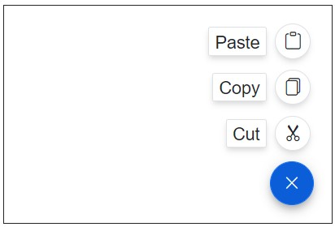
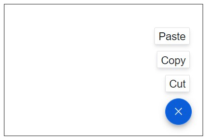

# Items in Blazor Speed Dial Component

## Icon types

The types of Speed Dial Item Icons are as follows:

* Icon Only
* Icon with Text
* Text Only

## Speed Dial Item with Icon Only

Use IconCss property to display the icon. Speed Dial can have an icon to provide the visual representation of the action. To place the icon on a Speed Dial item, set the [IconCss](https://help.syncfusion.com/cr/blazor/Syncfusion.Blazor.Buttons.SpeedDialItem.html#Syncfusion_Blazor_Buttons_SpeedDialItem_IconCss) property to `e-icons` with the required icon CSS.

In the following example, Speed Dial Item is demonstrated with only icons by providing the IconCss property.

```cshtml

@using Syncfusion.Blazor.Buttons

<div id="target" style="min-height:200px; position:relative; width:300px; border:1px solid;">
    <SfSpeedDial id="speeddial" Target="#target" Position="FabPosition.BottomRight" OpenIconCss="e-icons e-edit" CloseIconCss="e-icons e-close">
        <SpeedDialItems>
            <SpeedDialItem IconCss="e-icons e-cut"/>
            <SpeedDialItem IconCss="e-icons e-copy"/>
            <SpeedDialItem IconCss="e-icons e-paste"/>
        </SpeedDialItems>
    </SfSpeedDial>
</div>

```


## Speed Dial Item with Icon and Text

Use [Text](https://help.syncfusion.com/cr/blazor/Syncfusion.Blazor.Buttons.SpeedDialItem.html#Syncfusion_Blazor_Buttons_SpeedDialItem_Text) property and [IconCss](https://help.syncfusion.com/cr/blazor/Syncfusion.Blazor.Buttons.SpeedDialItem.html#Syncfusion_Blazor_Buttons_SpeedDialItem_IconCss) property to display the icon and text.

```cshtml

@using Syncfusion.Blazor.Buttons
<div id="target" style="min-height:200px; position:relative; width:300px; border:1px solid;">
    <SfSpeedDial id="speeddial" Target="#target" Position="FabPosition.BottomRight" OpenIconCss="e-icons e-edit" CloseIconCss="e-icons e-close">
        <SpeedDialItems>
            <SpeedDialItem IconCss="e-icons e-cut" Text="Cut"/>
            <SpeedDialItem IconCss="e-icons e-copy" Text="Copy"/>
            <SpeedDialItem IconCss="e-icons e-paste" Text="Paste"/>
        </SpeedDialItems>
    </SfSpeedDial>
</div>

```



## Speed Dial Item with Text Only

Use [Text](https://help.syncfusion.com/cr/blazor/Syncfusion.Blazor.Buttons.SpeedDialItem.html#Syncfusion_Blazor_Buttons_SpeedDialItem_Text) property to display the text.

```cshtml

@using Syncfusion.Blazor.Buttons

<div id="target" style="min-height:200px; position:relative; width:300px; border:1px solid;">
    <SfSpeedDial id="speeddial" Target="#target" Position="FabPosition.BottomRight" OpenIconCss="e-icons e-edit" CloseIconCss="e-icons e-close">
        <SpeedDialItems>
            <SpeedDialItem Text="Cut"/>
            <SpeedDialItem Text="Copy"/>
            <SpeedDialItem Text="Paste"/>
        </SpeedDialItems>
    </SfSpeedDial>
</div>

```


## Animation

Animation provides options to customize the animation applied while opening and closing the popup. Use [Effect](https://help.syncfusion.com/cr/blazor/Syncfusion.Blazor.Buttons.SpeedDialAnimationSettings.html#Syncfusion_Blazor_Buttons_SpeedDialAnimationSettings_Effect) property to customize animation effects. Animation effect applied when open and close the speed dial items.

| List of Effects |  |  | 
| --- | --- | --- | 
| Fade | FadeZoom | FlipLeftDown | 
| FlipLeftUp | FlipRightDown| FlipRightUp|
| FlipXDown | FlipXUp | FlipYLeft |
| FlipYRight | SlideBottom | SlideLeft |
| SlideRight | SlideTop | Zoom |

In the following example, Speed Dial Item is demonstrated with Effect property.

```cshtml

@using Syncfusion.Blazor.Buttons

<div id="target" style="min-height:200px; position:relative; width:300px; border:1px solid;">
    <SfSpeedDial Target="#target" Position="FabPosition.BottomRight" OpenIconCss="e-icons e-edit" CloseIconCss="e-icons e-close">
        <SpeedDialItems>
            <SpeedDialItem  Text="Cut"/>
            <SpeedDialItem  Text="Copy"/>
            <SpeedDialItem  Text="Paste"/>
        </SpeedDialItems>
        <SpeedDialAnimationSettings Effect=SpeedDialAnimationEffect.Zoom></SpeedDialAnimationSettings>
    </SfSpeedDial>
</div>

```



## Template

Types of Template
*Item Template
*PopUp Template

## Item Template

The template content is defined as a child content of <b>ItemTemplate</b> tag directive. The default value of template content is null. The `ItemTemplate` used to define custom template for speed dial item. Use the template’s context parameter to access SpeedDialItem properties.

## PopUp Template

It can display a menu of related actions `SpeedDialItems` or a custom content `PopupTemplate`. The template content is defined as a child content of <b>PopupTemplate</b> tag directive.

> [To learn more about Templates](https://blazor.syncfusion.com/documentation/speeddial/template)