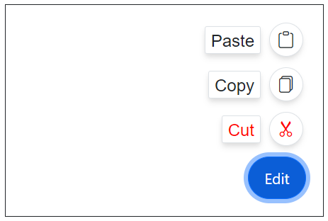

# Items in Blazor Speed Dial Component

The action items in Blazor Speed Dial can be added by using [SpeedDialItem](https://help.syncfusion.com/cr/blazor/Syncfusion.Blazor.Buttons.SpeedDialItem.html) tag directive.

| Fields | Type | Description |
|------|------|-------------|
| [Text](https://help.syncfusion.com/cr/blazor/Syncfusion.Blazor.Buttons.SpeedDialItem.html#Syncfusion_Blazor_Buttons_SpeedDialItem_Text) | `string` | Defines the text content of SpeedDialItem. |
| [IconCss](https://help.syncfusion.com/cr/blazor/Syncfusion.Blazor.Buttons.SpeedDialItem.html#Syncfusion_Blazor_Buttons_SpeedDialItem_IconCss) | `string` | Defines one or more CSS classes to include an icon or image in speed dial item. |
| [Disabled](https://help.syncfusion.com/cr/blazor/Syncfusion.Blazor.Buttons.SpeedDialItem.html#Syncfusion_Blazor_Buttons_SpeedDialItem_Disabled) | `boolean` | Defines whether to enable or disable the SpeedDialItem. |
| [Id](https://help.syncfusion.com/cr/blazor/Syncfusion.Blazor.Buttons.SpeedDialItem.html#Syncfusion_Blazor_Buttons_SpeedDialItem_ID) | `string` | Defines a unique value for the SpeedDialItem which can be used to identify the item in event args. |
| [Title](https://help.syncfusion.com/cr/blazor/Syncfusion.Blazor.Buttons.SpeedDialItem.html#Syncfusion_Blazor_Buttons_SpeedDialItem_Title) | `string` | Defines the title of SpeedDialItem to display tooltip. |

## Icons in speeddial items

You can customize the icon and text of Speed Dial action items using [IconCss](https://help.syncfusion.com/cr/blazor/Syncfusion.Blazor.Buttons.SpeedDialItem.html#Syncfusion_Blazor_Buttons_SpeedDialItem_IconCss) and [Text](https://help.syncfusion.com/cr/blazor/Syncfusion.Blazor.Buttons.SpeedDialItem.html#Syncfusion_Blazor_Buttons_SpeedDialItem_Text) properties.

### Icon only

You can show icon only in SpeedDial items by setting [IconCss](https://help.syncfusion.com/cr/blazor/Syncfusion.Blazor.Buttons.SpeedDialItem.html#Syncfusion_Blazor_Buttons_SpeedDialItem_IconCss) property. You can show tooltip on hover to show additional details to end-user by setting [Title](https://help.syncfusion.com/cr/blazor/Syncfusion.Blazor.Buttons.SpeedDialItem.html#Syncfusion_Blazor_Buttons_SpeedDialItem_Title) property.

```cshtml

@using Syncfusion.Blazor.Buttons

<SfSpeedDial OpenIconCss="e-icons e-edit" CloseIconCss="e-icons e-close">
    <SpeedDialItems>
        <SpeedDialItem Title="Cut" IconCss="e-icons e-cut"/>
        <SpeedDialItem Title="Copy" IconCss="e-icons e-copy"/>
        <SpeedDialItem Title="Paste" IconCss="e-icons e-paste"/>
    </SpeedDialItems>
</SfSpeedDial>

```


### Text Only

You can show only text in Speed Dial items by setting [Text](https://help.syncfusion.com/cr/blazor/Syncfusion.Blazor.Buttons.SpeedDialItem.html#Syncfusion_Blazor_Buttons_SpeedDialItem_Text) property.

```cshtml

@using Syncfusion.Blazor.Buttons

<SfSpeedDial Content="Edit">
    <SpeedDialItems>
        <SpeedDialItem Text="Cut"/>
        <SpeedDialItem Text="Copy"/>
        <SpeedDialItem Text="Paste"/>
    </SpeedDialItems>
</SfSpeedDial>

```


### Icon with Text

You can show icon along with text in Speed Dial items by setting [IconCss](https://help.syncfusion.com/cr/blazor/Syncfusion.Blazor.Buttons.SpeedDialItem.html#Syncfusion_Blazor_Buttons_SpeedDialItem_IconCss) and [Text](https://help.syncfusion.com/cr/blazor/Syncfusion.Blazor.Buttons.SpeedDialItem.html#Syncfusion_Blazor_Buttons_SpeedDialItem_Text) properties.

```cshtml

@using Syncfusion.Blazor.Buttons

<SfSpeedDial OpenIconCss="e-icons e-edit" CloseIconCss="e-icons e-close" Content="Edit">
    <SpeedDialItems>
        <SpeedDialItem Text="Cut" IconCss="e-icons e-cut"/>
        <SpeedDialItem Text="Copy" IconCss="e-icons e-copy"/>
        <SpeedDialItem Text="Paste" IconCss="e-icons e-paste"/>
    </SpeedDialItems>
</SfSpeedDial>

```


### Disabled

You can disable Speed Dial items by setting [Disabled](https://help.syncfusion.com/cr/blazor/Syncfusion.Blazor.Buttons.SpeedDialItem.html#Syncfusion_Blazor_Buttons_SpeedDialItem_Disabled) property as `true`.

```cshtml

@using Syncfusion.Blazor.Buttons

<SfSpeedDial Content="Edit">
    <SpeedDialItems>
        <SpeedDialItem Text="Cut" Disabled=true/>
        <SpeedDialItem Text="Copy"/>
        <SpeedDialItem Text="Paste"/>
    </SpeedDialItems>
</SfSpeedDial>

```


## Animation

The Speed Dial items can be animated during the opening and closing of the popup action items. You can customize the animation's `Effect`, `Delay`, and `Duration` by setting [SpeedDialAnimationSettings](https://help.syncfusion.com/cr/blazor/Syncfusion.Blazor.Buttons.SpeedDialAnimationSettings.html) tag directive. By default, Speed Dial animates with a `Fade` effect and supports all [SpeedDialAnimationEffect](https://help.syncfusion.com/cr/blazor/Syncfusion.Blazor.Buttons.SpeedDialAnimationEffect.html) effects.

Below example demonstrates the Speed Dial items with applied Zoom effect.

```cshtml

@using Syncfusion.Blazor.Buttons

<SfSpeedDial OpenIconCss="e-icons e-edit" CloseIconCss="e-icons e-close" Content="Edit">
    <SpeedDialItems>
        <SpeedDialItem Text="Cut" IconCss="e-icons e-cut"/>
        <SpeedDialItem Text="Copy" IconCss="e-icons e-copy"/>
        <SpeedDialItem Text="Paste" IconCss="e-icons e-paste"/>
    </SpeedDialItems>
    <SpeedDialAnimationSettings Effect="SpeedDialAnimationEffect.Zoom"></SpeedDialAnimationSettings>
</SfSpeedDial>

```


## Template

The Speed Dial supports to customize the action items and entire pop-up container by setting [ItemTemplate](https://help.syncfusion.com/cr/blazor/Syncfusion.Blazor.Buttons.SfSpeedDial.html#Syncfusion_Blazor_Buttons_SfSpeedDial_ItemTemplate) and [PopupTemplate](https://help.syncfusion.com/cr/blazor/Syncfusion.Blazor.Buttons.SfSpeedDial.html#Syncfusion_Blazor_Buttons_SfSpeedDial_PopupTemplate) tag directive. For more details about templates, check out the link [here](https://blazor.syncfusion.com/documentation/speeddial/getting-started).

## HTML attribute

The Blazor Speed Dial items support adding custom HTML attributes with [HtmlAttributes](https://help.syncfusion.com/cr/blazor/Syncfusion.Blazor.Buttons.SpeedDialItem.html#Syncfusion_Blazor_Buttons_SpeedDialItem_HtmlAttributes) property to customize the items. You can add them as inline attributes or use the `@attributes` directive.

Below example demonstrates the Speed Dial items with HTML attributes.

```cshtml

@using Syncfusion.Blazor.Buttons

<SfSpeedDial Content="Edit"> 
    <SpeedDialItems>
        <SpeedDialItem Text="Cut" IconCss="e-icons e-cut" style="color:red;"></SpeedDialItem>
        <SpeedDialItem Text="Copy" IconCss="e-icons e-copy"></SpeedDialItem>
        <SpeedDialItem Text="Paste" IconCss="e-icons e-paste"></SpeedDialItem>
    </SpeedDialItems>
</SfSpeedDial> 

```

