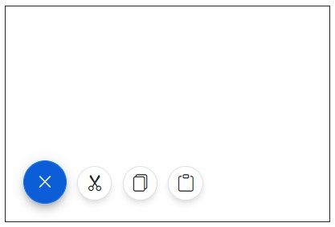

# Mode in Blazor Speed Dial Component

## Types of Mode
* Linear
* Radial

## Linear Mode

SpeedDial items are displayed in linear order like list. Use [Mode](https://help.syncfusion.com/cr/blazor/Syncfusion.Blazor.Buttons.SfSpeedDial.html#Syncfusion_Blazor_Buttons_SfSpeedDial_Mode) property to display the Items in linear order direction. In Linear Mode below directions are available

| List of Directions | 
|--|
| Right | 
| Left | 
| Up | 
| Down | 
| Auto |

In `Auto` direction Speed dial action items are displayed vertically above or below the button of Speed Dial based on the Speed Dial button position. In the following example, Speed Dial Items are demonstrated with [Direction](https://help.syncfusion.com/cr/blazor/Syncfusion.Blazor.Buttons.SfSpeedDial.html#Syncfusion_Blazor_Buttons_SfSpeedDial_Direction) property.

```cshtml

@using Syncfusion.Blazor.Buttons

<div id="target" style="height:200px; position:relative; width:300px; border:1px solid;">
    <SfSpeedDial Target="#target" Position="FabPosition.BottomLeft" Mode="SpeedDialMode.Linear" Direction="LinearDirection.Right" OpenIconCss="e-icons e-edit" CloseIconCss="e-icons e-close">
        <SpeedDialItems>
            <SpeedDialItem IconCss="e-icons e-cut"/>
            <SpeedDialItem IconCss="e-icons e-copy"/>
            <SpeedDialItem IconCss="e-icons e-paste"/>
        </SpeedDialItems>
    </SfSpeedDial>
</div>

```



## Radial Mode

SpeedDial items are displayed like radial menu in radial direction (circular direction). Use [Mode](https://help.syncfusion.com/cr/blazor/Syncfusion.Blazor.Buttons.SfSpeedDial.html#Syncfusion_Blazor_Buttons_SfSpeedDial_Mode) property to display the Items in Radial menu order direction. In Radial Mode below directions are available

| List of Directions | 
|--|
| Clockwise | 
| AntiClockwise |  
| Auto |

In `Auto` direction Speed dial action items are displayed clockwise or anti-clockwise based on the Speed Dial button position.

> [To learn more about Radial Mode](https://blazor.syncfusion.com/documentation/speeddial/radial-menu).