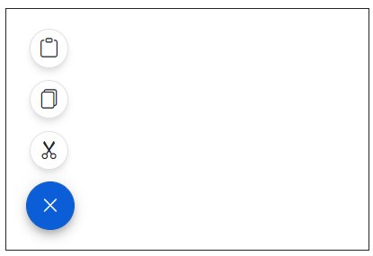
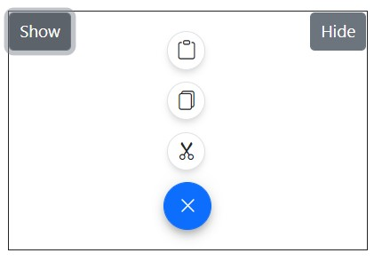
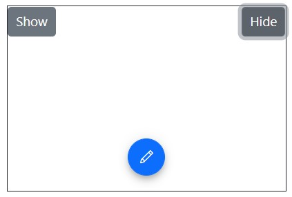

# Positions in Blazor Speed Dial Component

## OpensOnHover

[OpensOnHover](https://help.syncfusion.com/cr/blazor/Syncfusion.Blazor.Buttons.SfSpeedDial.html#Syncfusion_Blazor_Buttons_SfSpeedDial_OpensOnHover) property indicates whether to open the popup when the button of SpeedDial is hovered. By default, SpeedDial opens popup on click action. By default the OpensOnHover is false. Opens popup on mouse hover action is achieved by [OpensOnHover](https://help.syncfusion.com/cr/blazor/Syncfusion.Blazor.Buttons.SfSpeedDial.html#Syncfusion_Blazor_Buttons_SfSpeedDial_OpensOnHover) property when the value is true.

```cshtml

@using Syncfusion.Blazor.Buttons

<div id="target" style="height:200px; position:relative; width:300px; border:1px solid;">
    <SfSpeedDial Target="#target" Position="FabPosition.BottomLeft" OpensOnHover=true OpenIconCss="e-icons e-edit" CloseIconCss="e-icons e-close">
        <SpeedDialItems>
            <SpeedDialItem IconCss="e-icons e-cut"/>
            <SpeedDialItem IconCss="e-icons e-copy"/>
            <SpeedDialItem IconCss="e-icons e-paste"/>
        </SpeedDialItems>
    </SfSpeedDial>
</div>

```



## Programmatically Show/Hide

Speed Dial component can show and hide the items programmatically by using `ShowAsync` and `HideAsync` methods.

```cshtml

@using Syncfusion.Blazor.Buttons

<div id="target" style="height:200px; position:relative; width:300px; border:1px solid;">
    <SfButton OnClick="Show">Show</SfButton>
    <SfButton style="float:right"  OnClick="Hide">Hide</SfButton>
    <SfSpeedDial @ref="speeddial" Target="#target" Position="FabPosition.BottomCenter" OpenIconCss="e-icons e-edit" CloseIconCss="e-icons e-close">
        <SpeedDialItems>
            <SpeedDialItem IconCss="e-icons e-cut"/>
            <SpeedDialItem IconCss="e-icons e-copy"/>
            <SpeedDialItem IconCss="e-icons e-paste"/>
        </SpeedDialItems>
    </SfSpeedDial>
</div>
@code{
    SfSpeedDial speeddial;
    public void Show()
    {
        speeddial.ShowAsync();
    }
    public void Hide()
    {
        speeddial.HideAsync();
    }
}

```




## Programmatically Refresh the Position

Refreshes the speed dial button position. Use this method to re-position button when the `target` is resized. 

```cshtml

@using Syncfusion.Blazor.Buttons

<div id="target" style="height:200px; position:relative; width:300px; border:1px solid;">
    <SfButton style="float:right"  OnClick="RefreshPosition">Refresh</SfButton>
    <SfSpeedDial @ref="speeddial" Target="#target" Position="FabPosition.BottomLeft" OpenIconCss="e-icons e-edit" CloseIconCss="e-icons e-close">
        <SpeedDialItems>
            <SpeedDialItem IconCss="e-icons e-cut"/>
            <SpeedDialItem IconCss="e-icons e-copy"/>
            <SpeedDialItem IconCss="e-icons e-paste"/>
        </SpeedDialItems>
    </SfSpeedDial>
</div>
@code{
    SfSpeedDial speeddial;

    public void RefreshPosition()   
    {
        speeddial.RefreshPositionAsync();
    }
}

```


