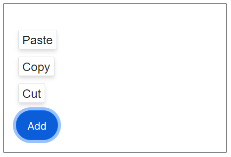
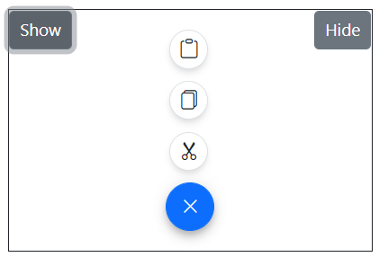
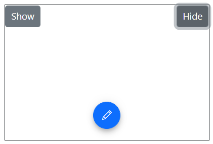

# Positions in Blazor Speed Dial Component

The Speed dial Component can be positioned anywhere on the [Target](https://help.syncfusion.com/cr/blazor/Syncfusion.Blazor.Buttons.SfSpeedDial.html#Syncfusion_Blazor_Buttons_SfSpeedDial_Target) using the [Position](https://help.syncfusion.com/cr/blazor/Syncfusion.Blazor.Buttons.SfSpeedDial.html#Syncfusion_Blazor_Buttons_SfSpeedDial_Position) property. If the `Target` is not defined, then Speed Dial is positioned based on the browser viewport.

The position values of Speed Dial are as follows:
* TopLeft
* TopCenter
* TopRight
* MiddleLeft
* MiddleCenter
* MiddleRight
* BottomLeft
* BottomCenter
* BottomRight

```cshtml

@using Syncfusion.Blazor.Buttons

<SfSpeedDial Content="Add" Position="FabPosition.BottomLeft">
    <SpeedDialItems>
        <SpeedDialItem Text="Cut"/>
        <SpeedDialItem Text="Copy"/>
        <SpeedDialItem Text="Paste"/>
    </SpeedDialItems>
</SfSpeedDial>

```



## Opens on hover

You can open the Speed Dial action items on mouse hover by setting the [OpensOnHover](https://help.syncfusion.com/cr/blazor/Syncfusion.Blazor.Buttons.SfSpeedDial.html#Syncfusion_Blazor_Buttons_SfSpeedDial_OpensOnHover) property as true.

```cshtml

@using Syncfusion.Blazor.Buttons

<SfSpeedDial OpensOnHover=true OpenIconCss="e-icons e-edit" CloseIconCss="e-icons e-close">
    <SpeedDialItems>
        <SpeedDialItem IconCss="e-icons e-cut"/>
        <SpeedDialItem IconCss="e-icons e-copy"/>
        <SpeedDialItem IconCss="e-icons e-paste"/>
    </SpeedDialItems>
</SfSpeedDial>

```


## Programmatically show/hide

You can open/close the Speed Dial action items programmatially using [ShowAsync](https://help.syncfusion.com/cr/blazor/Syncfusion.Blazor.Buttons.SfSpeedDial.html#Syncfusion_Blazor_Buttons_SfSpeedDial_ShowAsync) and 
[HideAsync](https://help.syncfusion.com/cr/blazor/Syncfusion.Blazor.Buttons.SfSpeedDial.html#Syncfusion_Blazor_Buttons_SfSpeedDial_HideAsync) methods.

Below example demonstrates open/close action items on button click.

```cshtml

@using Syncfusion.Blazor.Buttons

<div id="target" style="height:200px; position:relative; width:300px; border:1px solid;">
    <SfButton OnClick="Show">Show</SfButton>
    <SfButton style="float:right"  OnClick="Hide">Hide</SfButton>
    <SfSpeedDial @ref="speeddial" Target="#target" Position="FabPosition.BottomCenter" OpenIconCss="e-icons e-edit" CloseIconCss="e-icons e-close">
        <SpeedDialItems>
            <SpeedDialItem IconCss="e-icons e-cut"/>
            <SpeedDialItem IconCss="e-icons e-copy"/>
            <SpeedDialItem IconCss="e-icons e-paste"/>
        </SpeedDialItems>
    </SfSpeedDial>
</div>

@code{
    SfSpeedDial speeddial;
    public void Show()
    {
        speeddial.ShowAsync();
    }
    public void Hide()
    {
        speeddial.HideAsync();
    }
}

```




## Programmatically refresh the position

You can refresh the position of the Speed Dial using [RefreshPositionAsync](https://help.syncfusion.com/cr/blazor/Syncfusion.Blazor.Buttons.SfSpeedDial.html#Syncfusion_Blazor_Buttons_SfSpeedDial_RefreshPositionAsync) method when the `Target`position is changed.

```cshtml

@using Syncfusion.Blazor.Buttons

<div id="target" style="min-height:350px; position:relative; border:1px solid;">
    <SfButton OnClick="RefreshPosition">Refresh</SfButton>
    <SfSpeedDial @ref="speeddial" Target="#target" Position="FabPosition.MiddleRight" OpenIconCss="e-icons e-edit" CloseIconCss="e-icons e-close">
        <SpeedDialItems>
            <SpeedDialItem IconCss="e-icons e-cut"/>
            <SpeedDialItem IconCss="e-icons e-copy"/>
            <SpeedDialItem IconCss="e-icons e-paste"/>
        </SpeedDialItems>
    </SfSpeedDial>
</div>

@code{
    SfSpeedDial speeddial;

    public void RefreshPosition()   
    {
        speeddial.RefreshPositionAsync();
    }
}

```