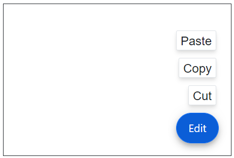

# Positions in Blazor SpeedDial Component

This section explains the different positions of SpeedDial.

## Target

The [Target](https://help.syncfusion.com/cr/blazor/Syncfusion.Blazor.Buttons.SfSpeedDial.html#Syncfusion_Blazor_Buttons_SfSpeedDial_Target) property in the Blazor SpeedDial component allows you to specify the element to which the SpeedDial should be attached by defining a CSS selector.




@using Syncfusion.Blazor.Buttons

<div id="target" style="min-height:200px; position:relative; width:300px; border:1px solid;">
    <SfSpeedDial Target="#target" Content="Edit">
        <SpeedDialItems>
            <SpeedDialItem Text="Cut"/>
            <SpeedDialItem Text="Copy"/>
            <SpeedDialItem Text="Paste"/>
        </SpeedDialItems>
    </SfSpeedDial>
</div>






## Built-in positions

The SpeedDial Component can be positioned anywhere on the `Target` using the [Position](https://help.syncfusion.com/cr/blazor/Syncfusion.Blazor.Buttons.SfSpeedDial.html#Syncfusion_Blazor_Buttons_SfSpeedDial_Position) property. If the `Target` is not defined, then SpeedDial is positioned based on the browser viewport.

The built-in position values of SpeedDial are as follows:

* TopLeft
* TopCenter
* TopRight
* MiddleLeft
* MiddleCenter
* MiddleRight
* BottomLeft
* BottomCenter
* BottomRight

```cshtml

@using Syncfusion.Blazor.Buttons

<SfSpeedDial Content="Add" Position="FabPosition.BottomLeft">
    <SpeedDialItems>
        <SpeedDialItem Text="Cut"/>
        <SpeedDialItem Text="Copy"/>
        <SpeedDialItem Text="Paste"/>
    </SpeedDialItems>
</SfSpeedDial>

```


## Custom Positioning

You can define the custom position of the SpeedDial by override the `top`, `left`, `right`, and `bottom` CSS properties using [CssClass](https://help.syncfusion.com/cr/blazor/Syncfusion.Blazor.Buttons.SfSpeedDial.html#Syncfusion_Blazor_Buttons_SfSpeedDial_CssClass).

```cshtml

@using Syncfusion.Blazor.Buttons

<SfSpeedDial Content="Add" CssClass="custom-position">
    <SpeedDialItems>
        <SpeedDialItem Text="Cut"/>
        <SpeedDialItem Text="Copy"/>
        <SpeedDialItem Text="Paste"/>
    </SpeedDialItems>
</SfSpeedDial>

<style>

    .e-fab.e-btn.custom-position {
        left: 325px;
        top: 170px;
        bottom: unset;
        right: unset;
    }

    .e-speeddial-popup.e-speeddial-right.e-speeddial-linear {
        right: 905px;   
    }

    .e-speeddial-popup.e-speeddial-bottom.e-speeddial-linear {
        bottom: 450px;
    }

</style>

```


N> You can use the [RefreshPositionAsync](https://help.syncfusion.com/cr/blazor/Syncfusion.Blazor.Buttons.SfSpeedDial.html#Syncfusion_Blazor_Buttons_SfSpeedDial_RefreshPositionAsync) method when the `Target`position is changed or resized.