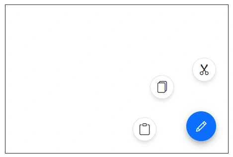
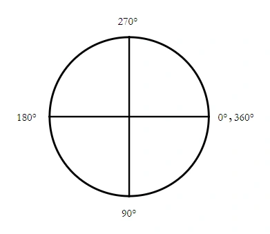
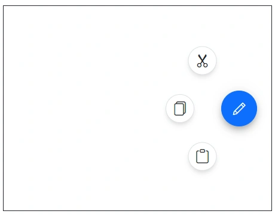
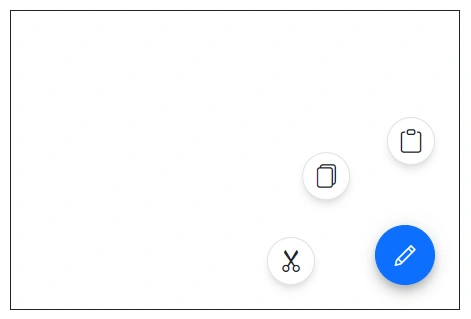

# Radial Menu in Blazor Speed Dial

Display SpeedDial action items in a circular pattern like a radial menu by setting the [Mode](https://help.syncfusion.com/cr/blazor/Syncfusion.Blazor.Buttons.SfSpeedDial.html#Syncfusion_Blazor_Buttons_SfSpeedDial_Mode) property to `Radial`. Customize the `Direction`, `StartAngle`, `EndAngle`, and `Offset` using the [SpeedDialRadialSettings](https://help.syncfusion.com/cr/blazor/Syncfusion.Blazor.Buttons.SpeedDialRadialSettings.html) tag directive.

## Radial Menu direction

Open the action items in either a clockwise or an anticlockwise direction by setting the [Direction](https://help.syncfusion.com/cr/blazor/Syncfusion.Blazor.Buttons.SpeedDialRadialSettings.html#Syncfusion_Blazor_Buttons_SpeedDialRadialSettings_Direction) property. The available [RadialDirection](https://help.syncfusion.com/cr/blazor/Syncfusion.Blazor.Buttons.RadialDirection.html) values are:

* `Clockwise` - Items are arranged in the clockwise direction.
* `AntiClockwise` - Items are arranged in the anticlockwise direction.
* `Auto` (default) - The direction is automatically determined based on the SpeedDial `Position`.

```cshtml

@using Syncfusion.Blazor.Buttons

<SfSpeedDial Mode="SpeedDialMode.Radial" OpenIconCss="e-icons e-edit">
    <SpeedDialRadialSettings Direction="RadialDirection.AntiClockwise" OffSet="80px"/>
    <SpeedDialItems>
        <SpeedDialItem IconCss="e-icons e-cut"/>
        <SpeedDialItem IconCss="e-icons e-copy"/>
        <SpeedDialItem IconCss="e-icons e-paste"/>
    </SpeedDialItems>
</SfSpeedDial>

```



## Start and end angle

Modify the start and end angles of the action items using the [StartAngle](https://help.syncfusion.com/cr/blazor/Syncfusion.Blazor.Buttons.SpeedDialRadialSettings.html#Syncfusion_Blazor_Buttons_SpeedDialRadialSettings_StartAngle) and [EndAngle](https://help.syncfusion.com/cr/blazor/Syncfusion.Blazor.Buttons.SpeedDialRadialSettings.html#Syncfusion_Blazor_Buttons_SpeedDialRadialSettings_EndAngle) properties (in degrees). If angles are not defined, the arc is determined by the Speed Dial `Position`.

The Speed Dial angle origin is 0° at the right side and increases in the clockwise direction.




```cshtml

@using Syncfusion.Blazor.Buttons

<SfSpeedDial Position="FabPosition.MiddleRight" Mode="SpeedDialMode.Radial" OpenIconCss="e-icons e-edit">
    <SpeedDialRadialSettings Direction="RadialDirection.AntiClockwise" StartAngle="130" EndAngle="230" OffSet="70px"/>
    <SpeedDialItems>
        <SpeedDialItem IconCss="e-icons e-cut"/>
        <SpeedDialItem IconCss="e-icons e-copy"/>
        <SpeedDialItem IconCss="e-icons e-paste"/>
    </SpeedDialItems>
</SfSpeedDial>

```



## Offset

Adjust the distance between the Speed Dial button and its action items using the [Offset](https://help.syncfusion.com/cr/blazor/Syncfusion.Blazor.Buttons.SpeedDialRadialSettings.html#Syncfusion_Blazor_Buttons_SpeedDialRadialSettings_OffSet) property.

```cshtml

@using Syncfusion.Blazor.Buttons

<SfSpeedDial Mode="SpeedDialMode.Radial" OpenIconCss="e-icons e-edit">
    <SpeedDialRadialSettings OffSet="80px"/>
    <SpeedDialItems>
        <SpeedDialItem IconCss="e-icons e-cut"/>
        <SpeedDialItem IconCss="e-icons e-copy"/>
        <SpeedDialItem IconCss="e-icons e-paste"/>
    </SpeedDialItems>
</SfSpeedDial>

```

