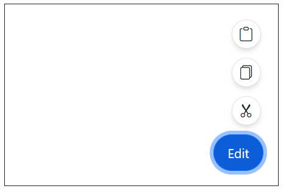
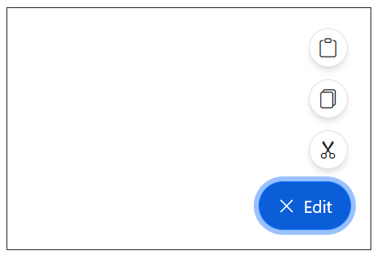
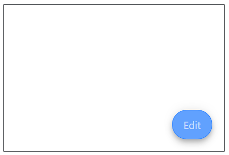
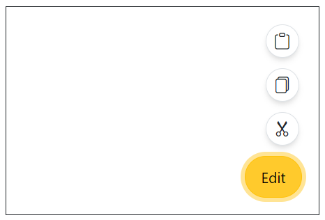
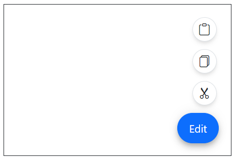
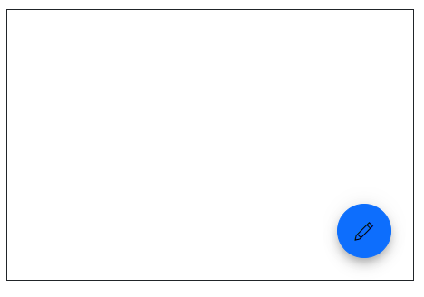
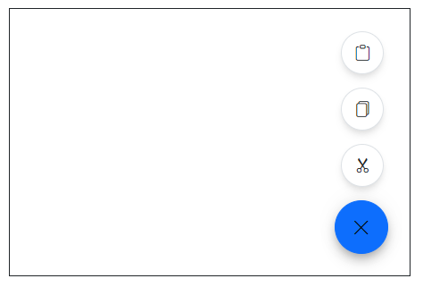

# Styles in Blazor SpeedDial Component

This section briefs different ways to style SpeedDial Component.

## SpeedDial button

You can customize the icon and text of Blazor SpeedDial component using [OpenIconCss](https://help.syncfusion.com/cr/blazor/Syncfusion.Blazor.Buttons.SfSpeedDial.html#Syncfusion_Blazor_Buttons_SfSpeedDial_OpenIconCss), [CloseIconCss](https://help.syncfusion.com/cr/blazor/Syncfusion.Blazor.Buttons.SfSpeedDial.html#Syncfusion_Blazor_Buttons_SfSpeedDial_CloseIconCss) and [Content](https://help.syncfusion.com/cr/blazor/Syncfusion.Blazor.Buttons.SfSpeedDial.html#Syncfusion_Blazor_Buttons_SfSpeedDial_Content) properties.

### SpeedDial with Icon

You can use the [OpenIconCss](https://help.syncfusion.com/cr/blazor/Syncfusion.Blazor.Buttons.SfSpeedDial.html#Syncfusion_Blazor_Buttons_SfSpeedDial_OpenIconCss) and [CloseIconCss](https://help.syncfusion.com/cr/blazor/Syncfusion.Blazor.Buttons.SfSpeedDial.html#Syncfusion_Blazor_Buttons_SfSpeedDial_CloseIconCss) properties to show icons in speed dial button. You can also show tooltip on hover to show additional details to end-user by setting `title` attribute.




@using Syncfusion.Blazor.Buttons

<SfSpeedDial OpenIconCss="e-icons e-edit" CloseIconCss="e-icons e-close">
    <SpeedDialItems>
        <SpeedDialItem IconCss="e-icons e-cut"/>
        <SpeedDialItem IconCss="e-icons e-copy"/>
        <SpeedDialItem IconCss="e-icons e-paste"/>
    </SpeedDialItems>
</SfSpeedDial>




### SpeedDial with Text

You can show text only in SpeedDial button by setting [Content](https://help.syncfusion.com/cr/blazor/Syncfusion.Blazor.Buttons.SfSpeedDial.html#Syncfusion_Blazor_Buttons_SfSpeedDial_Content) property without setting icon properties.




@using Syncfusion.Blazor.Buttons

<SfSpeedDial Content="Edit">
    <SpeedDialItems>
        <SpeedDialItem IconCss="e-icons e-cut"/>
        <SpeedDialItem IconCss="e-icons e-copy"/>
        <SpeedDialItem IconCss="e-icons e-paste"/>
    </SpeedDialItems>
</SfSpeedDial>




### SpeedDial with Icon and Text

You show icon and text in Blazor Speed Dial Button using [OpenIconCss](https://help.syncfusion.com/cr/blazor/Syncfusion.Blazor.Buttons.SfSpeedDial.html#Syncfusion_Blazor_Buttons_SfSpeedDial_OpenIconCss), [CloseIconCss](https://help.syncfusion.com/cr/blazor/Syncfusion.Blazor.Buttons.SfSpeedDial.html#Syncfusion_Blazor_Buttons_SfSpeedDial_CloseIconCss) and [Content](https://help.syncfusion.com/cr/blazor/Syncfusion.Blazor.Buttons.SfSpeedDial.html#Syncfusion_Blazor_Buttons_SfSpeedDial_Content) properties together.




@using Syncfusion.Blazor.Buttons

<SfSpeedDial Content="Edit" OpenIconCss="e-icons e-edit" CloseIconCss="e-icons e-close">
    <SpeedDialItems>
        <SpeedDialItem IconCss="e-icons e-cut"/>
        <SpeedDialItem IconCss="e-icons e-copy"/>
        <SpeedDialItem IconCss="e-icons e-paste"/>
    </SpeedDialItems>
</SfSpeedDial>




## Disabled

You can enable or disable the Speed Dial Component using [Disabled](https://help.syncfusion.com/cr/blazor/Syncfusion.Blazor.Buttons.SfSpeedDial.html#Syncfusion_Blazor_Buttons_SfSpeedDial_Disabled) property.




@using Syncfusion.Blazor.Buttons

<SfSpeedDial Disabled=true Content="Edit">
    <SpeedDialItems>
        <SpeedDialItem IconCss="e-icons e-cut"/>
        <SpeedDialItem IconCss="e-icons e-copy"/>
        <SpeedDialItem IconCss="e-icons e-paste"/>
    </SpeedDialItems>
</SfSpeedDial>




## CssClass

The Blazor Speed Dial supports the following predefined styles that can be defined using the [CssClass](https://help.syncfusion.com/cr/blazor/Syncfusion.Blazor.Buttons.SfSpeedDial.html#Syncfusion_Blazor_Buttons_SfSpeedDial_CssClass) property. You can customize by setting the `CssClass` property with the below defined class.

| CssClass | Description |
| -------- | -------- |
| e-primary | Used to represent a primary action. |
| e-outline |  Used to represent an appearance of button with outline. |
| e-info |  Used to represent an informative action. |
| e-success | Used to represent a positive action. |
| e-warning | Used to represent an action with caution. |
| e-danger | Used to represent a negative action. |




@using Syncfusion.Blazor.Buttons

<SfSpeedDial CssClass="e-warning" Content="Edit">
    <SpeedDialItems>
        <SpeedDialItem IconCss="e-icons e-cut"/>
        <SpeedDialItem IconCss="e-icons e-copy"/>
        <SpeedDialItem IconCss="e-icons e-paste"/>
    </SpeedDialItems>
</SfSpeedDial>




## Visible

You can set the Speed Dial Component to visible/hidden state using [Visible](https://help.syncfusion.com/cr/blazor/Syncfusion.Blazor.Buttons.SfSpeedDial.html#Syncfusion_Blazor_Buttons_SfSpeedDial_Visible) property.




@using Syncfusion.Blazor.Buttons

<SfSpeedDial Visible=false Content="Edit">
    <SpeedDialItems>
        <SpeedDialItem IconCss="e-icons e-cut"/>
        <SpeedDialItem IconCss="e-icons e-copy"/>
        <SpeedDialItem IconCss="e-icons e-paste"/>
    </SpeedDialItems>
</SfSpeedDial>




## Tooltip

You can show tooltip on hover to show additional details to end-user by setting [Title](https://help.syncfusion.com/cr/blazor/Syncfusion.Blazor.Buttons.SpeedDialItem.html#Syncfusion_Blazor_Buttons_SpeedDialItem_Title) property to speed dial items.




@using Syncfusion.Blazor.Buttons

<SfSpeedDial Content="Edit">
    <SpeedDialItems>
        <SpeedDialItem Title="Cut" IconCss="e-icons e-cut"/>
        <SpeedDialItem Title="Copy" IconCss="e-icons e-copy"/>
        <SpeedDialItem Title="Paste" IconCss="e-icons e-paste"/>
    </SpeedDialItems>
</SfSpeedDial>




## Opens on hover

You can use [OpensOnHover](https://help.syncfusion.com/cr/blazor/Syncfusion.Blazor.Buttons.SfSpeedDial.html#Syncfusion_Blazor_Buttons_SfSpeedDial_OpensOnHover) property to open actions items on hover itself. By default action items displayed only when clicking the speed dial button.




@using Syncfusion.Blazor.Buttons

<SfSpeedDial OpensOnHover=true Content="Edit">
    <SpeedDialItems>
        <SpeedDialItem IconCss="e-icons e-cut"/>
        <SpeedDialItem IconCss="e-icons e-copy"/>
        <SpeedDialItem IconCss="e-icons e-paste"/>
    </SpeedDialItems>
</SfSpeedDial>




## Customized icon

You can use the [CssClass](https://help.syncfusion.com/cr/blazor/Syncfusion.Blazor.Buttons.SfSpeedDial.html#Syncfusion_Blazor_Buttons_SfSpeedDial_CssClass) property to customize the appearance of the speedDial component in its default primary state. Below example demonstrates the `cssClass` property usage in speedDial.




@using Syncfusion.Blazor.Buttons

<SfSpeedDial Target="#target" OpenIconCss="e-icons e-edit" CloseIconCss="e-icons e-close" CssClass="custom-css">
    <SpeedDialItems>
        <SpeedDialItem IconCss="e-icons e-cut"/>
        <SpeedDialItem IconCss="e-icons e-copy"/>
        <SpeedDialItem IconCss="e-icons e-paste"/>
    </SpeedDialItems>
</SfSpeedDial>




