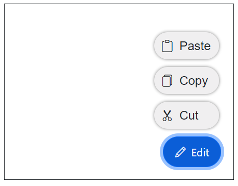
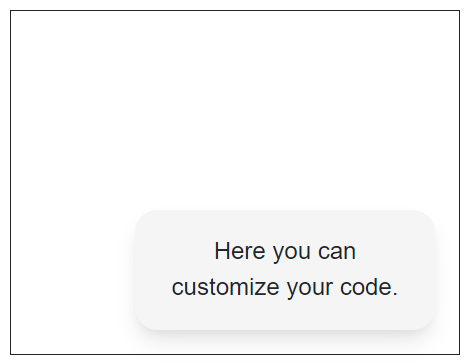

# Template in Blazor SpeedDial Component

This section describes the available templates in the SpeedDial component and their usage for customizing item content and the popup container.

## Item template

Use the [ItemTemplate](https://help.syncfusion.com/cr/blazor/Syncfusion.Blazor.Buttons.SfSpeedDial.html#Syncfusion_Blazor_Buttons_SfSpeedDial_ItemTemplate) to define custom content for each `SpeedDialItem`. Define the template as child content of the `ItemTemplate` tag directive.




@using Syncfusion.Blazor.Buttons

<SfSpeedDial Content="Edit" OpenIconCss="e-icons e-edit" Position="FabPosition.BottomRight">
    <ChildContent>
        <SpeedDialItems>
            <SpeedDialItem Text="Cut" IconCss="e-icons e-cut" />
            <SpeedDialItem Text="Copy" IconCss="e-icons e-copy" />
            <SpeedDialItem Text="Paste" IconCss="e-icons e-paste" />
        </SpeedDialItems>
    </ChildContent>
    <ItemTemplate>
        

            
            @context.Text
        

    </ItemTemplate>
</SfSpeedDial>




## Popup template

Use the [PopupTemplate](https://help.syncfusion.com/cr/blazor/Syncfusion.Blazor.Buttons.SfSpeedDial.html#Syncfusion_Blazor_Buttons_SfSpeedDial_PopupTemplate) to define custom content for the popup of the SpeedDial component. Define the template as child content of the `PopupTemplate` tag directive to render any custom layout or UI inside the popup.

  


@using Syncfusion.Blazor.Buttons

<SfSpeedDial CssClass="popupSpeedDial" Content="FeedBack"> 
    <PopupTemplate>
        

            
Here you can customize your code.

        

    </PopupTemplate>
</SfSpeedDial>




