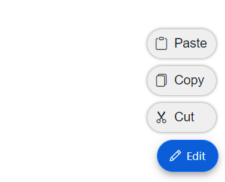
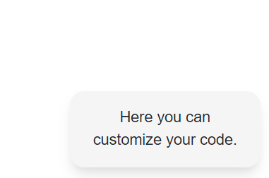

# Template in Blazor SpeedDial

This section has a detailed explanation on the available templates in Speed Dial Component.

## Item Template

You can use the [`ItemTemplate`](https://help.syncfusion.com/cr/blazor/Syncfusion.Blazor.Buttons.SfSpeedDial.html#Syncfusion_Blazor_Buttons_SfSpeedDial_ItemTemplate) tag directive to get or set a template content for the SpeedDialItem. The template content is defined as a child content of `ItemTemplate` tag directive.




@using Syncfusion.Blazor.Buttons

<SfSpeedDial Content="Edit" OpenIconCss="e-icons e-edit" Position="FabPosition.BottomRight">
    <ChildContent>
        <SpeedDialItems>
            <SpeedDialItem Text="Cut" IconCss="e-icons e-cut" />
            <SpeedDialItem Text="Copy" IconCss="e-icons e-copy" />
            <SpeedDialItem Text="Paste" IconCss="e-icons e-paste" />
        </SpeedDialItems>
    </ChildContent>
    <ItemTemplate>
        

            
            @context.Text
        

    </ItemTemplate>
</SfSpeedDial>




## Popup Template

You can use the [`PopupTemplate`](https://help.syncfusion.com/cr/blazor/Syncfusion.Blazor.Buttons.SfSpeedDial.html#Syncfusion_Blazor_Buttons_SfSpeedDial_PopupTemplate) tag directive to get or set a template content popup of SpeedDialItem. The template content is defined as a child content of `PopupTemplate` tag directive.

  


@using Syncfusion.Blazor.Buttons

<SfSpeedDial CssClass="popupSpeedDial" Content="FeedBack"> 
    <PopupTemplate>
        

            
Here you can customize your code.

        

    </PopupTemplate>
</SfSpeedDial>




