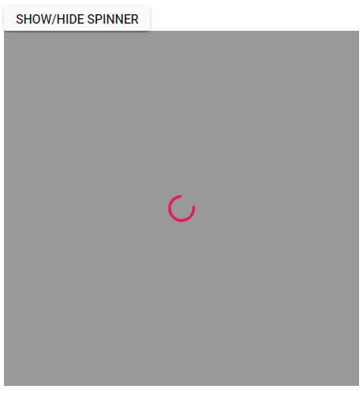
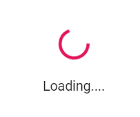

# Customize the Spinner in Blazor Spinner Component

You can customize the Spinner component when initializing or after rendering it.

## Customize when initializing the Spinner component

Provided support to change the default Spinner appearance when initializing Spinner component using the following properties.

* CssClass
* Label
* Type
* Size

### CssClass

Add the customized `Class` name to a Spinner root element to customize the Blazor Spinner component UI styles.

The following code explains how to initialize a Spinner with the custom class name in the Blazor Razor page.

```csharp

@using Syncfusion.Blazor.Buttons
@using Syncfusion.Blazor.Spinner

<div>
    <SfButton @onclick="@ClickHandler">Show/Hide Spinner</SfButton>

    <div id="container">
        <SfSpinner @bind-Visible="@VisibleProperty" CssClass="e-customClass">
        </SfSpinner>
    </div>
</div>


@code{
    private bool VisibleProperty { get; set; } = false;

    private async Task ClickHandler()
    {
        this.VisibleProperty = true;
        await Task.Delay(2000);
        this.VisibleProperty = false;
    }
}

<style>
    .e-spinner-pane.e-customClass .e-spinner-inner .e-spin-material {
        stroke: #808080;
    }
</style>

```


#### Modal Spinner

You can initialize a modal spinner by adding the class `e-spin-overlay` to the `CssClass` property of the spinner.

The following code explains how to render modal spinner.

```csharp

@using Syncfusion.Blazor.Buttons
@using Syncfusion.Blazor.Spinner

<SfButton @onclick="@ClickHandler">Show/Hide Spinner</SfButton>

<div id="container">
    <SfSpinner @bind-Visible="@VisibleProperty" CssClass="e-spin-overlay" />
</div>

<style>
    #container {
        position: relative;
        height: 550px;
    }
</style>

@code{
    private bool VisibleProperty { get; set; } = false;

    private async Task ClickHandler()
    {
        this.VisibleProperty = true;
        await Task.Delay(10000);
        this.VisibleProperty = false;
    }
}

```



### Label

Add the customize label text in Blazor Spinner component at the bottom.

The following code explains how to set the `Label` on Spinner in Blazor Razor page.

```csharp

@using Syncfusion.Blazor.Buttons
@using Syncfusion.Blazor.Spinner

<div>
    <SfButton @onclick="@ClickHandler">Show/Hide Spinner</SfButton>

    <div id="container">
        <SfSpinner @bind-Visible="@VisibleProperty" Label="Loading....">
        </SfSpinner>
    </div>
</div>

@code{
    private bool VisibleProperty { get; set; } = false;

    private async Task ClickHandler()
    {
        this.VisibleProperty = true;
        await Task.Delay(2000);
        this.VisibleProperty = false;
    }
}

```



### Type

By default, the `Type` is `None` where the Blazor Spinner is loaded based on the theme used in the application. You can also customize the type and show it on Spinner using the `Type` property. The available types are:

* None
* Material
* Fabric
* Bootstrap
* HighContrast
* Bootstrap4

The following code explains how to use the `Type` property when initializing Spinner in Blazor Razor page.

```csharp

@using Syncfusion.Blazor.Buttons
@using Syncfusion.Blazor.Spinner

<div>
    <SfButton @onclick="@ClickHandler">Show/Hide Spinner</SfButton>

    <div id="container">
        <SfSpinner @bind-Visible="@VisibleProperty" Type="@SpinnerType.Bootstrap">
        </SfSpinner>
    </div>
</div>

@code{
    private bool VisibleProperty { get; set; } = false;

    private async Task ClickHandler()
    {
        this.VisibleProperty = true;
        await Task.Delay(2000);
        this.VisibleProperty = false;
    }
}

```


### Size

By default, the Spinner size is `30px`.  You can change the size of the Spinner based on your application using the `Size` property.

The following code explains how to use the `Size` property when initializing Spinner in Blazor Razor page.

```csharp

@using Syncfusion.Blazor.Buttons
@using Syncfusion.Blazor.Spinner

<div>
    <SfButton @onclick="@ClickHandler">Show/Hide Spinner</SfButton>

    <div id="container">
        <SfSpinner @bind-Visible="@VisibleProperty" Size="50">
        </SfSpinner>
    </div>
</div>

@code{
    private bool VisibleProperty { get; set; } = false;

    private async Task ClickHandler()
    {
        this.VisibleProperty = true;
        await Task.Delay(2000);
        this.VisibleProperty = false;
    }
}

```


## Customize after creating the Spinner component

The Spinner component can be customized dynamically after initialize the Spinner component by using the following properties:

* Type
* CssClass

### Type

You can dynamically change the type of the Spinner using the `Type` property.

The following code explains how to use the `Type` property after creating the Spinner in Blazor Razor page.

```csharp

@using Syncfusion.Blazor.Buttons
@using Syncfusion.Blazor.Spinner

<div>
    <SfButton @onclick="@ClickHandler">Show/Hide Spinner</SfButton>
    <SfButton @onclick="@ChangeType">Change Type</SfButton>

    <div id="container">
        <SfSpinner @bind-Visible="@VisibleProperty" Type="@SpinnerType">
        </SfSpinner>
    </div>
</div>

@code{
    private SpinnerType SpinnerType = SpinnerType.Fabric;
    private bool VisibleProperty { get; set; } = false;

    private async Task ClickHandler()
    {
        this.VisibleProperty = true;
        await Task.Delay(2000);
        this.VisibleProperty = false;
    }

    private async Task ChangeType()
    {
        SpinnerType = SpinnerType.Material;
    }
}

```


### CssClass

Add the custom class name to Spinner after creating the Spinner component.

The following code explains how to dynamically add the `CssClass` property after creating the Spinner in Blazor Razor page.

```csharp

@using Syncfusion.Blazor.Buttons
@using Syncfusion.Blazor.Spinner

<div>
    <SfButton @onclick="@ClickHandler">Show/Hide Spinner</SfButton>
    <SfButton @onclick="@ChangeClass">Change CSS Class</SfButton>

    <div id="container">
        <SfSpinner @bind-Visible="@VisibleProperty" CssClass="@CssClassName">
        </SfSpinner>
    </div>
</div>

@code{
    private string CssClassName { get; set; } = "";
    private bool VisibleProperty { get; set; } = false;

    private async Task ClickHandler()
    {
        this.VisibleProperty = true;
        await Task.Delay(2000);
        this.VisibleProperty = false;
    }

    private async Task ChangeClass()
    {
        this.CssClassName = "e-customClass";
        StateHasChanged();
    }
}

<style>
    .e-spinner-pane.e-customClass .e-spinner-inner .e-spin-material {
        stroke: #808080;
    }
</style>

```

