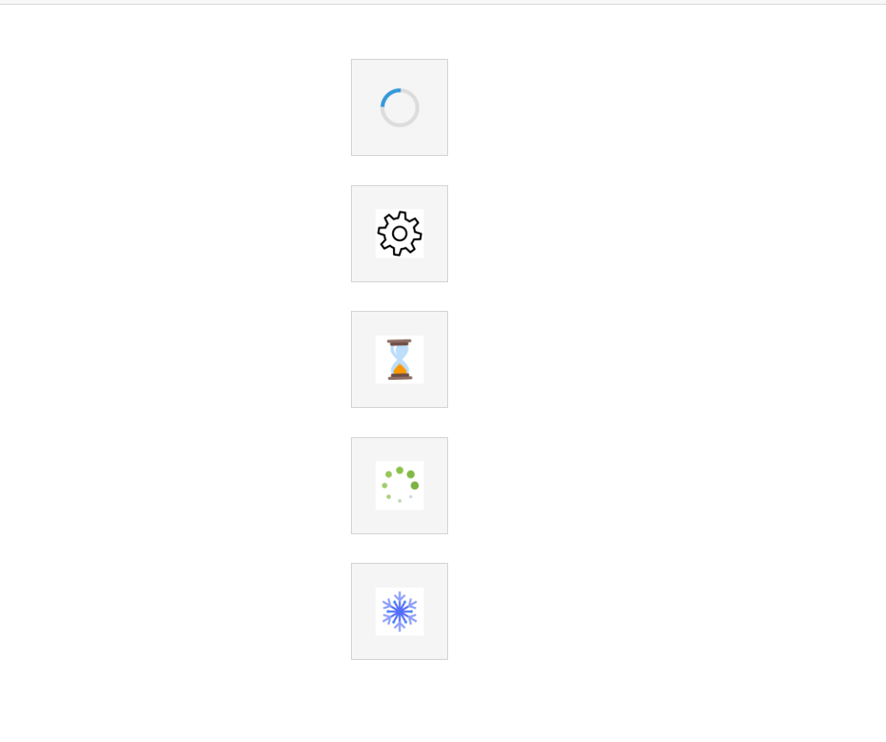

# SpinnerTemplate in Blazor Spinner Component

The [SpinnerTemplates](https://help.syncfusion.com/cr/blazor/Syncfusion.Blazor.Spinner.SpinnerTemplates.html) feature in the Syncfusion Blazor Spinner component allows you to fully customize the appearance of the loading spinner to better suit your application’s design and user experience requirements.Instead of relying on the default spinner, you can define your own custom content(e.g., text, image, animation , gif) using the SpinnerTemplate.

```cshtml
@using Syncfusion.Blazor.Buttons
@using Syncfusion.Blazor.Spinner

<div class="control-section">
    <div class="spinner-sample">
        <div class="spinners-container">
            <!-- Custom Template Spinner 1 -->
            <div class="spinner-item">
                
                <div class="spinner-wrapper">
                    <SfSpinner @bind-Visible="@IsSpinner1Visible">
                        <SpinnerTemplates>
                            <Template>
                                <div class="loader loader__inner"></div>
                            </Template>
                        </SpinnerTemplates>
                    </SfSpinner>
                </div>
            </div>

            <!-- Custom Template Spinner 2 -->
            <div class="spinner-item">
                <div class="spinner-wrapper">
                    <SfSpinner @bind-Visible="@IsSpinner1Visible">
                        <SpinnerTemplates>
                            <Template>
                                
                                
                            </Template>
                        </SpinnerTemplates>
                    </SfSpinner>
                </div>
            </div>
           
            <!-- Custom Template Spinner 3 -->
            <div class="spinner-item">
                <div class="spinner-wrapper">
                    <SfSpinner @bind-Visible="@IsSpinner1Visible">
                        <SpinnerTemplates>
                            <Template>
                                
                            </Template>
                        </SpinnerTemplates>
                    </SfSpinner>
                </div>
            </div>

            <!-- Custom Template Spinner 4 -->
            <div class="spinner-item">
                <div class="spinner-wrapper">
                    <SfSpinner @bind-Visible="@IsSpinner1Visible">
                        <SpinnerTemplates>
                            <Template>
                                
                            </Template>
                        </SpinnerTemplates>
                    </SfSpinner>
                </div>
            </div>

            <!-- Custom Template Spinner 5 -->
            <div class="spinner-item">
                <div class="spinner-wrapper">
                    <SfSpinner @bind-Visible="@IsSpinner1Visible">
                        <SpinnerTemplates>
                            <Template>
                                
                            </Template>
                        </SpinnerTemplates>
                    </SfSpinner>
                </div>
            </div>

        </div>
    </div>
</div>

@code {
    private bool IsSpinner1Visible { get; set; } = true;
    
}

<style>
    /* Container styles */
    .spinners-container {
        display: flex;
        margin-top: 10px;
    }

    .spinner-item {
        margin-right: 40px;
    }

    .spinner-wrapper {
        position: relative;
        width: 100px;
        height: 100px;
        border: 1px solid #ccc;
        background-color: #f5f5f5;
    }

    /* Custom spinner styles */
    .loader {
        width: 40px;
        height: 40px;
        border-radius: 50%;
    }

    /* First custom spinner style */
    .loader__inner {
        border: 4px solid rgba(0, 0, 0, 0.1);
        border-left-color: #3498db;
        animation: spin 1s linear infinite;
    }


    @@keyframes spin {
        0% { transform: rotate(0deg); }
        100% { transform: rotate(360deg); }
    }

    .control-section {
        display: flex;
        justify-content: center; 
        align-items: center; 
        height: 100vh; 
    }

    .spinners-container {
        display: flex;
        flex-direction: column; 
        gap: 30px; 
        align-items: center; 
    }

    .spinner-item {
        display: flex;
        justify-content: center;
        align-items: center;
    }
</style>


```
