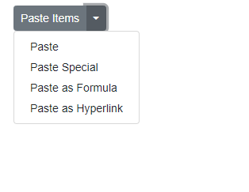

# Add and Remove Items in Blazor SplitButton Component

The SplitButton component supports dynamically adding or removing dropdown menu items using the AddItems and RemoveItems methods. The following example adds new items at runtime and removes the item matching the Text value "Paste" using a component reference obtained with @ref in button click handlers.

[AddItems](https://help.syncfusion.com/cr/blazor/Syncfusion.Blazor.SplitButtons.SfSplitButton.html#Syncfusion_Blazor_SplitButtons_SfSplitButton_AddItems_System_Collections_Generic_List_Syncfusion_Blazor_SplitButtons_DropDownMenuItem__System_String_System_Boolean_), [RemoveItems](https://help.syncfusion.com/cr/blazor/Syncfusion.Blazor.SplitButtons.SfSplitButton.html#Syncfusion_Blazor_SplitButtons_SfSplitButton_RemoveItems_System_Collections_Generic_List_System_String__System_Boolean_)

```cshtml
@using Syncfusion.Blazor.SplitButtons
@using Syncfusion.Blazor.Buttons

<SfSplitButton Content="Paste Items" @ref="SplitbuttonRef">
    <DropDownMenuItems>
        <DropDownMenuItem Text="Paste"></DropDownMenuItem>
    </DropDownMenuItems>
</SfSplitButton>
<div>
    <SfButton Content="Additem" IsPrimary="true" @onclick="addItem"></SfButton>

    <SfButton Content="Removeitem" IsPrimary="true" @onclick="removeItem"></SfButton>
</div>

@code {
    SfSplitButton SplitbuttonRef;

    private void addItem()
    {
        SplitbuttonRef.AddItems(SplitbtnItems);
    }

    private void removeItem()
    {
        SplitbuttonRef.RemoveItems(removeItems);
    }
    public List<DropDownMenuItem> SplitbtnItems = new List<DropDownMenuItem>
{
        new DropDownMenuItem{ Text="Paste Special" },
        new DropDownMenuItem{ Text="Paste as Formula" },
        new DropDownMenuItem{ Text="Paste as Hyperlink" }
    };

    public List<string> removeItems = new List<string>()
{
       "Paste"
    };
}

  
```

