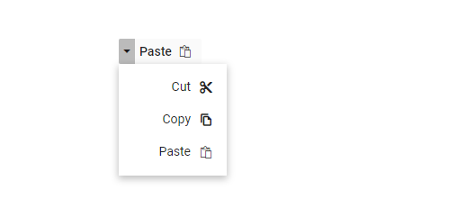

# Create right-to-left Blazor SplitButton Component

The SplitButton component supports right-to-left (RTL) rendering. Enable RTL by setting the [EnableRtl property (SfSplitButton)](https://help.syncfusion.com/cr/blazor/Syncfusion.Blazor.SplitButtons.SfSplitButton.html#Syncfusion_Blazor_SplitButtons_SfSplitButton_EnableRtl) to `true`.

The following example demonstrates how to enable right-to-left support in the SplitButton component.

```cshtml
@using Syncfusion.Blazor.SplitButtons

<SfSplitButton Content="Paste" IconCss="e-icons e-paste" EnableRtl="true">
    <DropDownMenuItems>
        <DropDownMenuItem IconCss="e-icons e-cut" Text="Cut"></DropDownMenuItem>
        <DropDownMenuItem IconCss="e-icons e-copy" Text="Copy"></DropDownMenuItem>
        <DropDownMenuItem IconCss="e-icons e-paste" Text="Paste"></DropDownMenuItem>
    </DropDownMenuItems>
</SfSplitButton>

<style>
    .e-paste::before {
        content: '\e739';
    }

    .e-cut::before {
        content: '\e73f';
    }

    .e-copy::before {
        content: '\e77b';
    }
</style>
  
```

