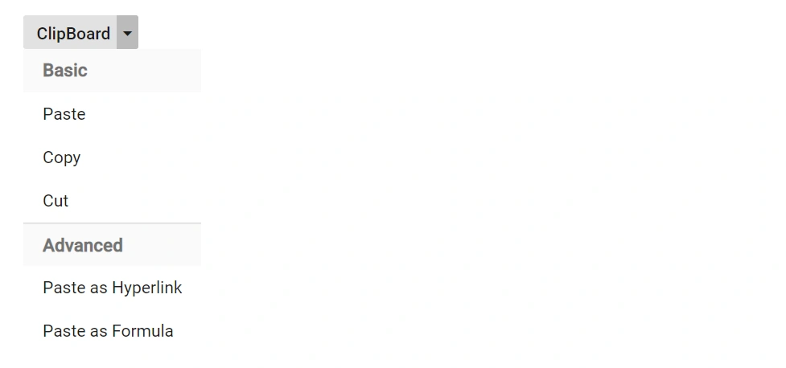

# How to group items in Blazor Split Button popup

Items in the popup can be grouped in the Blazor Split Button by rendering a ListView inside the popup using the `PopupContent` property, which replaces the default Blazor Split Button menu. For configuring grouping in the ListView, refer to the [ListView grouping](../../listview/grouping#grouping) documentation. In this approach, the ListView groups items by a specified field (for example, `Category`) using `ListViewFieldSettings`.

```cshtml

@using Syncfusion.Blazor.SplitButtons
@using Syncfusion.Blazor.Lists

<SfSplitButton Content="ClipBoard">
    <PopupContent>
        <SfListView ID="listview" DataSource="@Data" SortOrder="Syncfusion.Blazor.Lists.SortOrder.Descending" TValue="ListData">
            <ListViewFieldSettings Text="Text" GroupBy="Category" TValue="ListData"></ListViewFieldSettings>
        </SfListView>
    </PopupContent>
    <ChildContent>
        <SplitButtonEvents OnClose="popupClose"></SplitButtonEvents>
    </ChildContent>
</SfSplitButton>
@code {

    private void popupClose(BeforeOpenCloseMenuEventArgs args)
    {

    }

    public List<ListData> Data = new List<ListData>{
        new ListData{ Text = "Cut", Category = "Basic" },
        new ListData{ Text = "Copy", Category = "Basic" },
        new ListData{ Text = "Paste", Category = "Basic" },
        new ListData{ Text = "Paste as Formula", Category = "Advanced" },
        new ListData{ Text = "Paste as Hyperlink", Category = "Advanced" }
    };

    public class ListData
    {
        public string Text { get; set; }
        public string Category { get; set; }
    }
}

```

