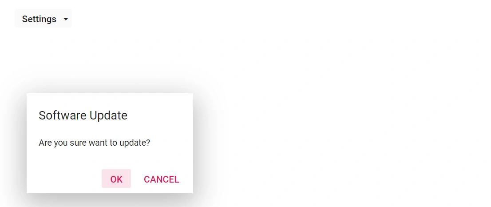

# How to open a dialog on Blazor Split Button popup click

This section explains how to open a dialog on a SplitButton popup item click. This can be achieved by handling dialog open in [ItemSelected](https://help.syncfusion.com/cr/blazor/Syncfusion.Blazor.SplitButtons.SplitButtonEvents.html#Syncfusion_Blazor_SplitButtons_SplitButtonEvents_ItemSelected) event of the Split Button.

In the following example, the dialog opens when selecting the Update item.

```cshtml

@using Syncfusion.Blazor.SplitButtons
@using Syncfusion.Blazor.Popups

<SfSplitButton Content="Settings">
    <SplitButtonEvents ItemSelected="select"></SplitButtonEvents>
    <DropDownMenuItems>
        <DropDownMenuItem Text="Help"></DropDownMenuItem>
        <DropDownMenuItem Text="About"></DropDownMenuItem>
        <DropDownMenuItem Text="Update"></DropDownMenuItem>
    </DropDownMenuItems>
</SfSplitButton>
<SfDialog Content="@Content" Header="@Header" Width="250px" Height="150px" Visible="false" @ref="DialogObj">
    <DialogPositionData X="300" Y="200"></DialogPositionData>
    <DialogButtons>
        <DialogButton OnClick="@click">
            <DialogButton Content="OK" IsPrimary="true"></DialogButton>
        </DialogButton>
        <DialogButton OnClick="@click">
            <DialogButton Content="Cancel"></DialogButton>
        </DialogButton>
    </DialogButtons>
</SfDialog>

@code  {
    SfDialog DialogObj;
    public string Content = "Are you sure want to update?";
    public string Header = "Software Update";

    private void click(object args)
    {
        DialogObj.Hide();
    }

    private void select(MenuEventArgs args)
    {
        if (args.Item.Text == "Update")
        {
            DialogObj.Show();
        }
    }
}

<style>
    .e-setting-icon::before {
        content: '\e679';
    }
</style>

```

