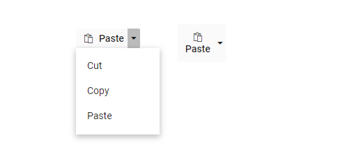

# Icons And Separator in Blazor SplitButton Component

## Split Button Icons

[Blazor Split Button](https://www.syncfusion.com/blazor-components/blazor-split-button) can have an icon to provide the visual representation of the action. To place the icon on a Split Button, set the [IconCss](https://help.syncfusion.com/cr/blazor/Syncfusion.Blazor.SplitButtons.SfSplitButton.html#Syncfusion_Blazor_SplitButtons_SfSplitButton_IconCss) property to `e-icons` with the required icon CSS. By default, the icon is positioned to the left side of the Split Button. The icon's position can be customized by using the [IconPosition](https://help.syncfusion.com/cr/blazor/Syncfusion.Blazor.SplitButtons.SfSplitButton.html#Syncfusion_Blazor_SplitButtons_SfSplitButton_IconPosition) property.

```cshtml
@using Syncfusion.Blazor.SplitButtons

<SfSplitButton Content="Paste" IconCss="e-icons e-paste">
    <DropDownMenuItems>
        <DropDownMenuItem Text="Cut"></DropDownMenuItem>
        <DropDownMenuItem Text="Copy"></DropDownMenuItem>
        <DropDownMenuItem Text="Paste"></DropDownMenuItem>
    </DropDownMenuItems>
</SfSplitButton>
<SfSplitButton Content="Paste" IconCss="e-icons e-paste" IconPosition="SplitButtonIconPosition.Top">
    <DropDownMenuItems>
        <DropDownMenuItem Text="Cut"></DropDownMenuItem>
        <DropDownMenuItem Text="Copy"></DropDownMenuItem>
        <DropDownMenuItem Text="Paste"></DropDownMenuItem>
    </DropDownMenuItems>
</SfSplitButton>

<style>
    .e-paste::before {
        content: '\e739';
    }
</style>

```



The third party icons on the Split Button can be used by the [IconCss](https://help.syncfusion.com/cr/blazor/Syncfusion.Blazor.SplitButtons.SfSplitButton.html#Syncfusion_Blazor_SplitButtons_SfSplitButton_IconCss) property.

## Vertical Button

Vertical Button in Split Button can be achieved by adding `e-vertical` class using [CssClass](https://help.syncfusion.com/cr/blazor/Syncfusion.Blazor.SplitButtons.SfSplitButton.html#Syncfusion_Blazor_SplitButtons_SfSplitButton_CssClass) property.

```cshtml
@using Syncfusion.Blazor.SplitButtons

<SfSplitButton Content="Paste" IconCss="e-icons e-paste" CssClass="e-vertical">
    <DropDownMenuItems>
        <DropDownMenuItem Text="Cut" ></DropDownMenuItem>
        <DropDownMenuItem Text="Copy" ></DropDownMenuItem>
        <DropDownMenuItem Text="Paste"></DropDownMenuItem>
    </DropDownMenuItems>
</SfSplitButton>

<style>
    .e-paste::before {
        content: '\e739';
    }
</style>

```


## Separator

The Separators are the horizontal lines that are used to separate the popup items. You cannot select the separators. You can enable separators to group the popup items using the separator property.

The following example illustrates how to enable [Separator](https://help.syncfusion.com/cr/blazor/Syncfusion.Blazor.SplitButtons.DropDownMenuItem.html#Syncfusion_Blazor_SplitButtons_DropDownMenuItem_Separator) support in Split Button component.

```cshtml
@using Syncfusion.Blazor.SplitButtons

<SfSplitButton Content="Paste" IconCss="e-icons e-paste" CssClass="e-vertical">
    <DropDownMenuItems>
        <DropDownMenuItem Text="Cut"></DropDownMenuItem>
        <DropDownMenuItem Text="Copy"></DropDownMenuItem>
        <DropDownMenuItem Separator="true"></DropDownMenuItem>
        <DropDownMenuItem Text="Paste"></DropDownMenuItem>
    </DropDownMenuItems>
</SfSplitButton>

<style>
    .e-paste::before {
        content: '\e739';
    }
</style>

```


## See Also

* [Split Button popup with icons](./popup-items#icons)