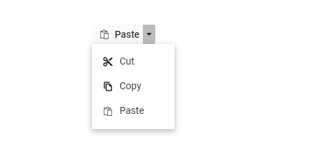

# Popup Items in Blazor SplitButton Component

## Icons

A popup action item can display an icon or image to provide a clear visual cue for the action. To add an icon to a popup item, set the [DropDownMenuItem.IconCss](https://help.syncfusion.com/cr/blazor/Syncfusion.Blazor.SplitButtons.DropDownMenuItem.html#Syncfusion_Blazor_SplitButtons_DropDownMenuItem_IconCss) property to include `e-icons` and the required icon CSS class. By default, the icon is positioned on the left side of the popup action item. Ensure that the corresponding icon font or stylesheet is referenced in the application.

In the following sample, the icons for Cut, Copy, and Paste menu items are added using the IconCss property.

```cshtml
@using Syncfusion.Blazor.SplitButtons

<SfSplitButton Content="Paste" IconCss="e-icons e-paste">
    <DropDownMenuItems>
        <DropDownMenuItem IconCss="e-icons e-cut" Text="Cut"></DropDownMenuItem>
        <DropDownMenuItem IconCss="e-icons e-copy" Text="Copy"></DropDownMenuItem>
        <DropDownMenuItem IconCss="e-icons e-paste" Text="Paste"></DropDownMenuItem>
    </DropDownMenuItems>
</SfSplitButton>

<style>
    .e-paste::before {
        content: '\e739';
    }

    .e-cut::before {
        content: '\e73f';
    }

    .e-copy::before {
        content: '\e77b';
    }

</style>

```
The following image shows Split Button popup items with icons.



## Template

### Item Templating

Popup items can be customized using the `CssClass` property. Customize the items using CSS style.

```cshtml

@using Syncfusion.Blazor.SplitButtons

<SfSplitButton Content="Edit" CssClass="custom">
    <DropDownMenuItems>
        <DropDownMenuItem Text="Cut"></DropDownMenuItem>
        <DropDownMenuItem Text="Copy"></DropDownMenuItem>
        <DropDownMenuItem Text="Paste"></DropDownMenuItem>
    </DropDownMenuItems>
</SfSplitButton>

<style>

    .custom li {
        float: left;
        font-size: 10px;
        padding-left: 50px;
        font-style: oblique;
    }
</style>

```

