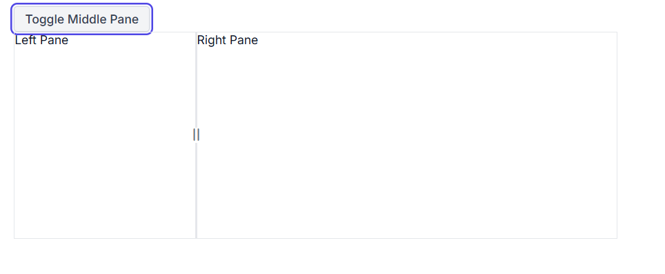

# Pane Settings in the Blazor Splitter Component

This section explains the behavior and configuration of individual pane settings within the Syncfusion Blazor Splitter component.

## Pane Visibility

Splitter panes can be shown or hidden using the `Visible` property, based on application demands such as initial load or dynamic changes. The `Visible` property is set to `true` by default for all panes.

In the following code example, the `Visible` property is bound to the second `SplitterPane` to dynamically show/hide the pane when a button is toggled.

```cshtml

@using Syncfusion.Blazor.Layouts

<button class="e-btn" @onclick="@ToggleMiddlePane"> Toggle Middle Pane </button>

<SfSplitter Height="240px" Width="700px" SeparatorSize="2">
    <SplitterPanes>
        <SplitterPane Size="30%" Collapsible="true">
            <ContentTemplate>
                <div> Left Pane </div>
            </ContentTemplate>
        </SplitterPane>
        <SplitterPane Size="30%" Collapsible="true" Visible="@this.PaneMiddleVisibility">
            <ContentTemplate>
                <div> Middle Pane </div>
            </ContentTemplate>
        </SplitterPane>
        <SplitterPane Collapsible="true">
            <ContentTemplate>
                <div> Right Pane </div>
            </ContentTemplate>
        </SplitterPane>
    </SplitterPanes>
</SfSplitter>

@code {
    public bool PaneMiddleVisibility { get; set; } = false;

    public void ToggleMiddlePane()
    {
        this.PaneMiddleVisibility = !this.PaneMiddleVisibility;
    }
}

```


