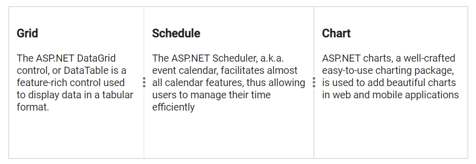
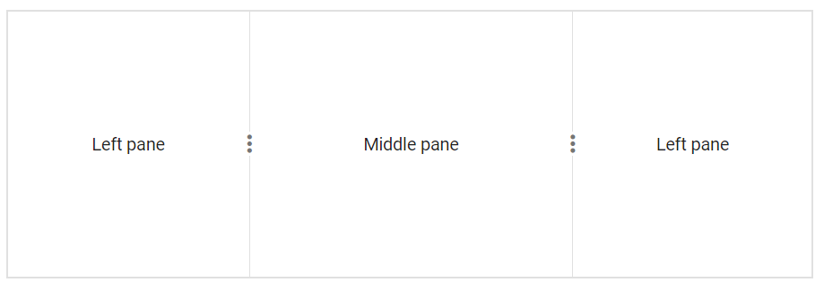

# Pane Sizing in Blazor Splitter Component

The Splitter allows providing pane sizes in either `Pixel` or `Percentage` formats.

## Auto Size Panes

Splitter panes adjust automatically during resizing if an explicit size is not specified, as panes are designed with a flex layout by default. When panes are added, removed, shown, or hidden, they auto-align within the container.

```cshtml

using Syncfusion.Blazor.Layouts

<SfSplitter Height="200px" Width="600px">
    <SplitterPanes>
        <SplitterPane>
            <ContentTemplate>
                <div>
                    <div class="content">
                        <h3 class="h3">Grid </h3>
                        The ASP.NET DataGrid control, or DataTable is a feature-rich control used to display data in a tabular format.
                    </div>
                </div>
            </ContentTemplate>
        </SplitterPane>
        <SplitterPane>
            <ContentTemplate>
                <div>
                    <div class="content">
                        <h3 class="h3">Schedule </h3>
                        The ASP.NET Scheduler, a.k.a. event calendar, facilitates almost all calendar features, thus allowing users to manage their time efficiently
                    </div>
                </div>
            </ContentTemplate>
        </SplitterPane>
        <SplitterPane>
            <ContentTemplate>
                <div>
                    <div class="content">
                        <h3 class="h3">Chart </h3>
                        ASP.NET charts, a well-crafted easy-to-use charting package, is used to add beautiful charts in web and mobile applications
                    </div>
                </div>
            </ContentTemplate>
        </SplitterPane>
    </SplitterPanes>
</SfSplitter>

<style>
    .content {
        padding: 10px;
    }
</style>

```





## Fixed Panes

Split panes can be rendered with a fixed size in both `Horizontal` and `Vertical` modes. Even if a fixed size is provided to all panes, the last pane is considered a flexible pane and will absorb any remaining space or overflow.

```cshtml

@using Syncfusion.Blazor.Layouts

<SfSplitter Height="200px" Width="600px">
    <SplitterPanes>
        <SplitterPane Size="200px">
            <ContentTemplate>
                <div> Left pane </div>
            </ContentTemplate>
        </SplitterPane>
        <SplitterPane Size="200px">
            <ContentTemplate>
                <div> Middle pane </div>
            </ContentTemplate>
        </SplitterPane>
        <SplitterPane Size="200px">
            <ContentTemplate>
                <div> Right pane </div>
            </ContentTemplate>
        </SplitterPane>
    </SplitterPanes>
</SfSplitter>

<style>
    .e-pane {
        text-align: center;
        align-items: center;
        display: grid;
    }
</style>

```




### Splitter Pane Size in Percentage

```cshtml

@using Syncfusion.Blazor.Layouts

<SfSplitter Height="200px" Width="600px">
    <SplitterPanes>
        <SplitterPane Size="30%">
            <ContentTemplate>
                <div> Left pane </div>
            </ContentTemplate>
        </SplitterPane>
        <SplitterPane Size="40%">
            <ContentTemplate>
                <div> Middle pane </div>
            </ContentTemplate>
        </SplitterPane>
        <SplitterPane Size="30%">
            <ContentTemplate>
                <div> Right pane </div>
            </ContentTemplate>
        </SplitterPane>
    </SplitterPanes>
</SfSplitter>

```



