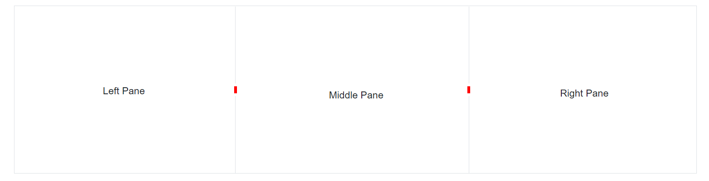

# Resize Icon Template

The Splitter allows to customize the resize icon of the separator using the template, where any image or other templates can be rendered as resize icon.

```cshtml

@using Syncfusion.Blazor.Layouts

<div>Horizontal Splitter</div>
<SfSplitter Height="240px" Width="100%">
    <SplitterTemplates>
        <Separator>
            <div style="height: 10px; border: 2px solid red"></div>
        </Separator>
    </SplitterTemplates>
    <SplitterPanes>
        <SplitterPane Collapsible="true">
            <ContentTemplate>
                <div> Left Pane </div>
            </ContentTemplate>
        </SplitterPane>
        <SplitterPane Collapsible="true">
            <ContentTemplate>
                <div> Middle Pane </div>
            </ContentTemplate>
        </SplitterPane>
        <SplitterPane Collapsible="true">
            <ContentTemplate>
                <div> Right Pane </div>
            </ContentTemplate>
        </SplitterPane>
    </SplitterPanes>
</SfSplitter>

```

