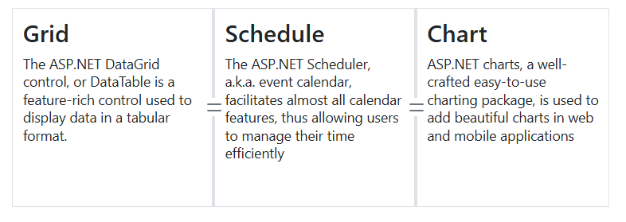

# Resizing in Blazor Splitter Component

By default, resizing is enabled for split panes. A resizing gripper element is added to the separator to facilitate easy resizing.

N> Horizontal splitters allow resizing in horizontal directions. Vertical splitters allow resizing in vertical directions.

When resizing, both the previous and next panes automatically adjust their dimensions.

## Minimum and Maximum Size Validation

The Splitter allows setting minimum (`Min`) and maximum (`Max`) sizes for each pane. Resizing will not extend beyond these defined minimum and maximum values.

```cshtml

@using Syncfusion.Blazor.Layouts

<SfSplitter Height="200px" Width="600px" SeparatorSize=4>
    <SplitterPanes>
        <SplitterPane Size="200px" Min="20%" Max="40%">
            <ContentTemplate>
                <div>
                    <div class="content">
                        <h3 class="h3">Grid </h3>
                        The ASP.NET DataGrid control, or DataTable is a feature-rich control used to display data in a tabular format.
                    </div>
                </div>
            </ContentTemplate>
        </SplitterPane>
        <SplitterPane Size="200px" Min="30%" Max="60%">
            <ContentTemplate>
                <div>
                    <div class="content">
                        <h3 class="h3">Schedule </h3>
                        The ASP.NET Scheduler, a.k.a. event calendar, facilitates almost all calendar features, thus allowing users to manage their time efficiently
                    </div>
                </div>
            </ContentTemplate>
        </SplitterPane>
        <SplitterPane>
            <ContentTemplate>
                <div>
                    <div class="content">
                        <h3 class="h3">Chart </h3>
                        ASP.NET charts, a well-crafted easy-to-use charting package, is used to add beautiful charts in web and mobile applications
                    </div>
                </div>
            </ContentTemplate>
        </SplitterPane>
    </SplitterPanes>
</SfSplitter>

<style>
    .content {
        padding: 10px;
    }
</style>

```




## Prevent Resizing

The resizing for the pane can be disabled by setting `false` to the `Resizable` API within `SplitterPane`.

N> Splitter resizing will be enabled only when the target of the adjacent pane's `Resizable` api should also be in `true` state.

```cshtml

@using Syncfusion.Blazor.Layouts

<SfSplitter Height="200px" Width="600px" SeparatorSize=4>
    <SplitterPanes>
        <SplitterPane Size="200px" Min="20%" Max="40%" Resizable="false">
            <ContentTemplate>
                <div>
                    <div class="content">
                        <h3 class="h3">Grid </h3>
                        The ASP.NET DataGrid control, or DataTable is a feature-rich control used to display data in a tabular format.
                    </div>
                </div>
            </ContentTemplate>
        </SplitterPane>
        <SplitterPane Size="200px" Min="30%" Max="60%">
            <ContentTemplate>
                <div>
                    <div class="content">
                        <h3 class="h3">Schedule </h3>
                        The ASP.NET Scheduler, a.k.a. event calendar, facilitates almost all calendar features, thus allowing users to manage their time efficiently
                    </div>
                </div>
            </ContentTemplate>
        </SplitterPane>
        <SplitterPane>
            <ContentTemplate>
                <div>
                    <div class="content">
                        <h3 class="h3">Chart </h3>
                        ASP.NET charts, a well-crafted easy-to-use charting package, is used to add beautiful charts in web and mobile applications
                    </div>
                </div>
            </ContentTemplate>
        </SplitterPane>
    </SplitterPanes>
</SfSplitter>

<style>
    .content {
        padding: 10px;
    }
</style>

```




## Refresh Content on Resizing

While resizing the panes, the pane contents can be refreshed by using either `OnResizeStart`, `Resizing` or `OnResizeStop`.

## Customize the Resize Grip and Cursor

The resize gripper icon and cursor can be customized in css level.

```cshtml

@using Syncfusion.Blazor.Layouts

<SfSplitter Height="200px" Width="600px" SeparatorSize=3>
    <SplitterPanes>
        <SplitterPane Size="200px" Min="20%" Max="40%">
            <ContentTemplate>
                <div>
                    <div class="content">
                        <h3 class="h3">Grid </h3>
                        The ASP.NET DataGrid control, or DataTable is a feature-rich control used to display data in a tabular format.
                    </div>
                </div>
            </ContentTemplate>
        </SplitterPane>
        <SplitterPane Size="200px" Min="30%" Max="60%">
            <ContentTemplate>
                <div>
                    <div class="content">
                        <h3 class="h3">Schedule </h3>
                        The ASP.NET Scheduler, a.k.a. event calendar, facilitates almost all calendar features, thus allowing users to manage their time efficiently
                    </div>
                </div>
            </ContentTemplate>
        </SplitterPane>
        <SplitterPane>
            <ContentTemplate>
                <div>
                    <div class="content">
                        <h3 class="h3">Chart </h3>
                        ASP.NET charts, a well-crafted easy-to-use charting package, is used to add beautiful charts in web and mobile applications
                    </div>
                </div>
            </ContentTemplate>
        </SplitterPane>
    </SplitterPanes>
</SfSplitter>

<style>
    .content {
        padding: 10px;
    }
    .e-splitter .e-split-bar .e-resize-handler:before {
      content: "\e934";
      font-family: 'e-icons';
      font-size: 11px;
      transform: rotate(90deg);
    }
    .e-splitter .e-split-bar.e-split-bar-horizontal.e-resizable-split-bar,
    .e-splitter .e-split-bar.e-split-bar-horizontal.e-resizable-split-bar::after {
        cursor: e-resize;
    }
</style>

```





## See Also

* [Collapsible panes](./expand-and-collapse)