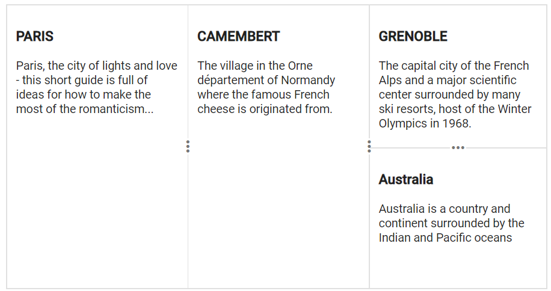

# Split Panes in Blazor Splitter Component

This section explains the configuration and behavior of split panes within the Syncfusion Blazor Splitter component.

## Horizontal Layout

By default, the Splitter renders in a horizontal orientation. The splitter container splits into panes flowing horizontally, with vertical separators between them.

```cshtml

@using Syncfusion.Blazor.Layouts

<SfSplitter Height="200px" Width="600px">
    <SplitterPanes>
        <SplitterPane Size="200px">
            <ContentTemplate>
                <div>
                    <div class="content">
                        <h3 class="h3">Grid </h3>
                        The ASP.NET DataGrid control, or DataTable is a feature-rich control used to display data in a tabular format.
                    </div>
                </div>
            </ContentTemplate>
        </SplitterPane>
        <SplitterPane Size="200px">
            <ContentTemplate>
                <div>
                    <div class="content">
                        <h3 class="h3">Schedule </h3>
                        The ASP.NET Scheduler, a.k.a. event calendar, facilitates almost all calendar features, thus allowing users to manage their time efficiently
                    </div>
                </div>
            </ContentTemplate>
        </SplitterPane>
        <SplitterPane Size="200px">
            <ContentTemplate>
                <div>
                    <div class="content">
                        <h3 class="h3">Chart </h3>
                        ASP.NET charts, a well-crafted easy-to-use charting package, is used to add beautiful charts in web and mobile applications
                    </div>
                </div>
            </ContentTemplate>
        </SplitterPane>
    </SplitterPanes>
</SfSplitter>

<style>
    .content {
        padding: 10px;
    }
</style>

```




## Vertical Layout

By setting the `Orientation` property to `Orientation.Vertical`, the Splitter renders in a vertical orientation. The splitter container then splits into panes flowing vertically, with horizontal separators between them.

```cshtml

@using Syncfusion.Blazor.Layouts

<SfSplitter Height="305px" Width="600px" Orientation="Orientation.Vertical">
    <SplitterPanes>
        <SplitterPane Size="100px">
            <ContentTemplate>
                <div>
                    <div class="content">
                        <h3 class="h3">Grid </h3>
                        The ASP.NET DataGrid control, or DataTable is a feature-rich control used to display data in a tabular format.
                    </div>
                </div>
            </ContentTemplate>
        </SplitterPane>
        <SplitterPane Size="100px">
            <ContentTemplate>
                <div>
                    <div class="content">
                        <h3 class="h3">Schedule </h3>
                        The ASP.NET Scheduler, a.k.a. event calendar, facilitates almost all calendar features, thus allowing users to manage their time efficiently
                    </div>
                </div>
            </ContentTemplate>
        </SplitterPane>
        <SplitterPane Size="100px">
            <ContentTemplate>
                <div>
                    <div class="content">
                        <h3 class="h3">Chart </h3>
                        ASP.NET charts, a well-crafted easy-to-use charting package, is used to add beautiful charts in web and mobile applications
                    </div>
                </div>
            </ContentTemplate>
        </SplitterPane>
    </SplitterPanes>
</SfSplitter>

<style>
    .content {
        padding: 9px;
    }
</style>

```




N> Multiple panes can also be rendered in splitter with both `Horizontal/Vertical` orientations.

## Separator

By default, pane separator will be rendered with `1px` width or height. The separator size can be customized by using `SeparatorSize` API.

N> For horizontal orientation, it will be considered as separator width. For vertical orientation, it will be considered as separator height.

```cshtml

@using Syncfusion.Blazor.Layouts

<SfSplitter Height="250px" Width="600px" SeparatorSize="5">
    <SplitterPanes>
        <SplitterPane Size="200px">
            <ContentTemplate>
                <div>
                    <div class="content">
                        <h3 class="h3">Grid </h3>
                        The ASP.NET DataGrid control, or DataTable is a feature-rich control used to display data in a tabular format.
                    </div>
                </div>
            </ContentTemplate>
        </SplitterPane>
        <SplitterPane Size="200px">
            <ContentTemplate>
                <div>
                    <div class="content">
                        <h3 class="h3">Schedule </h3>
                        The ASP.NET Scheduler, a.k.a. event calendar, facilitates almost all calendar features, thus allowing users to manage their time efficiently
                    </div>
                </div>
            </ContentTemplate>
        </SplitterPane>
        <SplitterPane Size="200px">
            <ContentTemplate>
                <div>
                    <div class="content">
                        <h3 class="h3">Chart </h3>
                        ASP.NET charts, a well-crafted easy-to-use charting package, is used to add beautiful charts in web and mobile applications
                    </div>
                </div>
            </ContentTemplate>
        </SplitterPane>
    </SplitterPanes>
</SfSplitter>

<style>
    .content {
        padding: 10px;
    }
</style>

```




## Nested Splitter

Splitter provides support to render the nested pane to achieve the complex layouts. The same `SplitterPane` tag can be used for splitter pane and nested splitter.

N> When rendering a nested splitter as a direct child of a splitter pane, the nested splitter should have `100%` width and height to match the parent pane's dimensions.

```cshtml

@using Syncfusion.Blazor.Layouts

<SfSplitter Height="316px" Width="600px">
    <SplitterPanes>
        <SplitterPane Size="200px">
            <ContentTemplate>
                <div>
                    <div class="content">
                        <h3 class="h3">PARIS </h3>
                        Paris, the city of lights and love - this short guide is full of ideas for how to make the most of the romanticism...
                    </div>
                </div>
            </ContentTemplate>
        </SplitterPane>
        <SplitterPane Size="200px">
            <ContentTemplate>
                <div>
                    <div class="content">
                        <h3 class="h3">CAMEMBERT </h3>
                        The village in the Orne département of Normandy where the famous French cheese is originated from.
                    </div>
                </div>
            </ContentTemplate>
        </SplitterPane>
        <SplitterPane Size="200px">
            <div>
                <SfSplitter ID="innerSplitter" Orientation="Orientation.Vertical">
                    <SplitterPanes>
                        <SplitterPane Size="150px" Min="20%">
                            <ContentTemplate>
                                <div>
                                    <div class="content">
                                        <h3 class="h3">GRENOBLE </h3>
                                        The capital city of the French Alps and a major scientific center surrounded by many ski resorts, host of the Winter Olympics in 1968.
                                    </div>
                                </div>
                            </ContentTemplate>
                        </SplitterPane>
                        <SplitterPane Size="100px" Min="20%">
                            <ContentTemplate>
                                <div>
                                    <div class="content">
                                        <h3 class="h3">Australia </h3>
                                        Australia is a country and continent surrounded by the Indian and Pacific oceans
                                    </div>
                                </div>
                            </ContentTemplate>
                        </SplitterPane>
                    </SplitterPanes>
                </SfSplitter>
            </div>
        </SplitterPane>
    </SplitterPanes>
</SfSplitter>

<style>
    .content {
        padding: 10px;
    }
    #innerSplitter {
        border: none;
    }
</style>

```





## Add or Remove Panes

For dynamic addition and removal of panes, use the `AddPaneAsync` and `RemovePaneAsync` methods to manage panes gracefully in the splitter.

### Add Pane

Panes can be added dynamically to the splitter by passing `SplitterPane` properties along with an index to the `AddPaneAsync` method.

```cshtml

@using Syncfusion.Blazor.Layouts
@using Syncfusion.Blazor.Buttons

<SfSplitter @ref="SplitterObj" Height="200px" Width="600px">
    <SplitterPanes>
        <SplitterPane Size="190px">
            <ContentTemplate>
                <div>
                    <div class='content'>
                        Pane 1
                    </div>
                </div>
            </ContentTemplate>
        </SplitterPane>
        <SplitterPane Size="190px">
            <ContentTemplate>
                <div>
                    <div class='content'>
                        Pane 2
                    </div>
                </div>
            </ContentTemplate>
        </SplitterPane>
    </SplitterPanes>
</SfSplitter>

<SfButton Content="Add Pane" @onclick="@Add"></SfButton>

<style>
    .content {
      padding: 9px;
    }
    #defaultBtn {
      margin-top: 15px;
    }
</style>

@code  {
    SfSplitter SplitterObj;

    private SplitterPane AddingPane = new SplitterPane() {
        Size = "190px",
        Content = "New Pane",
        Min = "30px",
        Max = "250px"
    };

    private async Task Add()
    {
       await this.SplitterObj.AddPaneAsync(AddingPane, 1);
    }
}

```


### Remove Pane

Split panes can be removed dynamically by passing the pane index to the `RemovePaneAsync` method.

```cshtml

@using Syncfusion.Blazor.Layouts
@using Syncfusion.Blazor.Buttons

<SfSplitter @ref="SplitterObj" Height="200px" Width="600px">
    <SplitterPanes>
        <SplitterPane Size="200px">
            <ContentTemplate>
                <div>
                    <div class='content'>
                        Pane 1
                    </div>
                </div>
            </ContentTemplate>
        </SplitterPane>
        <SplitterPane Size="200px">
            <ContentTemplate>
                <div>
                    <div class='content'>
                        Pane 2
                    </div>
                </div>
            </ContentTemplate>
        </SplitterPane>
        <SplitterPane Size="200px">
            <ContentTemplate>
                <div>
                    <div class='content'>
                        Pane 3
                    </div>
                </div>
            </ContentTemplate>
        </SplitterPane>
    </SplitterPanes>
</SfSplitter>

<SfButton Content="Remove Pane" @onclick="@Remove"></SfButton>

<style>
    .content {
      padding: 9px;
    }
    #defaultBtn {
      margin-top: 15px;
    }
</style>

@code  {
    SfSplitter SplitterObj;

    private async Task Remove()
    {
       await this.SplitterObj.RemovePaneAsync(1);
    }
}

```



## See Also

* [Resizable split panes](./resizing)
* [Collapsible panes](./expand-and-collapse)
* [Define size to a panes](./pane-sizing)
* [Specify content to a panes](./pane-content)