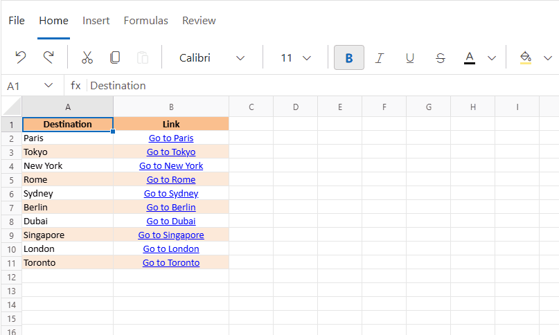
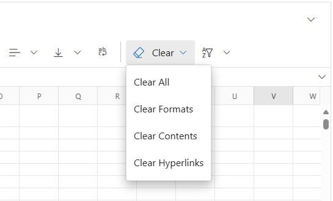

# Managing Cell Ranges in Blazor Spreadsheet component

A cell range in the Blazor Spreadsheet component refers to a group of selected cells that can be manipulated or processed collectively. It enables efficient data handling by allowing users to apply formatting, perform autofill operations, and clear content across multiple cells at once. This functionality streamlines spreadsheet workflows and enhances data presentation within the application.

## Cell formatting

Cell formatting enhances the visual presentation of data in the Spreadsheet component by applying styles to individual cells or cell ranges. Supported styles include font modifications, colors, borders, and alignment, which help organize and emphasize important information effectively. These formatting options improve readability, establish visual hierarchy, and highlight key data points for better clarity and impact.

N> To enable formatting in a protected sheet, select the **Format cells** checkbox in the protection settings. For more details, refer [here](https://blazor.syncfusion.com/documentation/spreadsheet/protection#protection-settings-in-a-protected-sheet).

### Available formatting options

Formatting options in the Spreadsheet component include several stylistic and positional attributes, each serving a specific purpose in data presentation. These options are accessible through the **Ribbon** under the **Home** tab.

| **Formatting Option**     | **Description** |
|---------------------------|-----------------|
| **Bold**                  | Applies a heavier font weight to make text more prominent. Commonly used for headers or key values. |
| **Italic**                | Slants text to distinguish or emphasize specific entries within a cell range. |
| **Underline**             | Adds a line beneath text, often used to denote hyperlinks or draw attention to important content. |
| **Strikethrough**         | Places a horizontal line through text, typically used to indicate completed tasks or obsolete data. |
| **Font Family**           | Changes the typeface (e.g., Arial, Calibri, Times New Roman) to improve readability or match design preferences. |
| **Font Size**             | Modifies text size to establish hierarchy or enhance legibility—larger for headings, smaller for detailed entries. |
| **Font Color**            | Alters text color to organize information visually or apply color-coded categorization for clarity. |
| **Fill Color**            | Applies background color to cells, helping group related data or highlight key areas. |
| **Horizontal Alignment**  | Adjusts left-to-right positioning of content: • **Left** – Ideal for text • **Center** – Common for titles • **Right** – Suited for numbers |
| **Vertical Alignment**    | Controls top-to-bottom placement within a cell: • **Top** – Useful for multiline text • **Middle** – Balanced presentation • **Bottom** – Default setting |
| **Wrap Text**             | Displays lengthy content across multiple lines within a cell, preventing overflow and maintaining layout integrity. |

## Autofill

The **Autofill** feature in the Spreadsheet component allows cells to be populated based on patterns detected from adjacent cells. This functionality reduces manual data entry and enhances efficiency. It is controlled by the [`AllowAutofill`](https://help.syncfusion.com/cr/blazor/Syncfusion.Blazor.Spreadsheet.SfSpreadsheet.html#Syncfusion_Blazor_Spreadsheet_SfSpreadsheet_AllowAutofill) property, which is set to **true** by default.

The Autofill can be performed in two ways:  
- Through the user interface (UI) by dragging the fill handle  
- Programmatically using the [`AutofillAsync`](https://help.syncfusion.com/cr/blazor/Syncfusion.Blazor.Spreadsheet.SfSpreadsheet.html#Syncfusion_Blazor_Spreadsheet_SfSpreadsheet_AutofillAsync_System_String_System_String_System_String_) method

The Autofill feature supports:
- Copying cell values  
- Detecting formula patterns

> * When the  `AllowAutofill` property is set to **false**, the fill handle is not displayed in the UI, and programmatic autofill operations using the `AutofillAsync` method does not execute.
> * When a sheet is protected, autofill is applicable only to unlocked ranges. This applies to autofill operations performed through the UI as well as those executed programmatically. To know more about worksheet protection, refer [here](https://blazor.syncfusion.com/documentation/spreadsheet/protection#protect-sheet).

### Autofill via UI

Autofill can be performed in the UI by dragging the fill handle, a small square at the bottom-right corner of a selected cell or range, which serves as the control point for initiating autofill operations. The following steps outline the process:

* Select a cell or range containing the data to be used as the source for autofill.

* Position the cursor over the fill handle until it changes to a crosshair, a plus-shaped pointer. This indicates that the fill handle is ready to be dragged.

* Drag the fill handle in the required direction—up, down, left, or right—to populate the target range with data based on the source pattern.

This process automatically detects and applies patterns for formula cells and repeated text values to the filled range. 

### Autofill programmatically

Autofill can be performed programmatically using the `AutofillAsync` method, which supports specifying both the fill range and the source data range. The operation is skipped if invalid range addresses are provided.

| Parameter | Type | Description |
| -- | -- | -- |
| fillRange | string | Specifies the address of the target range where the auto-fill operation will be applied. The value must be a valid cell range address (e.g., **"A1:A10"**) and must lie within the boundaries of the active worksheet. |
| dataRange | string (optional) | Specifies the address of the source data range in the active sheet used for filling. For example, **"A1"**. If this parameter is set to null, the currently active cell is used as the data source by default. |




@using Syncfusion.Blazor.Spreadsheet

<button @onclick="AutofillRange">Autofill</button>
<SfSpreadsheet @ref="SpreadsheetInstance" DataSource="DataSourceBytes">
    <SpreadsheetRibbon></SpreadsheetRibbon>
</SfSpreadsheet>

@code {
    public byte[] DataSourceBytes { get; set; }
    public SfSpreadsheet SpreadsheetInstance;

    protected override void OnInitialized()
    {
        string filePath = "wwwroot/Sample.xlsx";
        DataSourceBytes = File.ReadAllBytes(filePath);
    }

    public async Task AutofillRange()
    {  
        // Autofills the range A1:A10 downward using the value from cell A1.
        await SpreadsheetInstance.AutofillAsync("A1:A10", "A1");

        // Autofills the range B1:E1 rightward using the value from cell B1.
        await SpreadsheetInstance.AutofillAsync("B1:E1", "B1");

        // Autofills the range C1:C10 downward using the active cell as the data source.
        await SpreadsheetInstance.AutofillAsync("C1:C10");
    }
}




## Clear

The Spreadsheet component offers precise control over the removal of cell contents, formats, and hyperlinks. It provides four distinct clear options, each targeting specific elements within the selected cells or range:

- **Clear All**: Removes all contents (formulas and data), formats (including number formats), and hyperlinks.
- **Clear Formats**: Removes only formatting elements such as number formats, fonts, and cell styles, while preserving contents and hyperlinks.
- **Clear Contents**: Removes only the contents, including formulas and data, while retaining formats and hyperlinks.
- **Clear Hyperlinks**: Removes only hyperlinks, leaving contents and formats intact.

### Applying clear functionality

To use the clear options via the UI:

1. Select the cell or range of cells.
2. Click the **Clear** icon in the **Home** tab of the **Ribbon**.
3. Choose the desired option: **Clear All**, **Clear Formats**, **Clear Contents**, or **Clear Hyperlinks**.

### Clear functionality in protected sheets

When a sheet is protected, restrictions apply to the clear functionality. The **Clear All** and **Clear Contents** options are available only for unlocked ranges. To enable **Clear Formats** for these ranges, the **Format Cells** checkbox must be selected in the sheet protection settings. Similarly, to enable **Clear Hyperlinks**, the **Insert Hyperlinks** checkbox must be selected.

N> To know more about worksheet protection settings, refer [here](https://blazor.syncfusion.com/documentation/spreadsheet/protection#protection-settings-in-a-protected-sheet).

