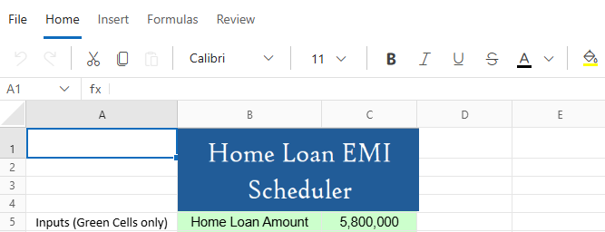
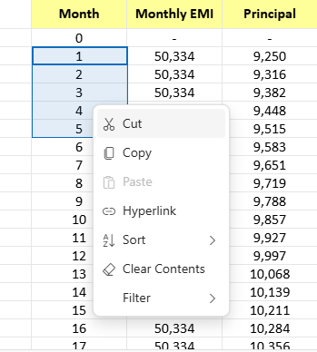
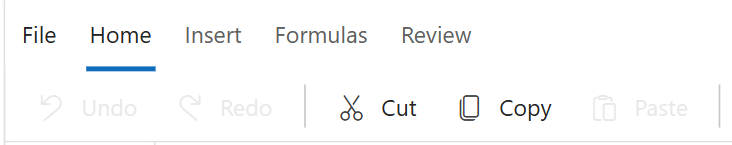
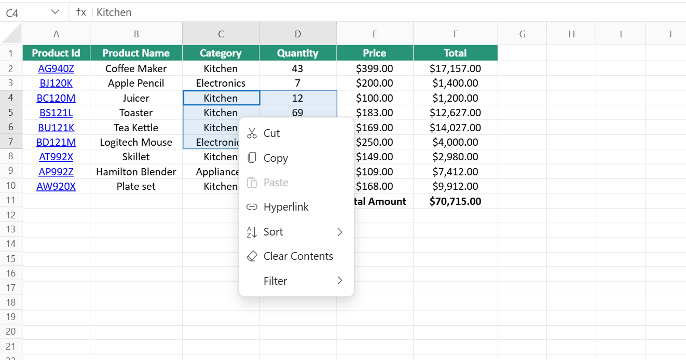

# Clipboard in Blazor Spreadsheet component

The Spreadsheet provides support for clipboard operations such as **Cut**, **Copy**, and **Paste**. These operations can be enabled or disabled by setting the [`EnableClipboard`](https://help.syncfusion.com/cr/blazor/Syncfusion.Blazor.Spreadsheet.SfSpreadsheet.html#Syncfusion_Blazor_Spreadsheet_SfSpreadsheet_EnableClipboard) property in the Spreadsheet component. By default, the `EnableClipboard` property is set to **true**.

N> When `EnableClipboard` is set to **false**, the **Cut** and **Copy** options are removed from the interface (Ribbon and context menu). Also, shortcut keys (**Ctrl+C, Ctrl+X, Ctrl+V**) and Clipboard API methods will not work.

## Cut

The cut operation removes data from a selected range of cells, rows, or columns in a sheet and temporarily stores it on the clipboard for use elsewhere. Cutting removes the original content once it's pasted to a new location, effectively allowing users to move data within the spreadsheet.

### Cut operation via UI

The cut operation can be performed through spreadsheet UI using any of the following methods:

**Using the Ribbon**

* Select the cell or range for copying the content.
* Click the **Cut** button in the **HOME** tab of the **Ribbon** toolbar. This will cut the current active cell or range.

**Using the Context Menu**

* Select the range of cell or click on the cell.
* Right-click on the selected cell or range of cells
* Choose the **Cut** option from the context menu.

### Cut operation programmatically

Using the [`CutCellAsync()`](https://help.syncfusion.com/cr/blazor/Syncfusion.Blazor.Spreadsheet.SfSpreadsheet.html#Syncfusion_Blazor_Spreadsheet_SfSpreadsheet_CutCellAsync_System_String_) method allows cut operations in sheet. This method cuts the specified cell or range and its properties (including value, format, style, etc.) to the clipboard. It supports multiple scenarios for cutting the cell or range. Below are the details for each scenario, including code examples and parameter information.

**Cut current active range**

When this method is called without any parameters, it automatically cuts the content from the last selected range if there is an active selection. If no range is currently selected, it cuts the active cell.




@using Syncfusion.Blazor.Spreadsheet

<button @onclick="cutActiveCell">Cut Active Cell</button>

<SfSpreadsheet @ref=SpreadsheetRef DataSource="DataSourceBytes">
    <SpreadsheetRibbon></SpreadsheetRibbon>
</SfSpreadsheet>

@code {

    public byte[] DataSourceBytes { get; set; }
    public SfSpreadsheet SpreadsheetRef;

    protected override void OnInitialized()
    {
        string filePath = "wwwroot/Sample.xlsx";
        DataSourceBytes = File.ReadAllBytes(filePath);
    }

    public async Task CutActiveCell()
    {
        // To cut from the current cell.
        await SpreadsheetRef.CutCellAsync();
    }
}




**Cut specific range in current active sheet**

Pass the cell address as a parameter to cut a specific cell. For cutting cells from the current active sheet, use just the cell reference.

| Parameter | Type | Description |
| -- | -- | -- |
| cellAddress | string (optional) | Specifies which cell(s) to cut. The parameter accepts two formats such as a single cell from active sheet like "A1" or a cell range from active sheet like "A1:B5". If not provided, the currently selected cell or range will be cut.




@using Syncfusion.Blazor.Spreadsheet

<button @onclick="CutCell">Cut Cell</button>
<button @onclick="CutRange">Cut Range Cells</button>

<SfSpreadsheet @ref=SpreadsheetRef DataSource="DataSourceBytes">
    <SpreadsheetRibbon></SpreadsheetRibbon>
</SfSpreadsheet>

@code {

    public byte[] DataSourceBytes { get; set; }
    public SfSpreadsheet SpreadsheetRef;

    protected override void OnInitialized()
    {
        string filePath = "wwwroot/Sample.xlsx";
        DataSourceBytes = File.ReadAllBytes(filePath);
    }

    public async Task CutCell()
    {
        // To cut the specified cell.
        await SpreadsheetRef.CutCellAsync("A2"); 
    }

    public async Task CutRange()
    {
        // To cut a range of cells.
        await SpreadsheetInstance.CutCellAsync("A1:D10");
    }
}




**Cut specific range in different sheet**

Pass the cell address as a parameter to cut a specific cell. For cutting cells from a specific sheet, include the sheet name along with the cell address as a parameter.

| Parameter | Type | Description |
| -- | -- | -- |
| cellAddress | string (optional) | Specifies which cell(s) to cut. The parameter accepts two formats such as a single cell from specific sheet like "Sheet1!A1" or a cell range from specific sheet like "Sheet2!A1:C5". If not provided, the currently selected cell or range will be cut.




@using Syncfusion.Blazor.Spreadsheet

<button @onclick="CutCell">Cut Cell</button>
<button @onclick="CutRangeFromSpecificSheet">Cut Range From Specific Sheet</button>

<SfSpreadsheet @ref=SpreadsheetRef DataSource="DataSourceBytes">
    <SpreadsheetRibbon></SpreadsheetRibbon>
</SfSpreadsheet>

@code {

    public byte[] DataSourceBytes { get; set; }
    public SfSpreadsheet SpreadsheetRef;

    protected override void OnInitialized()
    {
        string filePath = "wwwroot/Sample.xlsx";
        DataSourceBytes = File.ReadAllBytes(filePath);
    }

    public async Task CutCell()
    {
        // The address, along with the sheet name, to be cut.
        await SpreadsheetInstance.CutCellAsync("Sheet1!B2");
    }

    public async Task CutRangeFromSpecificSheet()
    {
        // To cut a range from a specific sheet.
        await SpreadsheetInstance.CutCellAsync("Sheet2!B3:E8");
    }
}




>* Use `Ctrl + X` (Windows) or `Command + X` (Mac) to cut content from the selected range. If no selection is active, the command will cut the current active cell.

>* Cut operation will not execute if invalid cell references or out-of-boundary ranges are provided. Ensure all cell addresses are within the valid worksheet boundaries.

## Copy

The copy operation copies data from a selected range of cells, rows, or columns in a sheet and temporarily stores it on the clipboard for use elsewhere. Unlike cut, copying preserves the original content in its location.

### Copy operation via UI

The copy operation can be performed through spreadsheet UI using any of the following methods:

**Using the Ribbon**

* Select the cell or range for copying the content.
* Click the **Copy** button in the **HOME** tab of the **Ribbon** toolbar. This will copy the current active cell or range.

**Using the Context Menu**

* Select the range of cell or click on the cell.
* Right-click on the selected cell or range of cells
* Choose the **Copy** option from the context menu.

### Copy operation programmatically

Using the [`CopyCellAsync`](https://help.syncfusion.com/cr/blazor/Syncfusion.Blazor.Spreadsheet.SfSpreadsheet.html#Syncfusion_Blazor_Spreadsheet_SfSpreadsheet_CopyCellAsync_System_String_) method allows copy operations in sheet. This method copies the specified cell or range and its properties (including value, format, style, etc.) to the clipboard. It supports multiple scenarios for copying the cell or range. Below are the details for each scenario, including code examples and parameter information.

**Copy current active range**

It automatically copies the content from the last selected range if there is an active selection. If no range is currently selected, it copies the active cell.




@using Syncfusion.Blazor.Spreadsheet

<button @onclick="CopyActiveCell">Copy Active Cell</button>

<SfSpreadsheet @ref=SpreadsheetRef DataSource="DataSourceBytes">
    <SpreadsheetRibbon></SpreadsheetRibbon>
</SfSpreadsheet>

@code {

    public byte[] DataSourceBytes { get; set; }
    public SfSpreadsheet SpreadsheetRef;

    protected override void OnInitialized()
    {
        string filePath = "wwwroot/Sample.xlsx";
        DataSourceBytes = File.ReadAllBytes(filePath);
    }

    public async Task CopyActiveCell()
    {
        // To copy from the current cell.
        await SpreadsheetRef.CopyCellAsync();
    }
}




**Copy specific range in active sheet**

Pass the cell address as a parameter to copy a specific cell. For copying cells from the current active sheet, use just the cell reference.

| Parameter | Type | Description |
| -- | -- | -- |
| cellAddress | string (optional) | Specifies which cell(s) to copy. The parameter accepts multiple formats such as a single cell from active sheet like "A1". Cell range from active sheet like "A1:B5". If not provided, the currently selected cell or range will be copied.




@using Syncfusion.Blazor.Spreadsheet

<button @onclick="CopyRangeCell">Copy Range Cell</button>
<button @onclick="CopyRange">Copy Range </button>

<SfSpreadsheet @ref=SpreadsheetRef DataSource="DataSourceBytes">
    <SpreadsheetRibbon></SpreadsheetRibbon>
</SfSpreadsheet>

@code {

    public byte[] DataSourceBytes { get; set; }
    public SfSpreadsheet SpreadsheetRef;

    protected override void OnInitialized()
    {
        string filePath = "wwwroot/Sample.xlsx";
        DataSourceBytes = File.ReadAllBytes(filePath);
    }

    public async Task CopyRangeCell()
    {
        // To copy the specified cell.
        await SpreadsheetRef.CopyCellAsync("A2"); 
    }

    public async Task CopyRange()
    {
        // To copy a range of cells.
        await SpreadsheetInstance.CopyCellAsync("A1:D10");
    }
}




**Copy specific range in different sheet**

Pass the cell address as a parameter to copy a specific cell. For copying cells from a specific sheet, include the sheet name along with the cell address as a parameter.

| Parameter | Type | Description |
| -- | -- | -- |
| cellAddress | string (optional) | Specifies which cell(s) to copy. The parameter accepts multiple formats such as a single cell from specific sheet like "Sheet1!A1" or a cell range from specific sheet like  "Sheet2!A1:C5". If not provided, the currently selected cell or range will be copied.




@using Syncfusion.Blazor.Spreadsheet

<button @onclick="CopyCell">Copy Cell</button>
<button @onclick="CopyRangeFromSpecificSheet">Copy Range From Specific Sheet</button>

<SfSpreadsheet @ref=SpreadsheetRef DataSource="DataSourceBytes">
    <SpreadsheetRibbon></SpreadsheetRibbon>
</SfSpreadsheet>

@code {

    public byte[] DataSourceBytes { get; set; }
    public SfSpreadsheet SpreadsheetRef;

    protected override void OnInitialized()
    {
        string filePath = "wwwroot/Sample.xlsx";
        DataSourceBytes = File.ReadAllBytes(filePath);
    }

    public async Task CopyCell()
    {
        // The address, along with the sheet name, to be copied.
        await SpreadsheetInstance.CopyCellAsync("Sheet1!B2");
    }

    public async Task CopyRangeFromSpecificSheet()
    {
        // To copy a range from a specific sheet.
        await SpreadsheetInstance.CopyCellAsync("Sheet2!B3:E8");
    }
}




>* Use `Ctrl + C` (Windows) or `Command + C` (Mac) to copy content from the selected range. If no selection is active, the command will copy the current active cell.

>* Copy operation will not execute if invalid cell references or out-of-boundary ranges are provided. Ensure all cell addresses are within the valid worksheet boundaries.

## Paste

The paste operation pastes data from the clipboard into a selected range of cells, rows, or columns. This includes all information such as values and formatting.

External clipboard functionality is supported. When using cut and paste, the clipboard is cleared after pasting. With copy and paste, the clipboard contents remain unchanged.

### Paste operation via UI

The paste operation can be performed through spreadsheet UI using any of the following methods:

**Using the Ribbon**

* Select the range of cell or click on the cell
* Click the **Paste** button in the **HOME** tab of the ribbon toolbar. This will paste the values which is copied or cut from the clipboard into the selected range of cells. If values are not copied means paste icon will be disabled.

**Using the context menu**

* Select the range of cell or click on the cell
* Right-click and select the **Paste** option from the context menu. If values are not copied means **Paste** option will be disabled.

### Paste operation programmatically

Using the [`PasteCellAsync`](https://help.syncfusion.com/cr/blazor/Syncfusion.Blazor.Spreadsheet.SfSpreadsheet.html#Syncfusion_Blazor_Spreadsheet_SfSpreadsheet_PasteCellAsync_System_String_) method pastes the clipboard content into the specified cell or range and retains all properties (including value, format, style, etc.).

**Paste to current active range**

When this method is called without any parameters, it automatically pastes the content to the last selected range if there is an active selection. If no range is currently selected, it pastes to the active cell.




@using Syncfusion.Blazor.Spreadsheet

<button @onclick="PasteActiveCell">Paste to Active Cell</button>

<SfSpreadsheet @ref=SpreadsheetRef DataSource="DataSourceBytes">
    <SpreadsheetRibbon></SpreadsheetRibbon>
</SfSpreadsheet>

@code {

    public byte[] DataSourceBytes { get; set; }
    public SfSpreadsheet SpreadsheetRef;

    protected override void OnInitialized()
    {
        string filePath = "wwwroot/Sample.xlsx";
        DataSourceBytes = File.ReadAllBytes(filePath);
    }

    public async Task PasteActiveCell()
    {
        // To paste to the current cell.
        await SpreadsheetRef.PasteCellAsync();
    }
}




**Paste to specific range in the current active sheet**

Pass the cell address as a parameter to paste to a specific cell. For pasting to cells in the current active sheet, use just the cell reference.

| Parameter | Type | Description |
| -- | -- | -- |
| cellAddress | string (optional) | Specifies which cell(s) to paste the clipboard content. The parameter accepts two formats such as a single cell from active sheet like "A1" or a cell range from active sheet like  "A1:B5". When copying a larger range and pasting to a smaller target range, all data from the source range will be pasted, extending beyond the specified target range. If not provided, the currently selected cell or range will be used as the paste destination.|




@using Syncfusion.Blazor.Spreadsheet

<button @onclick="PasteCell">Paste to Specific Cell</button>
<button @onclick="PasteRangeCell">Paste to Specific Range</button>
<button @onclick="CopyLargerRangeThanTarget">Copy Large Range to Smaller Target</button>

<SfSpreadsheet @ref=SpreadsheetRef DataSource="DataSourceBytes">
    <SpreadsheetRibbon></SpreadsheetRibbon>
</SfSpreadsheet>

@code {

    public byte[] DataSourceBytes { get; set; }
    public SfSpreadsheet SpreadsheetRef;

    protected override void OnInitialized()
    {
        string filePath = "wwwroot/Sample.xlsx";
        DataSourceBytes = File.ReadAllBytes(filePath);
    }

    public async Task PasteCell()
    {
        // To paste to the specified cell.
        await SpreadsheetRef.PasteCellAsync("A2"); 
    }

    public async Task PasteRangeCell()
    {
        // To paste to the specified range.
        await SpreadsheetRef.PasteCellAsync("A2:B5"); 
    }
    
    // Copy a large range and paste to smaller range.
    public async Task CopyLargerRangeThanTarget()
    {
        // Copy a 7-row range.
        await SpreadsheetInstance.CopyCellAsync("F3:F9");
        
        // Paste to a smaller 3-row range.
        // All 7 rows will be pasted, extending beyond the specified range.
        await SpreadsheetInstance.PasteCellAsync("A5:A7");
    }
}




**Paste to specific range in different sheet**

Pass the cell address as a parameter to paste to a specific cell. For pasting to cells in a specific sheet, include the sheet name along with the cell address as a parameter.

| Parameter | Type | Description |
| -- | -- | -- |
| cellAddress | string (optional) | Specifies which cell(s) to paste the clipboard content. The parameter accepts two formats such as a single cell from specific sheet like "Sheet1!A1" or a cell range from specific sheet like "Sheet2!A1:C5". If not provided, the currently selected cell or range will be used as the paste destination.




@using Syncfusion.Blazor.Spreadsheet

<button @onclick="PasteCell">Paste to Cell in Different Sheet</button>
<button @onclick="CopyBetweenSheets">Copy and Paste Between Sheets</button>

<SfSpreadsheet @ref=SpreadsheetRef DataSource="DataSourceBytes">
    <SpreadsheetRibbon></SpreadsheetRibbon>
</SfSpreadsheet>

@code {

    public byte[] DataSourceBytes { get; set; }
    public SfSpreadsheet SpreadsheetRef;

    protected override void OnInitialized()
    {
        string filePath = "wwwroot/Sample.xlsx";
        DataSourceBytes = File.ReadAllBytes(filePath);
    }

    public async Task PasteCell()
    {
        // The address, along with the sheet name, to be pasted.
        await SpreadsheetInstance.PasteCellAsync("Sheet1!B2");
    }
    
    // Copy from one sheet and paste to another without switching sheets.
    public async Task CopyBetweenSheets()
    {
        // Copy value from Sheet1.
        await SpreadsheetInstance.CopyCellAsync("Sheet1!A1:A5");
        
        // Paste to Sheet2 without switching to it.
        await SpreadsheetInstance.PasteCellAsync("Sheet2!C3");
    }
}




>* Use `Ctrl + V` (Windows) or `Command + V` (Mac) to paste content to the selected range. If no selection is active, the command will paste the current active cell.

>* Paste operation will not execute if invalid cell references or out-of-boundary ranges are provided. Ensure all cell addresses are within the valid worksheet boundaries.

## Clipboard Events

The Syncfusion Blazor Spreadsheet provides two events that are triggered during the clipboard action such as [CutCopyActionBegin](https://help.syncfusion.com/cr/blazor/Syncfusion.Blazor.Spreadsheet.CutCopyActionBeginEventArgs.html) and  [`Pasting`](https://help.syncfusion.com/cr/blazor/Syncfusion.Blazor.Spreadsheet.PastingEventArgs.html). These events can be used to perform any custom actions before the clipboard action starts.

* **CutCopyActionBegin** - [CutCopyActionBegin](https://help.### Clipboard Events
zor/Syncfusion.Blazor.Spreadsheet.CutCopyActionBeginEventArgs.html) event is triggered before a cut or copy operation begins.
* **Pasting** - [`Pasting`](https://help.syncfusion.com/cr/blazor/Syncfusion.Blazor.Spreadsheet.PastingEventArgs.html) event is triggered before a paste operation begins.

**CutCopyActionBegin Event**

The `CutCopyActionBegin` event is triggered before a cut or copy operation begins. This event provides details about the operation and allows for cancellation if required.

**Event Arguments**

The `CutCopyActionBeginEventArgs` includes the following properties:

| Event Arguments | Description |
|----------------|-------------|
| Action | An enum value from the ClipboardAction class that indicates whether the operation is `ClipboardAction.Cut` or `ClipboardAction.Copy`. |
| CopiedRange | A string representing the range being copied, including the sheet name (e.g., "Sheet1!A1:B5"). |
| Cancel | A boolean value that can be set to true to prevent the operation. |



 
@using Syncfusion.Blazor.Spreadsheet

<SfSpreadsheet @ref="SpreadsheetRef" DataSource="DataSourceBytes">
    <SpreadsheetRibbon></SpreadsheetRibbon>
    <SpreadsheetEvents CutCopyActionBegin="OnBeforeCutCopyActionHandler" ></SpreadsheetEvents>
</SfSpreadsheet>
 
@code {
    public byte[] DataSourceBytes { get; set; }

    public SfSpreadsheet SpreadsheetRef { get; set; }

    protected override void OnInitialized()
    {
        string filePath = "wwwroot/Sample.xlsx";
        DataSourceBytes = File.ReadAllBytes(filePath);
    }

    public void OnBeforeCutCopyActionHandler(CutCopyActionBeginEventArgs args)
    {
        // To cancel the cut or copy action.
        args.Cancel = true;
    }
}
 



**Pasting Event**

The `Pasting` event is triggered before a paste operation begins. It provides information about the paste operation and allows you to validate or cancel it.

**Event Arguments**

The `PastingEventArgs` includes the following properties:

| Event Arguments | Description |
|----------------|-------------|
| ExternalClipboardData | An array of strings containing raw text data from external sources (like Excel or Google Sheets), with each element representing a row of data. Set to null when copying from within the workbook. |
| CopiedRange | A string in the format "SheetName!Range" (e.g., "Sheet1!A1:A10") representing the source location of the copied or cut content. Set to null when pasting external content. |
| PasteRange | A string in the format "SheetName!Range" specifying the target cell range where content will be pasted. |
| Cancel | A boolean value that can be set to true to prevent the paste operation, allowing event handlers to control the paste behavior. The default value is <c>false</c>. |



 
@using Syncfusion.Blazor.Spreadsheet

<SfSpreadsheet @ref="SpreadsheetRef" DataSource="DataSourceBytes">
    <SpreadsheetRibbon></SpreadsheetRibbon>
    <SpreadsheetEvents Pasting="OnBeforePaste" ></SpreadsheetEvents>
</SfSpreadsheet>
 
@code {
    public byte[] DataSourceBytes { get; set; }

    public SfSpreadsheet SpreadsheetRef { get; set; }

    protected override void OnInitialized()
    {
        string filePath = "wwwroot/Sample.xlsx";
        DataSourceBytes = File.ReadAllBytes(filePath);
    }

    public void OnBeforePaste(PastingEventArgs args)
    {
        // Prevent pasting into a specific range
        if (args.PasteRange.Contains("A1:B5"))
        {
            args.Cancel = true;
        }

        // Validate external content
        if (args.ExternalClipboardData != null)
        {
            foreach (var line in args.ExternalClipboardData)
            {
                if (line.Contains("Confidential"))
                {
                    args.Cancel = true;
                    break;
                }
            }
        }
    }
}
 

