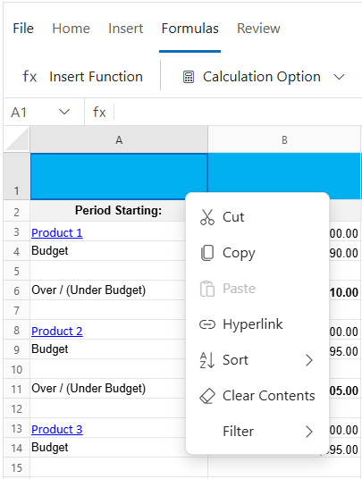
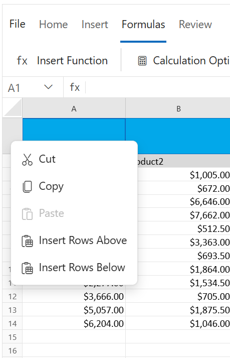
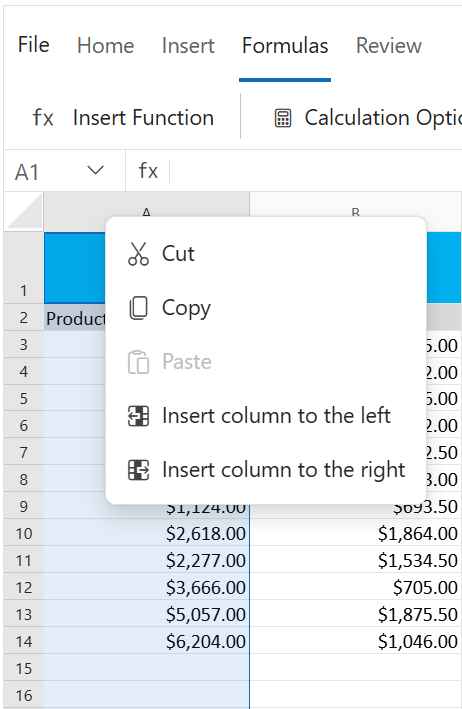
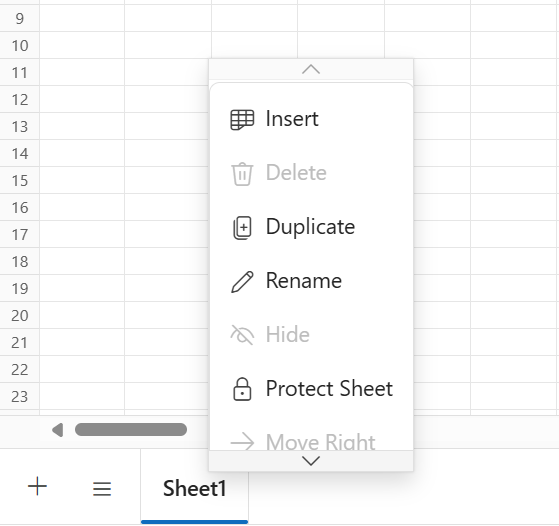

# Context menu in Blazor Spreadsheet component

Context menu is used to improve user interaction with Spreadsheet using the popup menu. It will open when right-clicking on Cell/Column header/Row header/Sheet tabs  in the Spreadsheet. The `EnableContextMenu` property can be used to enable/disable context menu.

> The default value for the `EnableContextMenu` property is `true`.

## Cell context menu options

Please find the table below for default context menu options and their actions.

| Context menu options | Action |
| -- | -- |
| Cut | Cut the selected cells data to the clipboard. The data can be pasted into a different cell location. |
| Copy | Copy the selected cells data to the clipboard for pasting elsewhere. |
| Paste | Paste the data from clipboard to Spreadsheet. |
| Hyperlink | Create a link in the Spreadsheet to navigate to web links or cell reference within the sheet or other sheets in the Spreadsheet. |
| Sort | Perform sorting to the selected range of cells by ascending or descending. |
| Clear Contents | Remove the selected cells data. |
| Filter | Perform filtering to the selected cells based on an active cell’s value. |

## Row header / Column header context menu options

Please find the table below for default context menu options and their actions.

| Context menu options | Action |
| -- | -- |
| Cut | Cut the selected row/column header data to the clipboard. The data can be pasted into a different cell location. |
| Copy | Copy the selected row/column header data to the clipboard for pasting elsewhere. |
| Paste | Paste the data from the clipboard to Spreadsheet. |
| Insert Rows / Insert Columns | Insert new rows or columns into the worksheet. |

## Sheet tabs context menu options

Please find the table below for default context menu options and their actions.

| Context menu options | Action |
| -- | -- |
| Insert | Insert a new worksheet after the existing worksheet in the Spreadsheet. |
| Delete | Delete the selected worksheet from the Spreadsheet. |
| Duplicate | Create a copy of the selected worksheet in the Spreadsheet. |
| Rename | Rename the selected worksheet. |
| Protect Sheet / Unprotect Sheet | Protect Sheet prevents unwanted changes from others by limiting their ability to edit. Unprotect Sheet removes these restrictions. |
| Move Right | Move the selected worksheet to the right of the next sheet. |
| Move Left | Move the selected worksheet to the left of the previous sheet. |
| Hide | Hide the selected worksheet. |

