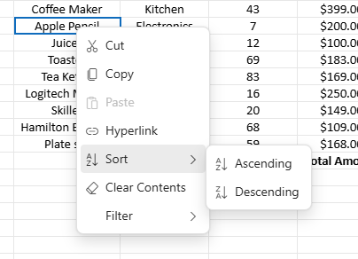
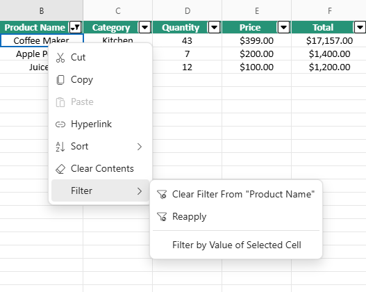
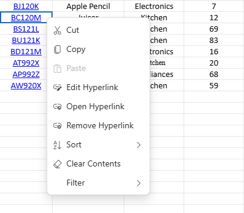
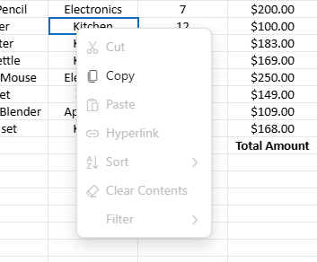

# Context Menu in Blazor Spreadsheet component

The context menu enhances interaction with the Syncfusion Blazor Spreadsheet component by providing a convenient popup menu of relevant operations. This menu appears when right-clicking on various elements including cells, column headers, row headers, or sheet tabs in the Spreadsheet. The [EnableContextMenu](https://help.syncfusion.com/cr/blazor/Syncfusion.Blazor.Spreadsheet.SfSpreadsheet.html#Syncfusion_Blazor_Spreadsheet_SfSpreadsheet_EnableContextMenu) property can be used to enable/disable the context menu. The default value for the `EnableContextMenu` property is **true**.

N> When `EnableContextMenu` is set to **false**, the context menu popup will not display when right-clicking the elements in Spreadsheet. If the workbook is protected, Context menu options like **Insert**, **Delete**, **Duplicate**, **Rename**, **Move Right**, **Move Left** and **Hide** are removed. To know more about workbook protection, refer [here](https://blazor.syncfusion.com/documentation/spreadsheet/protection#protect-workbook).

## Context menu options by element

The context menu options are dynamically adjusted based on the specific Spreadsheet element that is right-clicked. Each location provides specialized functionality relevant to that particular Spreadsheet element.

### Cell context menu options

When a cell or range of cells is right-clicked, the context menu displays the following options:

| Options | Action |
| -- | -- |
| Cut | The data from the selected cells is cut from the sheet and temporarily stored on the clipboard, enabling reuse within the Spreadsheet or in an external application. |
| Copy | The data from the selected cells is copied from the sheet and temporarily stored on the clipboard, enabling reuse within the Spreadsheet or in an external application. |
| Paste | Paste the data from the clipboard into the Spreadsheet at the current selection. If values are not copied means paste option will be disabled. |
| Hyperlink | Create a navigational link to web addresses or cell references within the current sheet or other sheets or other sheets in the Spreadsheet. |
| Sort | Perform sorting to the selected range of cells by sub-option ascending or descending. |
| Clear Contents | Removes all data from the selected cells while preserving formatting properties. |
| Filter | Perform filtering to the selected cells based on an active cell value. |

**Sort option**

When right-clicking on cell or range of cells in the Spreadsheet, the context menu displays a **Sort** option with the following sub-options:

**Sort sub-options**

* **Ascending:** This option arranges data in ascending order (A to Z, 0 to 9). The scope of the sort operation depends on the current selection: a single cell selection sorts the entire column containing that cell, while a range selection sorts only within the boundaries of that range. In both scenarios, related data in adjacent columns within the same rows moves together to maintain row integrity and data relationships across the Spreadsheet.

* **Descending:** This option organizes data in descending order (Z to A, 9 to 0). Like the ascending option, the scope depends on the selection - sorting the entire column when a single cell is selected or limiting the sort to just the selected range when multiple cells are selected. Row integrity is always preserved as entire rows within the affected region are reordered to maintain horizontal data relationships.

**Filter option**

The **Filter** option in the context menu provides data filtering capabilities with these sub-options:

**Filter sub-options**

* **Clear Filter From "[Column Name]":** Removes any existing filters from the specified column. This option is enabled only when a filter is currently applied to the column. The column name appears in the menu item text for clear identification.

* **Reapply:** Reapplies all current filter conditions after data changes in the sheet. This is useful when cell values have been modified and the filter results need to be updated without recreating the filter criteria.

* **Filter By Cell Value:** Creates a filter based on the value in the currently active cell. This option provides a quick way to filter a column to show only rows matching the selected cell's value. The operation uses exact value matching for the filtering process.

**Managing existing hyperlink cell option**

When right-clicking on a cell that already contains a hyperlink, the context menu presents specialized options for hyperlink management:

| Options | Action |
| -- | -- |
| Edit Hyperlink | Opens a dialog to modify the existing hyperlink's properties including the URL, display text, or cell reference. |
| Open Hyperlink | Activates the link, navigating to either the specified URL in a new browser tab or to the referenced cell location within the Spreadsheet. |
| Remove Hyperlink | Deletes the hyperlink while preserving the displayed text in the cell. |

### Row header context menu options

When right-clicking a single row header or a range of selected row headers (the numbered area on the left side of the Spreadsheet), the context menu displays the following options:

| Options | Action |
| -- | -- |
| Cut | The data from the selected rows are cut from the sheet and temporarily stored on the clipboard, enabling reuse within the Spreadsheet or in an external application. |
| Copy | The data from the selected rows are copied from the sheet and temporarily stored on the clipboard, enabling reuse within the Spreadsheet or in an external application. |
| Paste | Paste the data from the clipboard into the Spreadsheet at the current selection. If values are not copied means paste option will be disabled. |
| Insert Rows Above | New rows are inserted above the selected rows. The number of rows added is equal to the number of rows selected. |
| Insert Rows Below | New rows are inserted below the selected rows. The number of rows added is equal to the number of rows selected. |

### Column header context menu options

When right-clicking a single column header or a range of selected column headers (the lettered area at the top), the context menu displays the following options:

| Options | Action |
| -- | -- |
| Cut | The data from the selected columns are cut from the sheet and temporarily stored on the clipboard, enabling reuse within the Spreadsheet or in an external application. |
| Copy | The data from the selected columns are copied from the sheet and temporarily stored on the clipboard, enabling reuse within the Spreadsheet or in an external application. |
| Paste | Paste the data from the clipboard into the Spreadsheet at the current selection. If values are not copied means paste option will be disabled. |
| Insert columns  to the left |  New columns are inserted to the left of the selected columns. The number of columns added is equal to the number of columns selected. |
| Insert columns  to the right | New columns are inserted to the right of the selected columns. The number of columns added is equal to the number of columns selected. |

### Sheet tab context menu options

When right-clicking on a sheet tab located at the bottom of the Spreadsheet opens the context menu with the following options:

| Options | Action |
| -- | -- |
| Insert |  A new sheet is inserted immediately after the currently active sheet within the spreadsheet. |
| Delete | Delete the selected sheet from the Spreadsheet entirely. This option is disabled when only one sheet exists. |
| Duplicate | Creates an exact copy of the selected sheet, including all content, formatting, settings and positioned immediately after the current sheet in the Spreadsheet. |
| Rename | A dialog box is displayed to modify the name of the selected sheet. |
| Protect Sheet / Unprotect Sheet | Protect sheet prevents unwanted changes from others by limiting their ability to edit. Unprotect sheet removes these restrictions. |
| Move Right | Repositions the selected sheet one position to the right in the tab sequence. This option is disabled when only one sheet is visible or when the context menu is opened on the last sheet tab. |
| Move Left | Repositions the selected sheet one position to the left in the tab sequence. This option is disabled when only one sheet is visible or when the context menu is opened on the first sheet tab. |
| Hide | Hide the selected sheet within the Spreadsheet. This option is disabled when only one sheet is visible. |

## Context menu behavior with sheet protection enabled

* The context menu automatically adjusts when sheet protection is active, disabling any options that would violate the protection settings.
* The **Protect Sheet** option is replaced with **Unprotect Sheet**, clearly indicating that protection is currently enabled

## Properties that affect context menu behavior

These properties control specific context menu functionality:

| Property | Default | Effect when set to false |
| -- | -- | -- |
| EnableClipboard | true | Removes the Cut, Copy, and Paste options from all context menus throughout the Spreadsheet |
| AllowSorting | true | Removes the Sort option from the context menu, preventing sorting operations. |
| AllowFiltering | true | Removes the Filter option from the context menu, disabling filtering capabilities. |
| AllowHyperlink | true | Removes all hyperlink-related options from the context menu, preventing hyperlink operations. |




@using Syncfusion.Blazor.Spreadsheet

<SfSpreadsheet DataSource="DataSourceBytes" AllowFiltering="false" AllowSorting="false" EnableClipboard="false" AllowHyperlink="false" >
    <SpreadsheetRibbon></SpreadsheetRibbon>
</SfSpreadsheet>

@code {

    public byte[] DataSourceBytes { get; set; }

    protected override void OnInitialized()
    {
        string filePath = "wwwroot/Sample.xlsx";
        DataSourceBytes = File.ReadAllBytes(filePath);
    }
}


